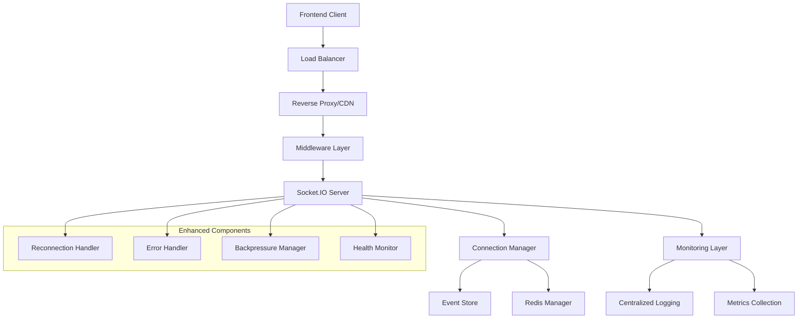

# Design Document

## Overview

This design addresses websocket production reliability issues in the OpenHands application by implementing comprehensive error handling, monitoring, reconnection strategies, and performance optimizations. The solution focuses on improving the existing Socket.IO implementation while maintaining backward compatibility and ensuring scalable production deployment.

## Architecture

### Current Architecture Analysis

The current OpenHands websocket implementation uses:
- Socket.IO server with ASGI integration (`openhands/server/listen_socket.py`)
- Event-driven architecture with `oh_event` and `oh_user_action` events
- Connection validation through conversation IDs and user authentication
- Event replay mechanism for connection recovery
- Rate limiting and CORS middleware

### Enhanced Architecture Components



## Components and Interfaces

### 1. Enhanced Connection Manager

**Purpose**: Manage websocket connections with improved reliability and monitoring

**Interface**:
```python
class EnhancedConnectionManager:
    async def handle_connection(self, connection_id: str, environ: dict) -> ConnectionResult
    async def handle_reconnection(self, connection_id: str, last_event_id: int) -> ReconnectionResult
    async def validate_connection_health(self, connection_id: str) -> HealthStatus
    async def graceful_disconnect(self, connection_id: str, reason: str) -> None
    def get_connection_metrics(self) -> ConnectionMetrics
```

**Key Features**:
- Connection state tracking with Redis persistence
- Automatic health checks with configurable intervals
- Graceful connection termination with cleanup
- Connection pooling and resource management

###nnection Strategy Handler

**Purpose**: Implement robust reconnection logic with exponential backoff

**Interface**:
```python
class ReconnectionHandler:
    def calculate_backoff_delay(self, attempt: int) -> float
    async def handle_client_reconnection(self, connection_id: str, last_event_id: int) -> ReconnectionResult
    def should_allow_reconnection(self, connection_id: str) -> bool
    async def cleanup_stale_connections(self) -> None
```

**Implementation Strategy**:
- Exponential backoff with jitter: `min(base * 2^attempt + random(0, 1000), max_delay)`
- Base delay: 500ms, Max delay: 30 seconds, Max attempts: 10
- Connection attempt rate limiting per IP/user
- Automatic cleanup of abandoned connections after 5 minutes

### 3. Enhanced Error Handling System

**Purpose**: Comprehensive error detection, logging, and recovery

**Interface**:
```python
class WebSocketErrorHandler:
    async def handle_connection_error(self, error: Exception, context: dict) -> ErrorResponse
    async def handle_event_processing_error(self, event: dict, error: Exception) -> None
    def classify_error(self, error: Exception) -> ErrorType
    async def emit_error_to_client(self, connection_id: str, error: ClientError) -> None
```

**Error Categories**:
- **Connection Errors**: Authentication failures, invalid conversation IDs, network issues
- **Event Processing Errors**: Malformed events, serialization failures, permission errors
- **System Errors**: Resource exhaustion, database failures, internal server errors
- **Client Errors**: Invalid requests, rate limiting violations, protocol violations

### 4. Monitoring and Observability Layer

**Purpose**: Comprehensive monitoring, logging, and alerting for websocket operations

**Interface**:
```python
class WebSocketMonitor:
    def log_connection_event(self, event_type: str, connection_id: str, metadata: dict) -> None
    def record_metric(self, metric_name: str, value: float, tags: dict) -> None
    async def check_system_health(self) -> HealthReport
    def emit_alert(self, alert_type: str, message: str, severity: str) -> None
```

**Monitoring Metrics**:
- Connection metrics: active connections, connection rate, disconnection rate
- Performance metrics: event processing latency, message throughput, memory usage
- Error metrics: error rates by type, failed connection attempts, timeout rates
- Business metrics: conversation activity, user engagement, feature usage

### 5. Backpressure Management System

**Purpose**: Handle high load scenarios and prevent system overload

**Interface**:
```python
class BackpressureManager:
    def should_accept_connection(self, connection_request: dict) -> bool
    async def queue_event(self, event: dict, priority: int) -> QueueResult
    def get_system_load(self) -> LoadMetrics
    async def shed_connections(self, criteria: dict) -> int
```

**Load Management Strategies**:
- Connection limiting based on system resources
- Event queuing with priority levels
- Graceful degradation during high load
- Connection shedding for non-critical users

## Data Models

### Connection State Model

```python
@dataclass
class ConnectionState:
    connection_id: str
    user_id: str
    conversation_id: str
    connected_at: datetime
    last_activity: datetime
    last_event_id: int
    client_info: dict
    health_status: HealthStatus
    reconnection_count: int
    error_count: int
```

### Error Event Model

```python
@dataclass
class ErrorEvent:
    error_id: str
    connection_id: str
    error_type: ErrorType
    error_message: str
    stack_trace: str
    context: dict
    timestamp: datetime
    severity: ErrorSeverity
    resolved: bool
```

### Metrics Model

```python
@dataclass
class ConnectionMetrics:
    active_connections: int
    total_connections_today: int
    average_connection_duration: float
    events_per_second: float
    error_rate: float
    memory_usage_mb: float
    cpu_usage_percent: float
```

## Error Handling

### Error Classification and Response Strategy

1. **Authentication Errors**
   - Log security event with IP and user details
   - Return specific error code to client
   - Implement progressive delays for repeated failures

2. **Connection Limit Errors**
   - Queue connection request if possible
   - Return retry-after header with backoff time
   - Log capacity planning metrics

3. **Event Processing Errors**
   - Log error with full context
   - Continue processing other events
   - Emit error event to client if appropriate

4. **System Resource Errors**
   - Trigger alerts for operations team
   - Implement graceful degradation
   - Scale resources automatically if configured

### Error Recovery Mechanisms

- **Automatic Retry**: For transient errors with exponential backoff
- **Circuit Breaker**: For downstream service failures
- **Fallback Responses**: For non-critical feature failures
- **Graceful Degradation**: Reduce functionality under load

## Testing Strategy

### Unit Testing

- **Connection Manager Tests**: Connection lifecycle, state management, cleanup
- **Error Handler Tests**: Error classification, response generation, logging
- **Reconnection Tests**: Backoff calculation, attempt limiting, cleanup
- **Monitoring Tests**: Metric collection, alert generation, health checks

### Integration Testing

- **End-to-End Connection Tests**: Full connection flow with authentication
- **Load Testing**: Concurrent connections, message throughput, resource usage
- **Failure Scenario Tests**: Network interruptions, server restarts, database failures
- **Security Tests**: Authentication bypass attempts, rate limiting, input validation

### Performance Testing

- **Scalability Tests**: 1K, 10K, 100K concurrent connections
- **Latency Tests**: Message delivery times under various loads
- **Memory Leak Tests**: Long-running connection stability
- **Resource Usage Tests**: CPU, memory, file descriptor consumption

### Production Testing

- **Canary Deployments**: Gradual rollout with monitoring
- **A/B Testing**: Compare old vs new implementation
- **Chaos Engineering**: Intentional failure injection
- **Real User Monitoring**: Track actual user experience metrics

## Implementation Phases

### Phase 1: Enhanced Error Handling and Logging
- Implement comprehensive error classification
- Add structured logging with correlation IDs
- Create error response standardization
- Add basic monitoring metrics

### Phase 2: Reconnection Strategy Implementation
- Implement exponential backoff with jitter
- Add connection state persistence
- Create reconnection attempt limiting
- Implement stale connection cleanup

### Phase 3: Monitoring and Observability
- Add comprehensive metrics collection
- Implement health check endpoints
- Create alerting rules and dashboards
- Add performance monitoring

### Phase 4: Load Management and Optimization
- Implement backpressure management
- Add connection pooling optimizations
- Create load-based connection shedding
- Optimize event processing pipeline

### Phase 5: Production Hardening
- Add security enhancements
- Implement rate limiting improvements
- Create deployment automation
- Add disaster recovery procedures

## Security Considerations

- **Authentication**: Validate JWT tokens and session cookies
- **Authorization**: Verify conversation access permissions
- **Rate Limiting**: Prevent abuse and DoS attacks
- **Input Validation**: Sanitize all incoming event data
- **Connection Limits**: Prevent resource exhaustion attacks
- **Audit Logging**: Track security-relevant events

## Performance Optimizations

- **Connection Pooling**: Reuse connections where possible
- **Event Batching**: Group multiple events for efficient processing
- **Memory Management**: Implement connection state cleanup
- **CPU Optimization**: Use async/await patterns effectively
- **Network Optimization**: Implement message compression
- **Caching**: Cache frequently accessed conversation data
