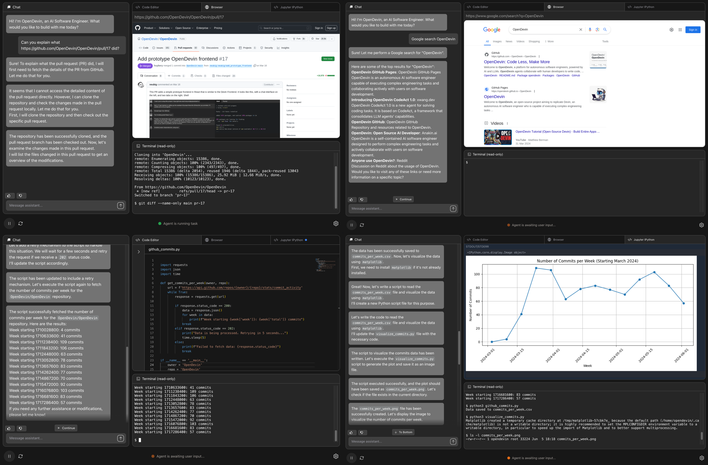

<a name="readme-top"></a>

<div align="center">
  
  <h1 align="center">OpenHands: コードを減らして、もっと作ろう</h1>
</div>

<div align="center">
  <a href="https://github.com/All-Hands-AI/OpenHands/graphs/contributors"></a>
  <a href="https://github.com/All-Hands-AI/OpenHands/stargazers"></a>
  <a href="https://github.com/All-Hands-AI/OpenHands/blob/main/LICENSE"></a>
  <br/>
  <a href="https://join.slack.com/t/openhands-ai/shared_invite/zt-3847of6xi-xuYJIPa6YIPg4ElbDWbtSA"></a>
  <a href="https://discord.gg/ESHStjSjD4"></a>
  <a href="https://github.com/All-Hands-AI/OpenHands/blob/main/CREDITS.md"></a>
  <br/>
  <a href="https://docs.all-hands.dev/usage/getting-started"></a>
  <a href="https://arxiv.org/abs/2407.16741"></a>
  <a href="https://docs.google.com/spreadsheets/d/1wOUdFCMyY6Nt0AIqF705KN4JKOWgeI4wUGUP60krXXs/edit?gid=0#gid=0"></a>
  <hr>
</div>

OpenHands（旧OpenDevin）へようこそ。これはAIが駆動するソフトウェア開発エージェントのプラットフォームです。

OpenHandsのエージェントは人間の開発者ができることは何でもこなします。コードを修正し、コマンドを実行し、ウェブを閲覧し、APIを呼び出し、StackOverflowからコードスニペットをコピーすることさえできます。

詳細は[docs.all-hands.dev](https://docs.all-hands.dev)をご覧いただくか、[OpenHands Cloud](https://app.all-hands.dev)に登録して始めましょう。

> [!IMPORTANT]
> 仕事でOpenHandsを使っていますか？ぜひお話を聞かせてください。[こちらの短いフォーム](https://docs.google.com/forms/d/e/1FAIpQLSet3VbGaz8z32gW9Wm-Grl4jpt5WgMXPgJ4EDPVmCETCBpJtQ/viewform)にご記入いただき、Design Partnerプログラムにご参加ください。商用機能の早期アクセスや製品ロードマップへのフィードバックの機会を提供します。



## ☁️ OpenHands Cloud
OpenHandsを始める最も簡単な方法は[OpenHands Cloud](https://app.all-hands.dev)を利用することです。新規ユーザーには50ドル分の無料クレジットが付与されます。

## 💻 OpenHandsをローカルで実行する

OpenHandsはDockerを利用してローカル環境でも実行できます。システム要件や詳細については[Running OpenHands](https://docs.all-hands.dev/usage/installation)ガイドをご覧ください。

> [!WARNING]
> 公共ネットワークで実行していますか？[Hardened Docker Installation Guide](https://docs.all-hands.dev/usage/runtimes/docker#hardened-docker-installation)を参照して、ネットワークバインディングの制限や追加のセキュリティ対策を実施してください。

```bash
docker pull docker.all-hands.dev/all-hands-ai/runtime:0.48-nikolaik

docker run -it --rm --pull=always \
    -e SANDBOX_RUNTIME_CONTAINER_IMAGE=docker.all-hands.dev/all-hands-ai/runtime:0.48-nikolaik \
    -e LOG_ALL_EVENTS=true \
    -v /var/run/docker.sock:/var/run/docker.sock \
    -v ~/.openhands:/.openhands \
    -p 3000:3000 \
    --add-host host.docker.internal:host-gateway \
    --name openhands-app \
    docker.all-hands.dev/all-hands-ai/openhands:0.48
```

**注**: バージョン0.44以前のOpenHandsを使用していた場合は、会話履歴を移行するために `mv ~/.openhands-state ~/.openhands` を実行してください。

OpenHandsは[http://localhost:3000](http://localhost:3000)で起動します！
