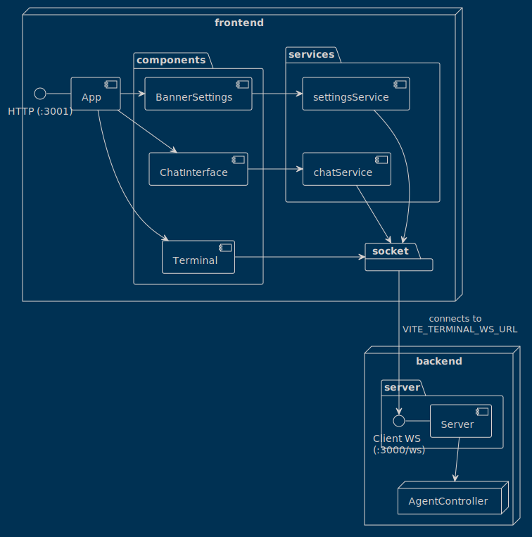
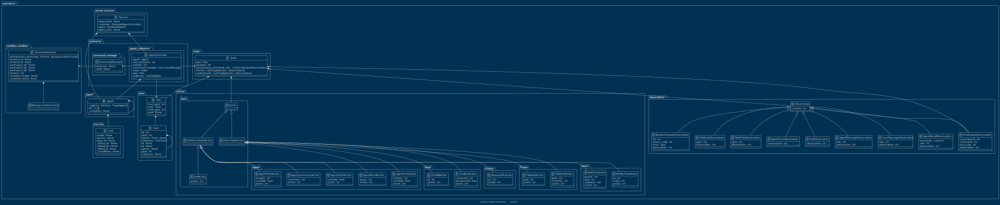

# System Architecture Overview

This is a high-level overview of the system architecture. The system is divided into two main components: the frontend and the backend. The frontend is responsible for handling user interactions and displaying the results. The backend is responsible for handling the business logic and executing the agents.

This Overview is simplified to show the main components and their interactions. For a more detailed view of the backend architecture, see the [Backend Architecture](#backend-architecture) section.

# Backend Architecture

*__Disclaimer__: The backend architecture is a work in progress and is subject to change. The following diagram shows the current architecture of the backend based on the commit that is shown in the footer of the diagram.*

