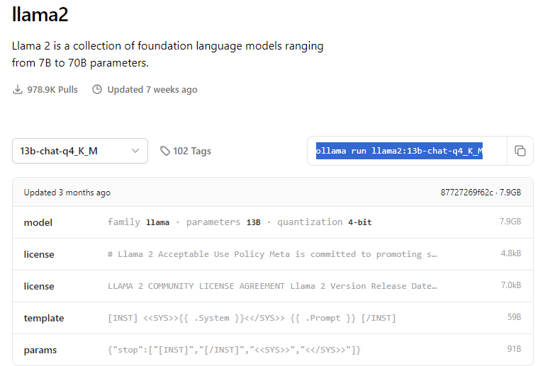

# Local LLM Guide with Ollama server

## 0. Install Ollama:
run the following command in a conda env with CUDA etc.

Linux:
```
curl -fsSL https://ollama.com/install.sh | sh
```
Windows or macOS: 

- Download from [here](https://ollama.com/download/)

## 1. Install Models:
Ollama model names can be found [here](https://ollama.com/library) (See example below)



Once you have found the model you want to use copy the command and run it in your conda env.

Example of llama2 q4 quantized:
```
conda activate <env_name>
ollama run llama2:13b-chat-q4_K_M
```

you can check which models you have downloaded like this:
```
~$ ollama list
NAME                            ID              SIZE    MODIFIED
llama2:latest                   78e26419b446    3.8 GB  6 weeks ago
mistral:7b-instruct-v0.2-q4_K_M eb14864c7427    4.4 GB  2 weeks ago
starcoder2:latest               f67ae0f64584    1.7 GB  19 hours ago
```
## 2. Run Ollama in CLI:
This command starts up the ollama server that is on port `11434`

This will show the requests in CLI
```
conda activate <env_name>
ollama serve
```
or

This will run with no output in the background
```
sudo systemctl start ollama
```

If you see something like this:
```
Error: listen tcp 127.0.0.1:11434: bind: address already in use
```
This is not an error it just means the server is already running

To stop the server use:
```
sudo systemctl stop ollama
```

For more info go [here](https://github.com/ollama/ollama/blob/main/docs/faq.md)

## 3. Follow the default installation of OpenDevin:
```
git clone git@github.com:OpenDevin/OpenDevin.git
```
or 
```
git clone git@github.com:<YOUR-USERNAME>/OpenDevin.git
```

then 
```
cd OpenDevin
```

## 4. Run setup commands:
```
make build
make setup-config
```

## 5. Modify config file:

- After running `make setup-config` you will see a generated file `OpenDevin/config.toml`.
- Open this file and modify it to your needs based on this template:

```
LLM_API_KEY="ollama"
LLM_MODEL="ollama/<model_name>"
LLM_EMBEDDING_MODEL="local"
LLM_BASE_URL="http://localhost:<port_number>"
WORKSPACE_DIR="./workspace"
```
Notes: 
- The API key should be set to `"ollama"` 
- The base url needs to be `localhost` 
- By default ollama port is `11434` unless you set it
- `model_name` needs to be the entire model name
    - Example: `LLM_MODEL="ollama/llama2:13b-chat-q4_K_M"`

## 6. Start OpenDevin:

At this point everything should be set up and working properly. 
1. Start by running the ollama server using the method outlined above
2. Run `make build` in your terminal `~/OpenDevin/`
3. Run `make run` in your terminal 
4. If that fails try running the server and front end in sepparate terminals:
 - In the first terminal `make start-backend`
 - In the second terminal `make start-frontend`
5. you should now be able to connect to `http://localhost:3001/` with your local model running!


## Additional Notes for WSL2 Users:

1. If you encounter the following error during setup: `Exception: Failed to create opendevin user in sandbox: b'useradd: UID 0 is not unique\n'`  
You can resolve it by running:  
    ```
    export SANDBOX_USER_ID=1000
    ```

2. If you face issues running Poetry even after installing it during the build process, you may need to add its binary path to your environment:  
    ```
    export PATH="$HOME/.local/bin:$PATH"
    ```

3. If you experiencing issues related to networking, such as `NoneType object has no attribute 'request'` when executing `make run`, you may need to configure your WSL2 networking settings. Follow these steps:
   - Open or create the `.wslconfig` file located at `C:\Users\%username%\.wslconfig` on your Windows host machine.
   - Add the following configuration to the `.wslconfig` file:
        ```
        [wsl2]
        networkingMode=mirrored
        localhostForwarding=true
        ```
   - Save the `.wslconfig` file.
   - Restart WSL2 completely by exiting any running WSL2 instances and executing the command `wsl --shutdown` in your command prompt or terminal.
   - After restarting WSL, attempt to execute `make run` again. The networking issue should be resolved. 