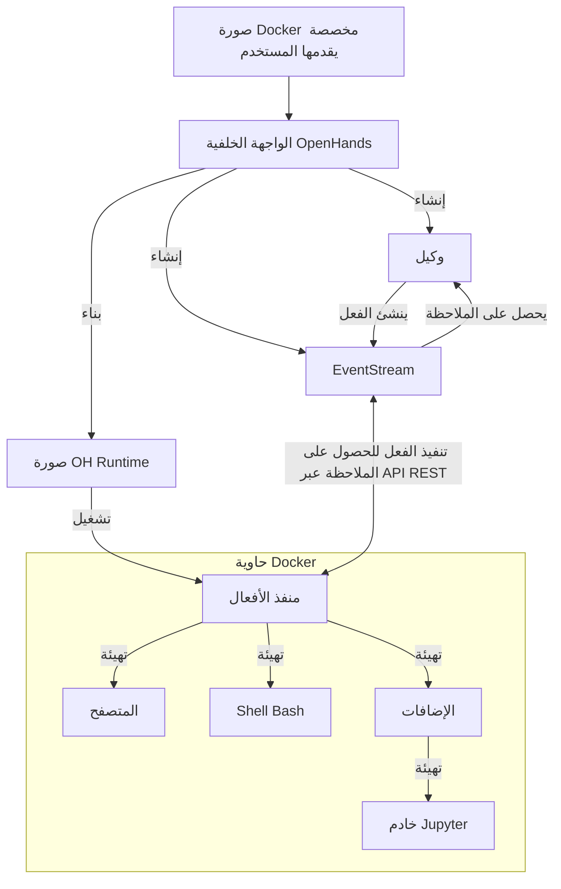

# 📦 نظام **Runtime EventStream**

نظام **Runtime EventStream** في OpenHands هو المكون الرئيسي الذي يتيح تنفيذ الأفعال الخاصة بالوكلاء (agents) الذكاء الاصطناعي بطريقة آمنة ومرنة. يقوم بإنشاء بيئة معزولة (sandbox) باستخدام Docker، حيث يمكن تنفيذ الشيفرة البرمجية بشكل آمن دون التأثير على النظام الأساسي.

## لماذا نحتاج إلى بيئة تنفيذ معزولة؟

يجب على OpenHands تنفيذ الشيفرة البرمجية في بيئة معزولة وآمنة لعدة أسباب:

1. **الأمان**: تنفيذ الشيفرة غير الموثوقة يمكن أن يشكل خطراً كبيراً على النظام الأساسي. بيئة المعزولة تمنع الشيفرة الخبيثة من الوصول إلى موارد النظام الأساسي أو تعديلها.
2. **التناسق**: تضمن البيئة المعزولة تنفيذ الشيفرة بشكل متناسق على أنظمة وأجهزة مختلفة، مما يحل مشكلة "الشيفرة تعمل على جهازي".
3. **التحكم في الموارد**: توفر البيئة المعزولة تحكماً أفضل في تخصيص واستخدام الموارد، مما يمنع العمليات غير المسيطر عليها من التأثير على النظام الأساسي.
4. **العزل**: يمكن للمشاريع أو المستخدمين المختلفين العمل في بيئات معزولة دون التأثير على بعضهم البعض أو على النظام الأساسي.
5. **الاستنساخ**: تسهل البيئات المعزولة إعادة إنشاء الأخطاء والمشاكل، حيث تكون بيئة التنفيذ ثابتة وقابلة للتحكم.

## كيف يعمل نظام Runtime؟

نظام Runtime في OpenHands يستخدم هيكلية عميل-خادم معتمدة على حاويات Docker. إليك نظرة عامة على كيفية عمله:

1. **إدخال المستخدم**: يقوم المستخدم بتوفير صورة Docker مخصصة.
2. **بناء الصورة**: يقوم OpenHands ببناء صورة Docker جديدة ("صورة OH runtime") استناداً إلى الصورة التي قدمها المستخدم. هذه الصورة الجديدة تتضمن الشيفرة البرمجية الخاصة بـ OpenHands.
3. **تشغيل الحاوية**: عند بدء OpenHands، يتم تشغيل حاوية Docker باستخدام صورة OH runtime.
4. **تهيئة خادم تنفيذ الأفعال**: يقوم خادم تنفيذ الأفعال بتهيئة `ActionExecutor` داخل الحاوية، وضبط المكونات اللازمة مثل shell bash وتحميل الإضافات.
5. **التواصل**: يتواصل واجهة OpenHands الخلفية (`openhands/runtime/impl/eventstream/eventstream_runtime.py`) مع خادم تنفيذ الأفعال عبر API RESTful، حيث يتم إرسال الأفعال واستقبال الملاحظات.
6. **تنفيذ الأفعال**: يستقبل عميل runtime الأفعال من الواجهة الخلفية، ويقوم بتنفيذها في بيئة المعزولة وإرجاع الملاحظات.
7. **إرجاع الملاحظات**: يعيد خادم تنفيذ الأفعال نتائج التنفيذ إلى واجهة OpenHands الخلفية على شكل ملاحظات.

### دور العميل:
- يعمل كوسيط بين الواجهة الخلفية لـ OpenHands وبيئة المعزولة.
- ينفذ أنواع مختلفة من الأفعال (أوامر shell، عمليات على الملفات، شيفرة Python، إلخ) بأمان داخل الحاوية.
- يدير حالة البيئة المعزولة، بما في ذلك الدليل الحالي والإضافات المحملة.
- يقوم بتنسيق وإرجاع الملاحظات إلى الواجهة الخلفية، مما يضمن واجهة متناسقة لمعالجة النتائج.

## كيف يقوم OpenHands ببناء وصيانة صور OH Runtime

يتبع OpenHands نهجاً فعالاً لبناء وإدارة صور runtime مما يضمن التناسق والمرونة في إنشاء وصيانة صور Docker للبيئات الإنتاجية والتطويرية.

راجع [الشيفرة ذات الصلة](https://github.com/All-Hands-AI/OpenHands/blob/main/openhands/runtime/utils/runtime_build.py) إذا كنت ترغب في مزيد من التفاصيل.

### نظام العلامات للصور

يستخدم OpenHands نظاماً من ثلاث علامات لصور runtime لتحقيق توازن بين القابلية للاستنساخ والمرونة. يمكن أن تكون العلامات بأحد الصيغتين التاليتين:

- **العلامة المرقمة**: `oh_v{version_openhands}_{base_image}` (مثل: `oh_v0.9.9_nikolaik_s_python-nodejs_t_python3.12-nodejs22`)
- **العلامة المؤمنة**: `oh_v{version_openhands}_{16_digit_lock_hash}` (مثل: `oh_v0.9.9_1234567890abcdef`)
- **العلامة المصدرية**: `oh_v{version_openhands}_{16_digit_lock_hash}_{16_digit_source_hash}`
  (مثل: `oh_v0.9.9_1234567890abcdef_1234567890abcdef`)

#### العلامة المصدرية - الأكثر تحديداً

هذه هي أول 16 رقماً من MD5 لوسم المجلد المصدر. هذه العلامة مخصصة فقط لمصدر OpenHands.

#### العلامة المؤمنة

يتم بناء هذه العلامة باستخدام أول 16 رقماً من MD5:
- اسم الصورة الأساسية التي تم بناء الصورة عليها (مثل: `nikolaik/python-nodejs:python3.12-nodejs22`)
- محتويات `pyproject.toml` المضمنة في الصورة.
- محتويات `poetry.lock` المضمنة في الصورة.

يتم استخدام هذه العلامة لتحديد حالة الاعتماديات في OpenHands بغض النظر عن الشيفرة المصدرية.

#### العلامة المرقمة - الأكثر عمومية

تعد هذه العلامة مجرد دمج بين إصدار OpenHands واسم الصورة الأساسية (يتم تعديله ليناسب معيار العلامات).

### عملية بناء الصورة

عند بناء صورة جديدة...

- **لا حاجة لإعادة البناء**: يتحقق OpenHands أولاً إذا كانت هناك صورة بنفس **العلامة المصدرية الأكثر تحديداً**. إذا كانت موجودة، لا يتم إعادة البناء وتُستخدم الصورة الحالية.
- **أسرع إعادة بناء**: يتحقق OpenHands إذا كانت هناك صورة بنفس **العلامة المؤمنة**. إذا كانت موجودة، يتم بناء صورة جديدة استناداً إليها، مع تجاوز خطوات التثبيت مثل `poetry install` و`apt-get`، ويتم فقط نسخ الشيفرة المصدرية الحالية.
- **إعادة بناء صحيحة**: إذا لم توجد صورة بنفس **العلامة المصدرية** أو **العلامة المؤمنة**، يتم بناء صورة جديدة استناداً إلى صورة العلامة المرقمة.
- **أبطأ إعادة بناء**: إذا لم تكن هناك أي من العلامات الثلاث، يتم بناء صورة جديدة بالكامل استناداً إلى الصورة الأساسية، مما يستغرق وقتاً أطول.

### نظام الإضافات في Runtime

يدعم OpenHands نظام الإضافات الذي يتيح توسيع الوظائف وتخصيص بيئة التنفيذ. يتم تهيئة الإضافات عند بدء تشغيل العميل runtime.

راجع [مثال لإضافة Jupyter هنا](https://github.com/All-Hands-AI/OpenHands/blob/ecf4aed28b0cf7c18d4d8ff554883ba182fc6bdd/openhands/runtime/plugins/jupyter/__init__.py#L21-L55) إذا كنت ترغب في تنفيذ إضافتك الخاصة.

*المزيد من التفاصيل حول نظام الإضافات قيد الإنشاء - المساهمات مرحب بها!*

### النقاط الرئيسية لنظام الإضافات:
1. **تعريف الإضافات**: الإضافات هي فئات Python التي ترث من الفئة الأساسية `Plugin`.
2. **تسجيل الإضافات**: يتم تسجيل الإضافات المتاحة في قاموس `ALL_PLUGINS`.
3. **تحديد الإضافات**: يتم ربط الإضافات بـ `Agent.sandbox_plugins: list[PluginRequirement]`. يمكن للمستخدمين تحديد الإضافات التي يجب تحميلها عند تهيئة البيئة.
4. **تهيئة الإضافات**: يتم تهيئة الإضافات بشكل غير متزامن عند بدء تشغيل العميل.
5. **استخدام الإضافات**: يمكن للعميل runtime استخدام الإضافات التي تم تهيئتها لتوسيع قدراته (مثل إضافة JupyterPlugin لتشغيل خلايا IPython).