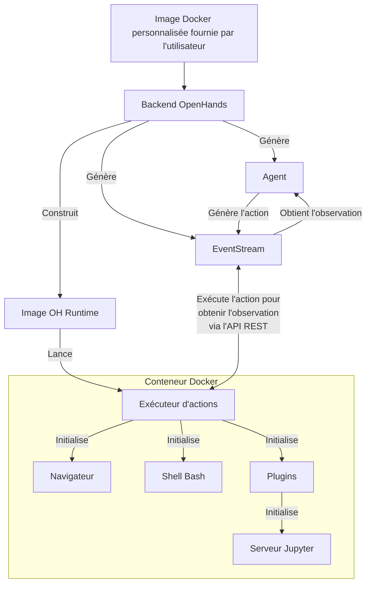

# 📦 Runtime Docker

Le Runtime Docker d'OpenHands est le composant principal qui permet l'exécution sécurisée et flexible des actions des agents d'IA.
Il crée un environnement en bac à sable (sandbox) en utilisant Docker, où du code arbitraire peut être exécuté en toute sécurité sans risquer le système hôte.

## Pourquoi avons-nous besoin d'un runtime en bac à sable ?

OpenHands doit exécuter du code arbitraire dans un environnement sécurisé et isolé pour plusieurs raisons :

1. Sécurité : L'exécution de code non fiable peut poser des risques importants pour le système hôte. Un environnement en bac à sable empêche le code malveillant d'accéder ou de modifier les ressources du système hôte
2. Cohérence : Un environnement en bac à sable garantit que l'exécution du code est cohérente sur différentes machines et configurations, éliminant les problèmes du type "ça fonctionne sur ma machine"
3. Contrôle des ressources : Le bac à sable permet un meilleur contrôle de l'allocation et de l'utilisation des ressources, empêchant les processus incontrôlés d'affecter le système hôte
4. Isolation : Différents projets ou utilisateurs peuvent travailler dans des environnements isolés sans interférer les uns avec les autres ou avec le système hôte
5. Reproductibilité : Les environnements en bac à sable facilitent la reproduction des bugs et des problèmes, car l'environnement d'exécution est cohérent et contrôlable

## Comment fonctionne le Runtime ?

Le système Runtime d'OpenHands utilise une architecture client-serveur implémentée avec des conteneurs Docker. Voici un aperçu de son fonctionnement :

1. Entrée utilisateur : L'utilisateur fournit une image Docker de base personnalisée
2. Construction de l'image : OpenHands construit une nouvelle image Docker (l'"image OH runtime") basée sur l'image fournie par l'utilisateur. Cette nouvelle image inclut le code spécifique à OpenHands, principalement le "client runtime"
3. Lancement du conteneur : Lorsqu'OpenHands démarre, il lance un conteneur Docker en utilisant l'image OH runtime
4. Initialisation du serveur d'exécution des actions : Le serveur d'exécution des actions initialise un `ActionExecutor` à l'intérieur du conteneur, mettant en place les composants nécessaires comme un shell bash et chargeant les plugins spécifiés
5. Communication : Le backend OpenHands (`openhands/runtime/impl/eventstream/eventstream_runtime.py`) communique avec le serveur d'exécution des actions via une API RESTful, envoyant des actions et recevant des observations
6. Exécution des actions : Le client runtime reçoit les actions du backend, les exécute dans l'environnement en bac à sable et renvoie les observations
7. Retour des observations : Le serveur d'exécution des actions renvoie les résultats d'exécution au backend OpenHands sous forme d'observations

Le rôle du client :
- Il agit comme un intermédiaire entre le backend OpenHands et l'environnement en bac à sable
- Il exécute différents types d'actions (commandes shell, opérations sur les fichiers, code Python, etc.) en toute sécurité dans le conteneur
- Il gère l'état de l'environnement en bac à sable, y compris le répertoire de travail courant et les plugins chargés
- Il formate et renvoie les observations au backend, assurant une interface cohérente pour le traitement des résultats

## Comment OpenHands construit et maintient les images OH Runtime

L'approche d'OpenHands pour la construction et la gestion des images runtime assure l'efficacité, la cohérence et la flexibilité dans la création et la maintenance des images Docker pour les environnements de production et de développement.

Consultez le [code pertinent](https://github.com/All-Hands-AI/OpenHands/blob/main/openhands/runtime/utils/runtime_build.py) si vous souhaitez plus de détails.

### Système de balises d'images

OpenHands utilise un système à trois balises pour ses images runtime afin d'équilibrer la reproductibilité et la flexibilité.
Les balises peuvent être dans l'un des 2 formats suivants :

- **Balise versionnée** : `oh_v{openhands_version}_{base_image}` (ex : `oh_v0.9.9_nikolaik_s_python-nodejs_t_python3.12-nodejs22`)
- **Balise de verrouillage** : `oh_v{openhands_version}_{16_digit_lock_hash}` (ex : `oh_v0.9.9_1234567890abcdef`)
- **Balise source** : `oh_v{openhands_version}_{16_digit_lock_hash}_{16_digit_source_hash}`
  (ex : `oh_v0.9.9_1234567890abcdef_1234567890abcdef`)

#### Balise source - La plus spécifique

Il s'agit des 16 premiers chiffres du MD5 du hash du répertoire pour le répertoire source. Cela donne un hash
uniquement pour la source d'openhands

#### Balise de verrouillage

Ce hash est construit à partir des 16 premiers chiffres du MD5 de :
- Le nom de l'image de base sur laquelle l'image a été construite (ex : `nikolaik/python-nodejs:python3.12-nodejs22`)
- Le contenu du `pyproject.toml` inclus dans l'image.
- Le contenu du `poetry.lock` inclus dans l'image.

Cela donne effectivement un hash pour les dépendances d'Openhands indépendamment du code source.

#### Balise versionnée - La plus générique

Cette balise est une concaténation de la version d'openhands et du nom de l'image de base (transformé pour s'adapter au standard des balises).

#### Processus de construction

Lors de la génération d'une image...

- **Pas de reconstruction** : OpenHands vérifie d'abord si une image avec la même **balise source la plus spécifique** existe. S'il existe une telle image,
  aucune construction n'est effectuée - l'image existante est utilisée.
- **Reconstruction la plus rapide** : OpenHands vérifie ensuite si une image avec la **balise de verrouillage générique** existe. S'il existe une telle image,
  OpenHands construit une nouvelle image basée sur celle-ci, en contournant toutes les étapes d'installation (comme `poetry install` et
  `apt-get`) sauf une opération finale pour copier le code source actuel. La nouvelle image est balisée avec une
  balise **source** uniquement.
- **Reconstruction correcte** : Si ni une balise **source** ni une balise **de verrouillage** n'existe, une image sera construite sur la base de l'image avec la balise **versionnée**.
  Dans l'image avec la balise versionnée, la plupart des dépendances devraient déjà être installées, ce qui permet de gagner du temps.
- **Reconstruction la plus lente** : Si les trois balises n'existent pas, une toute nouvelle image est construite à partir de
  l'image de base (ce qui est une opération plus lente). Cette nouvelle image est balisée avec toutes les balises **source**, **de verrouillage** et **versionnée**.

Cette approche de balisage permet à OpenHands de gérer efficacement les environnements de développement et de production.

1. Un code source et un Dockerfile identiques produisent toujours la même image (via des balises basées sur des hashs)
2. Le système peut reconstruire rapidement les images lorsque des changements mineurs se produisent (en s'appuyant sur des images compatibles récentes)
3. La balise **de verrouillage** (ex : `runtime:oh_v0.9.3_1234567890abcdef`) pointe toujours vers la dernière version pour une combinaison particulière d'image de base, de dépendances et de version d'OpenHands

## Système de plugins du Runtime

Le Runtime d'OpenHands prend en charge un système de plugins qui permet d'étendre les fonctionnalités et de personnaliser l'environnement d'exécution. Les plugins sont initialisés lorsque le client runtime démarre.

Consultez [un exemple de plugin Jupyter ici](https://github.com/All-Hands-AI/OpenHands/blob/ecf4aed28b0cf7c18d4d8ff554883ba182fc6bdd/openhands/runtime/plugins/jupyter/__init__.py#L21-L55) si vous souhaitez implémenter votre propre plugin.

*Plus de détails sur le système de plugins sont encore en construction - les contributions sont les bienvenues !*

Aspects clés du système de plugins :

1. Définition des plugins : Les plugins sont définis comme des classes Python qui héritent d'une classe de base `Plugin`
2. Enregistrement des plugins : Les plugins disponibles sont enregistrés dans un dictionnaire `ALL_PLUGINS`
3. Spécification des plugins : Les plugins sont associés à `Agent.sandbox_plugins: list[PluginRequirement]`. Les utilisateurs peuvent spécifier quels plugins charger lors de l'initialisation du runtime
4. Initialisation : Les plugins sont initialisés de manière asynchrone lorsque le client runtime démarre
5. Utilisation : Le client runtime peut utiliser les plugins initialisés pour étendre ses capacités (par exemple, le JupyterPlugin pour exécuter des cellules IPython)
