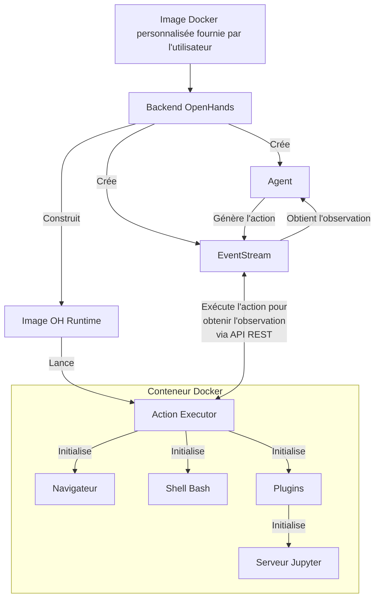

# 📦 Docker Runtime

Le Docker Runtime d'OpenHands est le composant central qui permet l'exécution sécurisée et flexible des actions d'un agent IA.
Il crée un environnement isolé (sandbox) en utilisant Docker, où du code arbitraire peut être exécuté en toute sécurité sans risquer de compromettre le système hôte.

## Pourquoi avons-nous besoin d'un environnement d'exécution isolé ?

OpenHands doit exécuter du code arbitraire dans un environnement sécurisé et isolé pour plusieurs raisons :

1. Sécurité : L'exécution de code non fiable peut présenter des risques importants pour le système hôte. Un environnement isolé empêche le code malveillant d'accéder ou de modifier les ressources du système hôte
2. Cohérence : Un environnement isolé garantit que l'exécution du code est cohérente sur différentes machines et configurations, éliminant les problèmes du type "ça marche sur ma machine"
3. Contrôle des ressources : L'isolation permet un meilleur contrôle de l'allocation et de l'utilisation des ressources, empêchant les processus incontrôlés d'affecter le système hôte
4. Isolation : Différents projets ou utilisateurs peuvent travailler dans des environnements isolés sans interférer les uns avec les autres ou avec le système hôte
5. Reproductibilité : Les environnements isolés facilitent la reproduction des bugs et des problèmes, car l'environnement d'exécution est cohérent et contrôlable

## Comment fonctionne le Runtime ?

Le système Runtime d'OpenHands utilise une architecture client-serveur implémentée avec des conteneurs Docker. Voici un aperçu de son fonctionnement :

1. Entrée utilisateur : L'utilisateur fournit une image Docker de base personnalisée
2. Construction de l'image : OpenHands construit une nouvelle image Docker (l'"image OH runtime") basée sur l'image fournie par l'utilisateur. Cette nouvelle image inclut le code spécifique à OpenHands, principalement le "client runtime"
3. Lancement du conteneur : Lorsqu'OpenHands démarre, il lance un conteneur Docker utilisant l'image OH runtime
4. Initialisation du serveur d'exécution d'actions : Le serveur d'exécution d'actions initialise un `ActionExecutor` à l'intérieur du conteneur, configurant les composants nécessaires comme un shell bash et chargeant les plugins spécifiés
5. Communication : Le backend OpenHands (`openhands/runtime/impl/eventstream/eventstream_runtime.py`) communique avec le serveur d'exécution d'actions via une API RESTful, envoyant des actions et recevant des observations
6. Exécution d'actions : Le client runtime reçoit les actions du backend, les exécute dans l'environnement isolé, et renvoie des observations
7. Retour d'observation : Le serveur d'exécution d'actions renvoie les résultats d'exécution au backend OpenHands sous forme d'observations

Le rôle du client :

- Il agit comme intermédiaire entre le backend OpenHands et l'environnement isolé
- Il exécute divers types d'actions (commandes shell, opérations sur fichiers, code Python, etc.) en toute sécurité dans le conteneur
- Il gère l'état de l'environnement isolé, y compris le répertoire de travail actuel et les plugins chargés
- Il formate et renvoie les observations au backend, assurant une interface cohérente pour le traitement des résultats

## Comment OpenHands construit et maintient les images OH Runtime

L'approche d'OpenHands pour construire et gérer les images runtime assure efficacité, cohérence et flexibilité dans la création et la maintenance des images Docker pour les environnements de production et de développement.

Consultez le [code pertinent](https://github.com/All-Hands-AI/OpenHands/blob/main/openhands/runtime/utils/runtime_build.py) si vous êtes intéressé par plus de détails.

### Système de marquage d'images

OpenHands utilise un système à trois tags pour ses images runtime afin d'équilibrer reproductibilité et flexibilité.
Les tags peuvent être dans l'un des 2 formats suivants :

- **Tag versionné** : `oh_v{openhands_version}_{base_image}` (ex. : `oh_v0.9.9_nikolaik_s_python-nodejs_t_python3.12-nodejs22`)
- **Tag de verrouillage** : `oh_v{openhands_version}_{16_digit_lock_hash}` (ex. : `oh_v0.9.9_1234567890abcdef`)
- **Tag source** : `oh_v{openhands_version}_{16_digit_lock_hash}_{16_digit_source_hash}`
  (ex. : `oh_v0.9.9_1234567890abcdef_1234567890abcdef`)

#### Tag source - Le plus spécifique

Il s'agit des 16 premiers chiffres du MD5 du hash du répertoire pour le répertoire source. Cela donne un hash
uniquement pour la source openhands.

#### Tag de verrouillage

Ce hash est construit à partir des 16 premiers chiffres du MD5 de :

- Le nom de l'image de base sur laquelle l'image a été construite (ex. : `nikolaik/python-nodejs:python3.12-nodejs22`)
- Le contenu du `pyproject.toml` inclus dans l'image.
- Le contenu du `poetry.lock` inclus dans l'image.

Cela donne effectivement un hash pour les dépendances d'Openhands indépendamment du code source.

#### Tag versionné - Le plus générique

Ce tag est une concaténation de la version openhands et du nom de l'image de base (transformé pour s'adapter au standard des tags).

#### Processus de construction

Lors de la génération d'une image...

- **Pas de reconstruction** : OpenHands vérifie d'abord si une image avec le même **tag source le plus spécifique** existe. S'il existe une telle image, aucune construction n'est effectuée - l'image existante est utilisée.
- **Reconstruction la plus rapide** : OpenHands vérifie ensuite si une image avec le **tag de verrouillage générique** existe. S'il existe une telle image, OpenHands construit une nouvelle image basée sur celle-ci, contournant toutes les étapes d'installation (comme `poetry install` et `apt-get`) sauf une opération finale pour copier le code source actuel. La nouvelle image est marquée uniquement avec un tag **source**.
- **Reconstruction acceptable** : Si ni un tag **source** ni un tag **verrouillage** n'existe, une image sera construite basée sur l'image avec le tag **versionné**. Dans l'image avec tag versionné, la plupart des dépendances devraient déjà être installées, ce qui permet de gagner du temps.
- **Reconstruction la plus lente** : Si aucun des trois tags n'existe, une toute nouvelle image est construite basée sur l'image de base (ce qui est une opération plus lente). Cette nouvelle image est marquée avec tous les tags **source**, **verrouillage** et **versionné**.

Cette approche de marquage permet à OpenHands de gérer efficacement les environnements de développement et de production.

1. Un code source et un Dockerfile identiques produisent toujours la même image (via des tags basés sur des hashs)
2. Le système peut rapidement reconstruire des images lorsque des changements mineurs se produisent (en exploitant des images compatibles récentes)
3. Le tag **verrouillage** (ex., `runtime:oh_v0.9.3_1234567890abcdef`) pointe toujours vers la dernière construction pour une combinaison particulière d'image de base, de dépendances et de version OpenHands

## Système de plugins Runtime

Le Runtime OpenHands prend en charge un système de plugins qui permet d'étendre les fonctionnalités et de personnaliser l'environnement d'exécution. Les plugins sont initialisés au démarrage du client runtime.

Consultez [un exemple de plugin Jupyter ici](https://github.com/All-Hands-AI/OpenHands/blob/ecf4aed28b0cf7c18d4d8ff554883ba182fc6bdd/openhands/runtime/plugins/jupyter/__init__.py#L21-L55) si vous souhaitez implémenter votre propre plugin.

*Plus de détails sur le système de plugins sont encore en construction - les contributions sont les bienvenues !*

Aspects clés du système de plugins :

1. Définition du plugin : Les plugins sont définis comme des classes Python qui héritent d'une classe de base `Plugin`
2. Enregistrement du plugin : Les plugins disponibles sont enregistrés dans un dictionnaire `ALL_PLUGINS`
3. Spécification du plugin : Les plugins sont associés à `Agent.sandbox_plugins: list[PluginRequirement]`. Les utilisateurs peuvent spécifier quels plugins charger lors de l'initialisation du runtime
4. Initialisation : Les plugins sont initialisés de manière asynchrone au démarrage du client runtime
5. Utilisation : Le client runtime peut utiliser les plugins initialisés pour étendre ses capacités (par exemple, le JupyterPlugin pour exécuter des cellules IPython)
