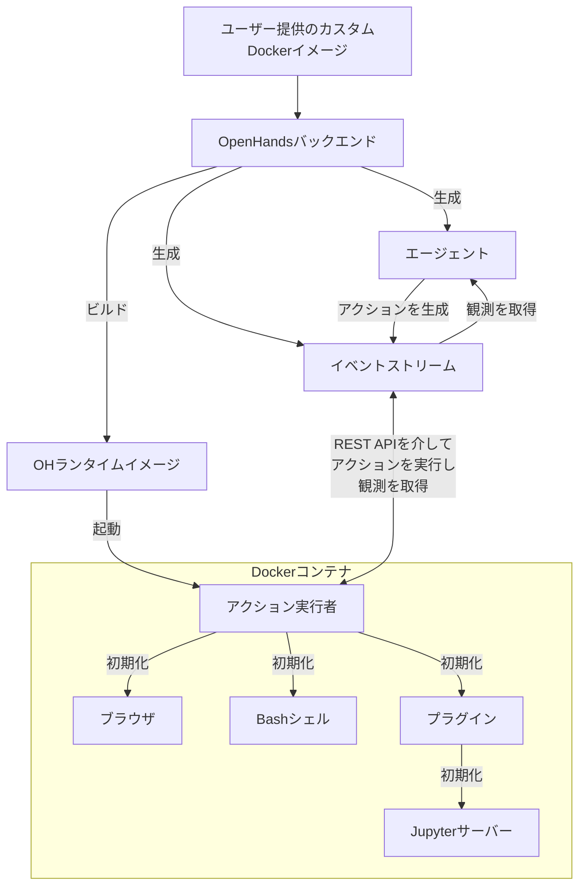

# 📦 Docker ランタイム

OpenHands Docker ランタイムは、AIエージェントのアクションを安全かつ柔軟に実行できるようにする中核コンポーネントです。
Dockerを使用してサンドボックス環境を作成し、ホストシステムを危険にさらすことなく任意のコードを安全に実行できます。

## なぜサンドボックス化されたランタイムが必要なのか？

OpenHandsが任意のコードを安全で隔離された環境で実行する必要がある理由はいくつかあります：

1. セキュリティ：信頼されていないコードの実行はホストシステムに重大なリスクをもたらす可能性があります。サンドボックス環境は悪意のあるコードがホストシステムのリソースにアクセスしたり変更したりすることを防ぎます
2. 一貫性：サンドボックス環境により、異なるマシンやセットアップ間でのコード実行の一貫性が確保され、「自分のマシンでは動作する」という問題を排除します
3. リソース制御：サンドボックス化によりリソースの割り当てと使用をより適切に制御でき、暴走プロセスがホストシステムに影響を与えることを防ぎます
4. 分離：異なるプロジェクトやユーザーが互いにまたはホストシステムに干渉することなく、隔離された環境で作業できます
5. 再現性：サンドボックス環境は実行環境が一貫していて制御可能なため、バグや問題の再現が容易になります

## ランタイムはどのように機能するか？

OpenHandsランタイムシステムはDockerコンテナで実装されたクライアント-サーバーアーキテクチャを使用しています。以下はその仕組みの概要です：

1. ユーザー入力：ユーザーがカスタムベースDockerイメージを提供します
2. イメージビルド：OpenHandsはユーザー提供のイメージに基づいて新しいDockerイメージ（「OHランタイムイメージ」）をビルドします。この新しいイメージにはOpenHands固有のコード、主に「ランタイムクライアント」が含まれます
3. コンテナ起動：OpenHandsが起動すると、OHランタイムイメージを使用してDockerコンテナを起動します
4. アクション実行サーバーの初期化：アクション実行サーバーはコンテナ内で`ActionExecutor`を初期化し、Bashシェルなどの必要なコンポーネントをセットアップし、指定されたプラグインをロードします
5. 通信：OpenHandsバックエンド（`openhands/runtime/impl/eventstream/eventstream_runtime.py`）はRESTful APIを介してアクション実行サーバーと通信し、アクションを送信して観測を受け取ります
6. アクション実行：ランタイムクライアントはバックエンドからアクションを受け取り、サンドボックス環境で実行し、観測結果を送り返します
7. 観測結果の返送：アクション実行サーバーは実行結果を観測としてOpenHandsバックエンドに送り返します

クライアントの役割：

- OpenHandsバックエンドとサンドボックス環境の間の仲介役として機能します
- さまざまなタイプのアクション（シェルコマンド、ファイル操作、Pythonコードなど）をコンテナ内で安全に実行します
- 現在の作業ディレクトリやロードされたプラグインなど、サンドボックス環境の状態を管理します
- 観測結果をバックエンドにフォーマットして返し、結果処理のための一貫したインターフェースを確保します

## OpenHandsがOHランタイムイメージをビルドし維持する方法

OpenHandsのランタイムイメージの構築と管理へのアプローチは、本番環境と開発環境の両方のDockerイメージを作成・維持する際の効率性、一貫性、柔軟性を確保します。

詳細に興味がある場合は[関連コード](https://github.com/All-Hands-AI/OpenHands/blob/main/openhands/runtime/utils/runtime_build.py)をご確認ください。

### イメージタグシステム

OpenHandsはランタイムイメージに3つのタグシステムを使用して、再現性と柔軟性のバランスを取っています。
タグは以下の2つの形式のいずれかになります：

- **バージョンタグ**：`oh_v{openhands_version}_{base_image}`（例：`oh_v0.9.9_nikolaik_s_python-nodejs_t_python3.12-nodejs22`）
- **ロックタグ**：`oh_v{openhands_version}_{16_digit_lock_hash}`（例：`oh_v0.9.9_1234567890abcdef`）
- **ソースタグ**：`oh_v{openhands_version}_{16_digit_lock_hash}_{16_digit_source_hash}`
  （例：`oh_v0.9.9_1234567890abcdef_1234567890abcdef`）

#### ソースタグ - 最も具体的

これはソースディレクトリのディレクトリハッシュのMD5の最初の16桁です。これによりOpenhandsのソースコードのみのハッシュが得られます。

#### ロックタグ

このハッシュは以下のMD5の最初の16桁から構築されます：

- イメージが構築されたベースイメージの名前（例：`nikolaik/python-nodejs:python3.12-nodejs22`）
- イメージに含まれる`pyproject.toml`の内容
- イメージに含まれる`poetry.lock`の内容

これにより、ソースコードとは独立したOpenhandsの依存関係のハッシュが効果的に得られます。

#### バージョンタグ - 最も一般的

このタグはOpenhandsのバージョンとベースイメージ名（タグ標準に合わせて変換）の連結です。

#### ビルドプロセス

イメージを生成する際...

- **再ビルドなし**：OpenHandsはまず同じ**最も具体的なソースタグ**を持つイメージが存在するかどうかを確認します。そのようなイメージが存在する場合、ビルドは実行されず、既存のイメージが使用されます。
- **最速の再ビルド**：OpenHandsは次に**一般的なロックタグ**を持つイメージが存在するかどうかを確認します。そのようなイメージが存在する場合、OpenHandsはそれに基づいて新しいイメージをビルドし、現在のソースコードをコピーする最終操作を除いて、すべてのインストール手順（`poetry install`や`apt-get`など）をバイパスします。新しいイメージには**ソース**タグのみが付けられます。
- **まあまあの再ビルド**：**ソース**も**ロック**タグも存在しない場合、**バージョン**タグイメージに基づいてイメージがビルドされます。バージョンタグイメージでは、ほとんどの依存関係がすでにインストールされているため、時間を節約できます。
- **最も遅い再ビルド**：3つのタグすべてが存在しない場合、ベースイメージに基づいて全く新しいイメージがビルドされます（これはより遅い操作です）。この新しいイメージには**ソース**、**ロック**、**バージョン**のすべてのタグが付けられます。

このタグ付けアプローチにより、OpenHandsは開発環境と本番環境の両方を効率的に管理できます。

1. 同一のソースコードとDockerfileは常に同じイメージを生成します（ハッシュベースのタグを介して）
2. 軽微な変更が発生した場合、システムは互換性のある最新のイメージを活用して迅速にイメージを再構築できます
3. **ロック**タグ（例：`runtime:oh_v0.9.3_1234567890abcdef`）は常に特定のベースイメージ、依存関係、OpenHandsバージョンの組み合わせに対する最新のビルドを指します

## ランタイムプラグインシステム

OpenHandsランタイムは、機能を拡張しランタイム環境をカスタマイズできるプラグインシステムをサポートしています。プラグインはランタイムクライアントの起動時に初期化されます。

独自のプラグインを実装したい場合は、[Jupyterプラグインの例はこちら](https://github.com/All-Hands-AI/OpenHands/blob/ecf4aed28b0cf7c18d4d8ff554883ba182fc6bdd/openhands/runtime/plugins/jupyter/__init__.py#L21-L55)をご確認ください。

*プラグインシステムに関する詳細はまだ構築中です - 貢献を歓迎します！*

プラグインシステムの主な側面：

1. プラグイン定義：プラグインは基本の`Plugin`クラスを継承するPythonクラスとして定義されます
2. プラグイン登録：利用可能なプラグインは`ALL_PLUGINS`辞書に登録されます
3. プラグイン指定：プラグインは`Agent.sandbox_plugins: list[PluginRequirement]`に関連付けられます。ユーザーはランタイムの初期化時にロードするプラグインを指定できます
4. 初期化：プラグインはランタイムクライアントの起動時に非同期で初期化されます
5. 使用法：ランタイムクライアントは初期化されたプラグインを使用して機能を拡張できます（例：IPythonセルを実行するためのJupyterPlugin）
