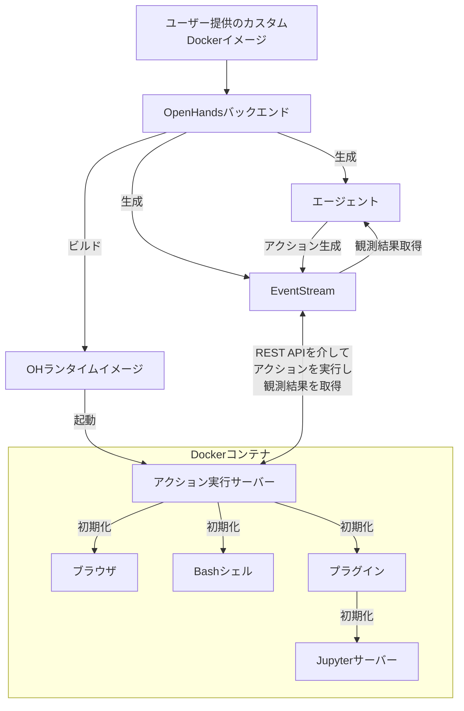

以下に翻訳結果を示します。

# 📦 Dockerランタイム

OpenHands Dockerランタイムは、AIエージェントのアクションを安全かつ柔軟に実行できるようにするコアコンポーネントです。
Dockerを使用してサンドボックス化された環境を作成し、ホストシステムを危険にさらすことなく任意のコードを安全に実行できます。

## サンドボックス化されたランタイムが必要な理由

OpenHandsでは、いくつかの理由から、信頼できないコードを安全で隔離された環境で実行する必要があります。

1. セキュリティ: 信頼できないコードを実行すると、ホストシステムに重大なリスクを及ぼす可能性があります。サンドボックス化された環境では、悪意のあるコードがホストシステムのリソースにアクセスしたり、変更したりすることを防ぐことができます。
2. 一貫性: サンドボックス化された環境では、異なるマシンやセットアップ間でコードの実行が一貫していることが保証され、「自分のマシンでは動作する」という問題が解消されます。
3. リソース制御: サンドボックス化により、リソースの割り当てと使用をより適切に制御でき、暴走プロセスがホストシステムに影響を与えることを防ぐことができます。
4. 分離: 異なるプロジェクトやユーザーは、ホストシステムや他のプロジェクトに干渉することなく、分離された環境で作業できます。
5. 再現性: サンドボックス化された環境では、実行環境が一貫しており制御可能であるため、バグや問題を再現しやすくなります。

## ランタイムの仕組み

OpenHandsランタイムシステムは、Dockerコンテナを使用してクライアント-サーバーアーキテクチャを実装しています。以下は、その仕組みの概要です。

1. ユーザー入力: ユーザーがカスタムベースDockerイメージを提供します。
2. イメージのビルド: OpenHandsは、ユーザー提供のイメージをベースに新しいDockerイメージ（「OHランタイムイメージ」）をビルドします。この新しいイメージには、主に「ランタイムクライアント」であるOpenHands固有のコードが含まれます。
3. コンテナの起動: OpenHandsが起動すると、OHランタイムイメージを使用してDockerコンテナが起動します。
4. アクション実行サーバーの初期化: アクション実行サーバーは、コンテナ内で`ActionExecutor`を初期化し、Bashシェルなどの必要なコンポーネントをセットアップし、指定されたプラグインをロードします。
5. 通信: OpenHandsバックエンド（`openhands/runtime/impl/eventstream/eventstream_runtime.py`）は、RESTful APIを介してアクション実行サーバーと通信し、アクションを送信し、観測結果を受信します。
6. アクションの実行: ランタイムクライアントはバックエンドからアクションを受信し、サンドボックス化された環境内でそれらを実行し、観測結果を送り返します。
7. 観測結果の返却: アクション実行サーバーは、実行結果を観測結果としてOpenHandsバックエンドに送り返します。

クライアントの役割:

- OpenHandsバックエンドとサンドボックス化された環境の間の仲介役を果たします。
- コンテナ内で様々なタイプのアクション（シェルコマンド、ファイル操作、Pythonコードなど）を安全に実行します。
- 現在の作業ディレクトリやロードされたプラグインなど、サンドボックス化された環境の状態を管理します。
- 観測結果をフォーマットしてバックエンドに返し、結果を処理するための一貫したインターフェースを確保します。

## OpenHandsがOHランタイムイメージをビルドおよび管理する方法

OpenHandsのランタイムイメージのビルドと管理に対するアプローチは、本番環境と開発環境の両方でDockerイメージを効率的、一貫性のある、柔軟な方法で作成および維持することを保証します。

詳細に興味がある場合は、[関連コード](https://github.com/All-Hands-AI/OpenHands/blob/main/openhands/runtime/utils/runtime_build.py)をチェックしてください。

### イメージタグ付けシステム

OpenHandsは、再現性と柔軟性のバランスを取るために、ランタイムイメージに3つのタグシステムを使用しています。
タグは以下の2つの形式のいずれかになります。

- **バージョン付きタグ**: `oh_v{openhands_version}_{base_image}` (例: `oh_v0.9.9_nikolaik_s_python-nodejs_t_python3.12-nodejs22`)
- **ロックタグ**: `oh_v{openhands_version}_{16_digit_lock_hash}` (例: `oh_v0.9.9_1234567890abcdef`)
- **ソースタグ**: `oh_v{openhands_version}_{16_digit_lock_hash}_{16_digit_source_hash}`
  (例: `oh_v0.9.9_1234567890abcdef_1234567890abcdef`)

#### ソースタグ - 最も具体的

これは、ソースディレクトリのディレクトリハッシュのMD5の最初の16桁です。これにより、openhandsソースのみのハッシュが得られます。

#### ロックタグ

このハッシュは、以下のMD5の最初の16桁から構築されます。

- イメージがビルドされたベースイメージの名前（例: `nikolaik/python-nodejs:python3.12-nodejs22`）
- イメージに含まれる`pyproject.toml`の内容
- イメージに含まれる`poetry.lock`の内容

これにより、ソースコードとは無関係に、Openhandsの依存関係のハッシュが効果的に得られます。

#### バージョン付きタグ - 最も一般的

このタグは、openhandsのバージョンとベースイメージ名（タグ標準に適合するように変換されたもの）を連結したものです。

#### ビルドプロセス

イメージを生成する際...

- **再ビルドなし**: OpenHandsは最初に、同じ**最も具体的なソースタグ**を持つイメージが存在するかどうかをチェックします。そのようなイメージが存在する場合、ビルドは実行されず、既存のイメージが使用されます。
- **最速の再ビルド**: 次に、OpenHandsは**一般的なロックタグ**を持つイメージが存在するかどうかをチェックします。そのようなイメージが存在する場合、OpenHandsはそれに基づいて新しいイメージをビルドし、現在のソースコードをコピーする最終操作を除くすべてのインストール手順（`poetry install`や`apt-get`など）をバイパスします。新しいイメージには**ソース**タグのみが付けられます。
- **まあまあの再ビルド**: **ソース**タグも**ロック**タグも存在しない場合、**バージョン付き**タグイメージに基づいてイメージがビルドされます。バージョン付きタグイメージでは、ほとんどの依存関係がすでにインストールされているため、時間を節約できます。
- **最も遅い再ビルド**: 3つのタグのすべてが存在しない場合、ベースイメージに基づいて新しいイメージがビルドされます（これは遅い操作です）。この新しいイメージには、**ソース**、**ロック**、**バージョン付き**の各タグが付けられます。

このタグ付けアプローチにより、OpenHandsは開発環境と本番環境の両方を効率的に管理できます。

1. 同一のソースコードとDockerfileは、常に同じイメージを生成します（ハッシュベースのタグを介して）。
2. 小さな変更が発生した場合、システムはイメージを迅速に再ビルドできます（最近の互換性のあるイメージを活用することで）。
3. **ロック**タグ（例: `runtime:oh_v0.9.3_1234567890abcdef`）は、特定のベースイメージ、依存関係、およびOpenHandsバージョンの組み合わせに対する最新のビルドを常に指します。

## ランタイムプラグインシステム

OpenHandsランタイムは、機能を拡張し、ランタイム環境をカスタマイズできるプラグインシステムをサポートしています。プラグインは、ランタイムクライアントの起動時に初期化されます。

独自のプラグインを実装したい場合は、[Jupyterプラグインの例](https://github.com/All-Hands-AI/OpenHands/blob/ecf4aed28b0cf7c18d4d8ff554883ba182fc6bdd/openhands/runtime/plugins/jupyter/__init__.py#L21-L55)をチェックしてください。

*プラグインシステムの詳細はまだ作成中です - 貢献を歓迎します！*

プラグインシステムの主な側面:

1. プラグインの定義: プラグインは、基本の`Plugin`クラスを継承するPythonクラスとして定義されます。
2. プラグインの登録: 利用可能なプラグインは、`ALL_PLUGINS`辞書に登録されます。
3. プラグインの指定: プラグインは、`Agent.sandbox_plugins: list[PluginRequirement]`に関連付けられます。ユーザーは、ランタイムを初期化するときにロードするプラグインを指定できます。
4. 初期化: プラグインは、ランタイムクライアントの起動時に非同期で初期化されます。
5. 使用: ランタイムクライアントは、初期化されたプラグインを使用して機能を拡張できます（例: IPythonセルを実行するためのJupyterPlugin）。
