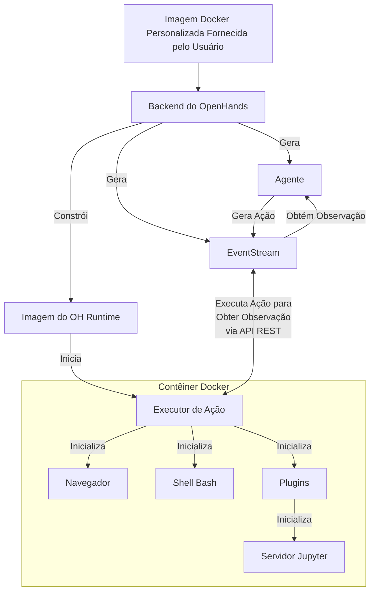

# 📦 Docker Runtime

O OpenHands Docker Runtime é o componente principal que permite a execução segura e flexível das ações do agente de IA.
Ele cria um ambiente isolado usando o Docker, onde código arbitrário pode ser executado com segurança sem arriscar o sistema host.

## Por que precisamos de um runtime isolado?

O OpenHands precisa executar código arbitrário em um ambiente seguro e isolado por várias razões:

1. Segurança: Executar código não confiável pode representar riscos significativos para o sistema host. Um ambiente isolado impede que código malicioso acesse ou modifique os recursos do sistema host
2. Consistência: Um ambiente isolado garante que a execução do código seja consistente em diferentes máquinas e configurações, eliminando problemas do tipo "funciona na minha máquina"
3. Controle de Recursos: O isolamento permite um melhor controle sobre a alocação e uso de recursos, evitando que processos descontrolados afetem o sistema host
4. Isolamento: Diferentes projetos ou usuários podem trabalhar em ambientes isolados sem interferir uns com os outros ou com o sistema host
5. Reprodutibilidade: Ambientes isolados facilitam a reprodução de bugs e problemas, já que o ambiente de execução é consistente e controlável

## Como o Runtime funciona?

O sistema OpenHands Runtime usa uma arquitetura cliente-servidor implementada com contêineres Docker. Aqui está uma visão geral de como ele funciona:

1. Entrada do Usuário: O usuário fornece uma imagem Docker base personalizada
2. Construção da Imagem: O OpenHands constrói uma nova imagem Docker (a "imagem do OH runtime") com base na imagem fornecida pelo usuário. Essa nova imagem inclui código específico do OpenHands, principalmente o "cliente de runtime"
3. Inicialização do Contêiner: Quando o OpenHands inicia, ele lança um contêiner Docker usando a imagem do OH runtime
4. Inicialização do Servidor de Execução de Ação: O servidor de execução de ação inicializa um `ActionExecutor` dentro do contêiner, configurando os componentes necessários, como um shell bash e carregando quaisquer plugins especificados
5. Comunicação: O backend do OpenHands (`openhands/runtime/impl/eventstream/eventstream_runtime.py`) se comunica com o servidor de execução de ação por meio de uma API RESTful, enviando ações e recebendo observações
6. Execução da Ação: O cliente de runtime recebe ações do backend, as executa no ambiente isolado e envia de volta as observações
7. Retorno da Observação: O servidor de execução de ação envia os resultados da execução de volta para o backend do OpenHands como observações

O papel do cliente:

- Ele atua como um intermediário entre o backend do OpenHands e o ambiente isolado
- Ele executa vários tipos de ações (comandos shell, operações de arquivo, código Python, etc.) com segurança dentro do contêiner
- Ele gerencia o estado do ambiente isolado, incluindo o diretório de trabalho atual e os plugins carregados
- Ele formata e retorna observações para o backend, garantindo uma interface consistente para processar os resultados

## Como o OpenHands constrói e mantém imagens do OH Runtime

A abordagem do OpenHands para construir e gerenciar imagens de runtime garante eficiência, consistência e flexibilidade na criação e manutenção de imagens Docker para ambientes de produção e desenvolvimento.

Confira o [código relevante](https://github.com/All-Hands-AI/OpenHands/blob/main/openhands/runtime/utils/runtime_build.py) se você estiver interessado em mais detalhes.

### Sistema de Tags de Imagem

O OpenHands usa um sistema de três tags para suas imagens de runtime para equilibrar reprodutibilidade com flexibilidade.
As tags podem estar em um dos 2 formatos:

- **Tag Versionada**: `oh_v{openhands_version}_{base_image}` (ex.: `oh_v0.9.9_nikolaik_s_python-nodejs_t_python3.12-nodejs22`)
- **Tag de Bloqueio**: `oh_v{openhands_version}_{16_digit_lock_hash}` (ex.: `oh_v0.9.9_1234567890abcdef`)
- **Tag de Origem**: `oh_v{openhands_version}_{16_digit_lock_hash}_{16_digit_source_hash}`
  (ex.: `oh_v0.9.9_1234567890abcdef_1234567890abcdef`)

#### Tag de Origem - Mais Específica

Estes são os primeiros 16 dígitos do MD5 do hash do diretório para o diretório de origem. Isso fornece um hash
apenas para o código-fonte do openhands

#### Tag de Bloqueio

Este hash é construído a partir dos primeiros 16 dígitos do MD5 de:

- O nome da imagem base sobre a qual a imagem foi construída (ex.: `nikolaik/python-nodejs:python3.12-nodejs22`)
- O conteúdo do `pyproject.toml` incluído na imagem.
- O conteúdo do `poetry.lock` incluído na imagem.

Isso efetivamente fornece um hash para as dependências do Openhands independente do código-fonte.

#### Tag Versionada - Mais Genérica

Esta tag é uma concatenação da versão do openhands e do nome da imagem base (transformado para se adequar ao padrão de tag).

#### Processo de Construção

Ao gerar uma imagem...

- **Sem reconstrução**: O OpenHands primeiro verifica se existe uma imagem com a mesma **tag de origem mais específica**. Se houver tal imagem,
  nenhuma construção é realizada - a imagem existente é usada.
- **Reconstrução mais rápida**: O OpenHands verifica em seguida se existe uma imagem com a **tag de bloqueio genérica**. Se houver tal imagem,
  o OpenHands constrói uma nova imagem com base nela, ignorando todas as etapas de instalação (como `poetry install` e
  `apt-get`), exceto uma operação final para copiar o código-fonte atual. A nova imagem é marcada apenas com uma
  tag de **origem**.
- **Reconstrução razoável**: Se não existir uma tag de **origem** nem de **bloqueio**, uma imagem será construída com base na imagem com tag **versionada**.
  Na imagem com tag versionada, a maioria das dependências já deve estar instalada, economizando tempo.
- **Reconstrução mais lenta**: Se todas as três tags não existirem, uma nova imagem é construída com base na imagem
  base (o que é uma operação mais lenta). Esta nova imagem é marcada com todas as tags de **origem**, **bloqueio** e **versionada**.

Essa abordagem de tags permite que o OpenHands gerencie com eficiência ambientes de desenvolvimento e produção.

1. Código-fonte e Dockerfile idênticos sempre produzem a mesma imagem (via tags baseadas em hash)
2. O sistema pode reconstruir rapidamente imagens quando ocorrem pequenas alterações (aproveitando imagens compatíveis recentes)
3. A tag de **bloqueio** (ex.: `runtime:oh_v0.9.3_1234567890abcdef`) sempre aponta para a construção mais recente para uma combinação específica de imagem base, dependência e versão do OpenHands

## Sistema de Plugins do Runtime

O OpenHands Runtime suporta um sistema de plugins que permite estender a funcionalidade e personalizar o ambiente de runtime. Os plugins são inicializados quando o cliente de runtime é iniciado.

Confira [um exemplo do plugin Jupyter aqui](https://github.com/All-Hands-AI/OpenHands/blob/ecf4aed28b0cf7c18d4d8ff554883ba182fc6bdd/openhands/runtime/plugins/jupyter/__init__.py#L21-L55) se você quiser implementar seu próprio plugin.

_Mais detalhes sobre o sistema de Plugins ainda estão em construção - contribuições são bem-vindas!_

Aspectos-chave do sistema de plugins:

1. Definição de Plugin: Os plugins são definidos como classes Python que herdam de uma classe base `Plugin`
2. Registro de Plugin: Os plugins disponíveis são registrados em um dicionário `ALL_PLUGINS`
3. Especificação de Plugin: Os plugins são associados a `Agent.sandbox_plugins: list[PluginRequirement]`. Os usuários podem especificar quais plugins carregar ao inicializar o runtime
4. Inicialização: Os plugins são inicializados de forma assíncrona quando o cliente de runtime é iniciado
5. Uso: O cliente de runtime pode usar plugins inicializados para estender suas capacidades (por exemplo, o JupyterPlugin para executar células IPython)
