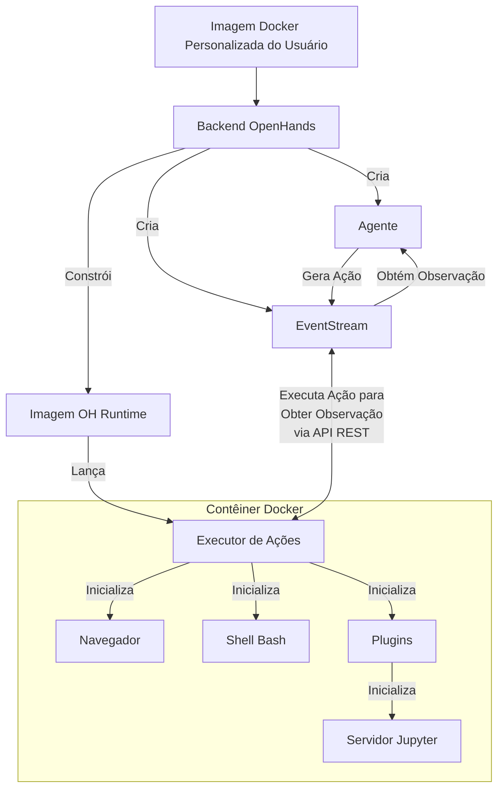

# 📦 Docker Runtime

O Docker Runtime do OpenHands é o componente central que permite a execução segura e flexível das ações do agente de IA.
Ele cria um ambiente isolado (sandbox) usando Docker, onde código arbitrário pode ser executado com segurança sem colocar em risco o sistema host.

## Por que precisamos de um runtime em sandbox?

O OpenHands precisa executar código arbitrário em um ambiente seguro e isolado por várias razões:

1. Segurança: A execução de código não confiável pode representar riscos significativos para o sistema host. Um ambiente em sandbox impede que código malicioso acesse ou modifique os recursos do sistema host
2. Consistência: Um ambiente em sandbox garante que a execução do código seja consistente em diferentes máquinas e configurações, eliminando problemas do tipo "funciona na minha máquina"
3. Controle de Recursos: O sandbox permite um melhor controle sobre a alocação e uso de recursos, evitando que processos descontrolados afetem o sistema host
4. Isolamento: Diferentes projetos ou usuários podem trabalhar em ambientes isolados sem interferir uns com os outros ou com o sistema host
5. Reprodutibilidade: Ambientes em sandbox facilitam a reprodução de bugs e problemas, já que o ambiente de execução é consistente e controlável

## Como funciona o Runtime?

O sistema Runtime do OpenHands usa uma arquitetura cliente-servidor implementada com contêineres Docker. Veja uma visão geral de como funciona:

1. Entrada do Usuário: O usuário fornece uma imagem Docker base personalizada
2. Construção da Imagem: O OpenHands constrói uma nova imagem Docker (a "imagem OH runtime") baseada na imagem fornecida pelo usuário. Esta nova imagem inclui código específico do OpenHands, principalmente o "cliente runtime"
3. Lançamento do Contêiner: Quando o OpenHands inicia, ele lança um contêiner Docker usando a imagem OH runtime
4. Inicialização do Servidor de Execução de Ações: O servidor de execução de ações inicializa um `ActionExecutor` dentro do contêiner, configurando componentes necessários como um shell bash e carregando quaisquer plugins especificados
5. Comunicação: O backend do OpenHands (`openhands/runtime/impl/eventstream/eventstream_runtime.py`) se comunica com o servidor de execução de ações através de API RESTful, enviando ações e recebendo observações
6. Execução de Ações: O cliente runtime recebe ações do backend, executa-as no ambiente sandbox e envia de volta as observações
7. Retorno de Observação: O servidor de execução de ações envia os resultados da execução de volta ao backend do OpenHands como observações

O papel do cliente:

- Atua como intermediário entre o backend do OpenHands e o ambiente sandbox
- Executa vários tipos de ações (comandos shell, operações de arquivo, código Python, etc.) com segurança dentro do contêiner
- Gerencia o estado do ambiente sandbox, incluindo o diretório de trabalho atual e plugins carregados
- Formata e retorna observações para o backend, garantindo uma interface consistente para processamento de resultados

## Como o OpenHands constrói e mantém imagens OH Runtime

A abordagem do OpenHands para construir e gerenciar imagens runtime garante eficiência, consistência e flexibilidade na criação e manutenção de imagens Docker para ambientes de produção e desenvolvimento.

Confira o [código relevante](https://github.com/All-Hands-AI/OpenHands/blob/main/openhands/runtime/utils/runtime_build.py) se você estiver interessado em mais detalhes.

### Sistema de Marcação de Imagens

O OpenHands usa um sistema de três tags para suas imagens runtime para equilibrar reprodutibilidade com flexibilidade.
As tags podem estar em um dos 2 formatos:

- **Tag Versionada**: `oh_v{openhands_version}_{base_image}` (ex.: `oh_v0.9.9_nikolaik_s_python-nodejs_t_python3.12-nodejs22`)
- **Tag de Bloqueio**: `oh_v{openhands_version}_{16_digit_lock_hash}` (ex.: `oh_v0.9.9_1234567890abcdef`)
- **Tag de Fonte**: `oh_v{openhands_version}_{16_digit_lock_hash}_{16_digit_source_hash}`
  (ex.: `oh_v0.9.9_1234567890abcdef_1234567890abcdef`)

#### Tag de Fonte - Mais Específica

Esta é os primeiros 16 dígitos do MD5 do hash do diretório para o diretório fonte. Isso fornece um hash
apenas para o código fonte do openhands

#### Tag de Bloqueio

Este hash é construído a partir dos primeiros 16 dígitos do MD5 de:

- O nome da imagem base sobre a qual a imagem foi construída (ex.: `nikolaik/python-nodejs:python3.12-nodejs22`)
- O conteúdo do `pyproject.toml` incluído na imagem.
- O conteúdo do `poetry.lock` incluído na imagem.

Isso efetivamente fornece um hash para as dependências do Openhands independente do código fonte.

#### Tag Versionada - Mais Genérica

Esta tag é uma concatenação da versão do openhands e do nome da imagem base (transformado para se adequar ao padrão de tag).

#### Processo de Construção

Ao gerar uma imagem...

- **Sem reconstrução**: O OpenHands primeiro verifica se existe uma imagem com a mesma **tag de fonte mais específica**. Se existir tal imagem,
  nenhuma construção é realizada - a imagem existente é usada.
- **Reconstrução mais rápida**: O OpenHands verifica em seguida se existe uma imagem com a **tag de bloqueio genérica**. Se existir tal imagem,
  o OpenHands constrói uma nova imagem baseada nela, ignorando todas as etapas de instalação (como `poetry install` e
  `apt-get`) exceto uma operação final para copiar o código fonte atual. A nova imagem é marcada apenas com uma
  tag de **fonte**.
- **Reconstrução razoável**: Se nem uma tag de **fonte** nem de **bloqueio** existir, uma imagem será construída com base na imagem de tag **versionada**.
  Na imagem de tag versionada, a maioria das dependências já deve estar instalada, economizando tempo.
- **Reconstrução mais lenta**: Se todas as três tags não existirem, uma imagem totalmente nova é construída com base na imagem
  base (o que é uma operação mais lenta). Esta nova imagem é marcada com todas as tags de **fonte**, **bloqueio** e **versionada**.

Esta abordagem de marcação permite que o OpenHands gerencie eficientemente ambientes de desenvolvimento e produção.

1. Código fonte idêntico e Dockerfile sempre produzem a mesma imagem (via tags baseadas em hash)
2. O sistema pode reconstruir rapidamente imagens quando ocorrem mudanças menores (aproveitando imagens compatíveis recentes)
3. A tag de **bloqueio** (ex., `runtime:oh_v0.9.3_1234567890abcdef`) sempre aponta para a construção mais recente para uma combinação específica de imagem base, dependência e versão do OpenHands

## Sistema de Plugins do Runtime

O Runtime do OpenHands suporta um sistema de plugins que permite estender a funcionalidade e personalizar o ambiente de runtime. Os plugins são inicializados quando o cliente runtime é iniciado.

Confira [um exemplo de plugin Jupyter aqui](https://github.com/All-Hands-AI/OpenHands/blob/ecf4aed28b0cf7c18d4d8ff554883ba182fc6bdd/openhands/runtime/plugins/jupyter/__init__.py#L21-L55) se você quiser implementar seu próprio plugin.

*Mais detalhes sobre o sistema de Plugins ainda estão em construção - contribuições são bem-vindas!*

Aspectos-chave do sistema de plugins:

1. Definição de Plugin: Os plugins são definidos como classes Python que herdam de uma classe base `Plugin`
2. Registro de Plugin: Os plugins disponíveis são registrados em um dicionário `ALL_PLUGINS`
3. Especificação de Plugin: Os plugins são associados com `Agent.sandbox_plugins: list[PluginRequirement]`. Os usuários podem especificar quais plugins carregar ao inicializar o runtime
4. Inicialização: Os plugins são inicializados de forma assíncrona quando o cliente runtime inicia
5. Uso: O cliente runtime pode usar plugins inicializados para estender suas capacidades (ex., o JupyterPlugin para executar células IPython)
