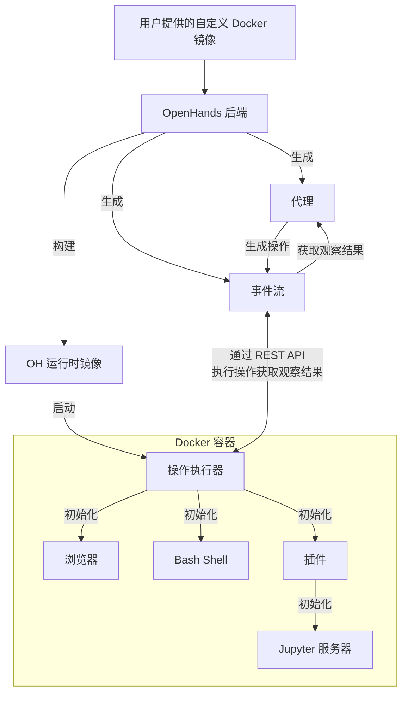

# 📦 Docker 运行时

OpenHands Docker 运行时是使 AI 代理能够安全灵活执行操作的核心组件。
它使用 Docker 创建一个沙盒环境，在这个环境中可以安全地运行任意代码，而不会危及宿主系统。

## 为什么我们需要沙盒运行时？

OpenHands 需要在安全、隔离的环境中执行任意代码，原因如下：

1. 安全性：执行不受信任的代码可能对宿主系统造成重大风险。沙盒环境可防止恶意代码访问或修改宿主系统的资源
2. 一致性：沙盒环境确保代码执行在不同机器和设置上保持一致，消除"在我的机器上可以运行"的问题
3. 资源控制：沙盒允许更好地控制资源分配和使用，防止失控进程影响宿主系统
4. 隔离：不同项目或用户可以在隔离的环境中工作，而不会相互干扰或影响宿主系统
5. 可重现性：沙盒环境使得重现错误和问题变得更容易，因为执行环境是一致且可控的

## 运行时如何工作？

OpenHands 运行时系统使用 Docker 容器实现的客户端-服务器架构。以下是其工作原理概述：

1. 用户输入：用户提供自定义基础 Docker 镜像
2. 镜像构建：OpenHands 基于用户提供的镜像构建新的 Docker 镜像（"OH 运行时镜像"）。这个新镜像包含 OpenHands 特定代码，主要是"运行时客户端"
3. 容器启动：当 OpenHands 启动时，它使用 OH 运行时镜像启动 Docker 容器
4. 操作执行服务器初始化：操作执行服务器在容器内初始化 `ActionExecutor`，设置必要组件如 bash shell 并加载指定的插件
5. 通信：OpenHands 后端（`openhands/runtime/impl/eventstream/eventstream_runtime.py`）通过 RESTful API 与操作执行服务器通信，发送操作并接收观察结果
6. 操作执行：运行时客户端从后端接收操作，在沙盒环境中执行它们，并返回观察结果
7. 观察结果返回：操作执行服务器将执行结果作为观察结果发送回 OpenHands 后端

客户端的角色：

- 它充当 OpenHands 后端和沙盒环境之间的中介
- 它在容器内安全地执行各种类型的操作（shell 命令、文件操作、Python 代码等）
- 它管理沙盒环境的状态，包括当前工作目录和已加载的插件
- 它格式化并将观察结果返回给后端，确保处理结果的接口一致

## OpenHands 如何构建和维护 OH 运行时镜像

OpenHands 构建和管理运行时镜像的方法确保了在创建和维护生产和开发环境的 Docker 镜像时的效率、一致性和灵活性。

如果您对更多细节感兴趣，请查看[相关代码](https://github.com/All-Hands-AI/OpenHands/blob/main/openhands/runtime/utils/runtime_build.py)。

### 镜像标签系统

OpenHands 使用三标签系统来平衡其运行时镜像的可重现性和灵活性。
标签可能采用以下 2 种格式之一：

- **版本标签**：`oh_v{openhands_version}_{base_image}`（例如：`oh_v0.9.9_nikolaik_s_python-nodejs_t_python3.12-nodejs22`）
- **锁定标签**：`oh_v{openhands_version}_{16_digit_lock_hash}`（例如：`oh_v0.9.9_1234567890abcdef`）
- **源码标签**：`oh_v{openhands_version}_{16_digit_lock_hash}_{16_digit_source_hash}`
  （例如：`oh_v0.9.9_1234567890abcdef_1234567890abcdef`）

#### 源码标签 - 最具体

这是源目录的目录哈希的 MD5 的前 16 位数字。这仅为 openhands 源码提供了一个哈希值。

#### 锁定标签

此哈希值由以下内容的 MD5 的前 16 位数字构建：

- 构建镜像所基于的基础镜像的名称（例如：`nikolaik/python-nodejs:python3.12-nodejs22`）
- 镜像中包含的 `pyproject.toml` 的内容
- 镜像中包含的 `poetry.lock` 的内容

这有效地为 Openhands 的依赖项提供了一个独立于源代码的哈希值。

#### 版本标签 - 最通用

此标签是 openhands 版本和基础镜像名称（转换为符合标签标准）的连接。

#### 构建过程

生成镜像时...

- **无需重建**：OpenHands 首先检查是否存在具有相同**最具体源码标签**的镜像。如果存在这样的镜像，则不执行构建 - 使用现有镜像。
- **最快重建**：OpenHands 接下来检查是否存在具有**通用锁定标签**的镜像。如果存在这样的镜像，OpenHands 基于它构建新镜像，绕过所有安装步骤（如 `poetry install` 和 `apt-get`），只执行最后一步操作来复制当前源代码。新镜像仅使用**源码**标签标记。
- **一般重建**：如果既没有**源码**标签也没有**锁定**标签存在，将基于**版本**标签镜像构建镜像。在版本标签镜像中，大多数依赖项应该已经安装，从而节省时间。
- **最慢重建**：如果三个标签都不存在，将基于基础镜像构建全新镜像（这是一个较慢的操作）。这个新镜像将使用所有**源码**、**锁定**和**版本**标签进行标记。

这种标签方法使 OpenHands 能够高效管理开发和生产环境。

1. 相同的源代码和 Dockerfile 总是产生相同的镜像（通过基于哈希的标签）
2. 当发生微小变化时，系统可以快速重建镜像（通过利用最近的兼容镜像）
3. **锁定**标签（例如，`runtime:oh_v0.9.3_1234567890abcdef`）始终指向特定基础镜像、依赖项和 OpenHands 版本组合的最新构建

## 运行时插件系统

OpenHands 运行时支持插件系统，允许扩展功能和自定义运行时环境。插件在运行时客户端启动时初始化。

如果您想实现自己的插件，请查看[这里的 Jupyter 插件示例](https://github.com/All-Hands-AI/OpenHands/blob/ecf4aed28b0cf7c18d4d8ff554883ba182fc6bdd/openhands/runtime/plugins/jupyter/__init__.py#L21-L55)。

*关于插件系统的更多详细信息仍在建设中 - 欢迎贡献！*

插件系统的关键方面：

1. 插件定义：插件被定义为继承自基础 `Plugin` 类的 Python 类
2. 插件注册：可用插件在 `ALL_PLUGINS` 字典中注册
3. 插件规范：插件与 `Agent.sandbox_plugins: list[PluginRequirement]` 相关联。用户可以在初始化运行时时指定要加载的插件
4. 初始化：插件在运行时客户端启动时异步初始化
5. 使用：运行时客户端可以使用已初始化的插件来扩展其功能（例如，用于运行 IPython 单元格的 JupyterPlugin）
