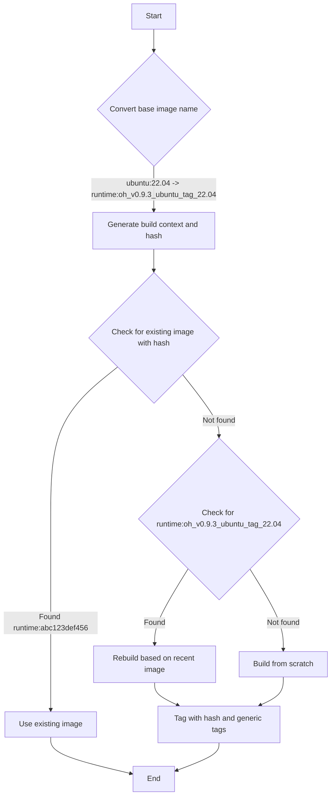

# 📦 EventStream Runtime

The OpenHands EventStream Runtime is the core component that enables secure and flexible execution of AI agent's action.
It creates a sandboxed environment using Docker, where arbitrary code can be run safely without risking the host system.

## Why do we need a sandboxed runtime?

OpenHands needs to execute arbitrary code in a secure, isolated environment for several reasons:

1. Security: Executing untrusted code can pose significant risks to the host system. A sandboxed environment prevents malicious code from accessing or modifying the host system's resources
2. Consistency: A sandboxed environment ensures that code execution is consistent across different machines and setups, eliminating "it works on my machine" issues
3. Resource Control: Sandboxing allows for better control over resource allocation and usage, preventing runaway processes from affecting the host system
4. Isolation: Different projects or users can work in isolated environments without interfering with each other or the host system
5. Reproducibility: Sandboxed environments make it easier to reproduce bugs and issues, as the execution environment is consistent and controllable

## How does the Runtime work?

The OpenHands Runtime system uses a client-server architecture implemented with Docker containers. Here's an overview of how it works:

1. User Input: The user provides a custom base Docker image
2. Image Building: OpenHands builds a new Docker image (the "OH runtime image") based on the user-provided image. This new image includes OpenHands-specific code, primarily the "runtime client"
3. Container Launch: When OpenHands starts, it launches a Docker container using the OH runtime image
4. Client Initialization: The runtime client initializes inside the container, setting up necessary components like a bash shell and loading any specified plugins
5. Communication: The OpenHands backend (`runtime.py`) communicates with the runtime client over RESTful API, sending actions and receiving observations
6. Action Execution: The runtime client receives actions from the backend, executes them in the sandboxed environment, and sends back observations
7. Observation Return: The client sends execution results back to the OpenHands backend as observations

The role of the client:
- It acts as an intermediary between the OpenHands backend and the sandboxed environment
- It executes various types of actions (shell commands, file operations, Python code, etc.) safely within the container
- It manages the state of the sandboxed environment, including the current working directory and loaded plugins
- It formats and returns observations to the backend, ensuring a consistent interface for processing results

## How OpenHands builds and maintains OH Runtime images

OpenHands' approach to building and managing runtime images ensures efficiency, consistency, and flexibility in creating and maintaining Docker images for both production and development environments.

Check out the [relevant code](https://github.com/All-Hands-AI/OpenHands/blob/main/openhands/runtime/utils/runtime_build.py) if you are interested in more details.

### Image Tagging System

OpenHands uses a dual-tagging system for its runtime images to balance reproducibility with flexibility:

1. Hash-based tag: `{target_image_repo}:{target_image_hash_tag}`.
   Example: `runtime:abc123def456`

   - This tag is based on the MD5 hash of the Docker build folder, which includes the source code (of runtime client and related dependencies) and Dockerfile
   - Identical hash tags guarantee that the images were built with exactly the same source code and Dockerfile
   - This ensures reproducibility; the same hash always means the same image contents

2. Generic tag: `{target_image_repo}:{target_image_tag}`.
   Example: `runtime:oh_v0.9.3_ubuntu_tag_22.04`

   - This tag follows the format: `runtime:oh_v{OH_VERSION}_{BASE_IMAGE_NAME}_tag_{BASE_IMAGE_TAG}`
   - It represents the latest build for a particular base image and OpenHands version combination
   - This tag is updated whenever a new image is built from the same base image, even if the source code changes

The hash-based tag ensures reproducibility, while the generic tag provides a stable reference to the latest version of a particular configuration. This dual-tagging approach allows OpenHands to efficiently manage both development and production environments.

### Build Process

1. Image Naming Convention:
   - Hash-based tag: `{target_image_repo}:{target_image_hash_tag}`.
     Example: `runtime:abc123def456`
   - Generic tag: `{target_image_repo}:{target_image_tag}`.
     Example: `runtime:oh_v0.9.3_ubuntu_tag_22.04`

2. Build Process:
   - a. Convert the base image name to an OH runtime image name
      Example: `ubuntu:22.04` -> `runtime:oh_v0.9.3_ubuntu_tag_22.04`
   - b. Generate a build context (Dockerfile and OpenHands source code) and calculate its hash
   - c. Check for an existing image with the calculated hash
   - d. If not found, check for a recent compatible image to use as a base
   - e. If no compatible image exists, build from scratch using the original base image
   - f. Tag the new image with both hash-based and generic tags

3. Image Reuse and Rebuilding Logic:
   The system follows these steps to determine whether to build a new image or use an existing one from a user-provided (base) image (e.g., `ubuntu:22.04`):
   - a. If an image exists with the same hash (e.g., `runtime:abc123def456`), it will be reused as is
   - b. If the exact hash is not found, the system will try to rebuild using the latest generic image (e.g., `runtime:oh_v0.9.3_ubuntu_tag_22.04`) as a base. This saves time by leveraging existing dependencies
   - c. If neither the hash-tagged nor the generic-tagged image is found, the system will build the image completely from scratch

4. Caching and Efficiency:
   - The system attempts to reuse existing images when possible to save build time
   - If an exact match (by hash) is found, it's used without rebuilding
   - If a compatible image is found, it's used as a base for rebuilding, saving time on dependency installation

Here's a flowchart illustrating the build process:

This approach ensures that:

1. Identical source code and Dockerfile always produce the same image (via hash-based tags)
2. The system can quickly rebuild images when minor changes occur (by leveraging recent compatible images)
3. The generic tag (e.g., `runtime:oh_v0.9.3_ubuntu_tag_22.04`) always points to the latest build for a particular base image and OpenHands version combination

## Runtime Plugin System

The OpenHands Runtime supports a plugin system that allows for extending functionality and customizing the runtime environment. Plugins are initialized when the runtime client starts up.

Check [an example of Jupyter plugin here](https://github.com/All-Hands-AI/OpenHands/blob/ecf4aed28b0cf7c18d4d8ff554883ba182fc6bdd/openhands/runtime/plugins/jupyter/__init__.py#L21-L55) if you want to implement your own plugin.

*More details about the Plugin system are still under construction - contributions are welcomed!*

Key aspects of the plugin system:

1. Plugin Definition: Plugins are defined as Python classes that inherit from a base `Plugin` class
2. Plugin Registration: Available plugins are registered in an `ALL_PLUGINS` dictionary
3. Plugin Specification: Plugins are associated with `Agent.sandbox_plugins: list[PluginRequirement]`. Users can specify which plugins to load when initializing the runtime
4. Initialization: Plugins are initialized asynchronously when the runtime client starts
5. Usage: The runtime client can use initialized plugins to extend its capabilities (e.g., the JupyterPlugin for running IPython cells)
