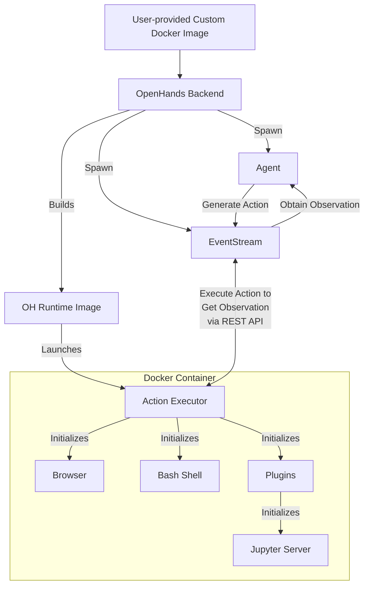

# 📦 Docker Runtime

The OpenHands Docker Runtime is the core component that enables secure and flexible execution of AI agent's action.
It creates a sandboxed environment using Docker, where arbitrary code can be run safely without risking the host system.

## Why do we need a sandboxed runtime?

OpenHands needs to execute arbitrary code in a secure, isolated environment for several reasons:

1. Security: Executing untrusted code can pose significant risks to the host system. A sandboxed environment prevents malicious code from accessing or modifying the host system's resources
2. Consistency: A sandboxed environment ensures that code execution is consistent across different machines and setups, eliminating "it works on my machine" issues
3. Resource Control: Sandboxing allows for better control over resource allocation and usage, preventing runaway processes from affecting the host system
4. Isolation: Different projects or users can work in isolated environments without interfering with each other or the host system
5. Reproducibility: Sandboxed environments make it easier to reproduce bugs and issues, as the execution environment is consistent and controllable

## How does the Runtime work?

The OpenHands Runtime system uses a client-server architecture implemented with Docker containers. Here's an overview of how it works:

1. User Input: The user provides a custom base Docker image
2. Image Building: OpenHands builds a new Docker image (the "OH runtime image") based on the user-provided image. This new image includes OpenHands-specific code, primarily the "runtime client"
3. Container Launch: When OpenHands starts, it launches a Docker container using the OH runtime image
4. Action Execution Server Initialization: The action execution server initializes an `ActionExecutor` inside the container, setting up necessary components like a bash shell and loading any specified plugins
5. Communication: The OpenHands backend (`openhands/runtime/impl/eventstream/eventstream_runtime.py`) communicates with the action execution server over RESTful API, sending actions and receiving observations
6. Action Execution: The runtime client receives actions from the backend, executes them in the sandboxed environment, and sends back observations
7. Observation Return: The action execution server sends execution results back to the OpenHands backend as observations

The role of the client:

- It acts as an intermediary between the OpenHands backend and the sandboxed environment
- It executes various types of actions (shell commands, file operations, Python code, etc.) safely within the container
- It manages the state of the sandboxed environment, including the current working directory and loaded plugins
- It formats and returns observations to the backend, ensuring a consistent interface for processing results

## How OpenHands builds and maintains OH Runtime images

OpenHands' approach to building and managing runtime images ensures efficiency, consistency, and flexibility in creating and maintaining Docker images for both production and development environments.

Check out the [relevant code](https://github.com/All-Hands-AI/OpenHands/blob/main/openhands/runtime/utils/runtime_build.py) if you are interested in more details.

OpenHands uses a two-stage build process for runtime images. See [Runtime Building Approach](runtime_build.md) for details.

### Image Tagging System

OpenHands uses a simple tagging system for its runtime images:

- **Dependencies Image**: `oh_deps_v{openhands_version}` (e.g.: `oh_deps_v0.9.9`)
- **Runtime Image**: `oh_v{openhands_version}_image_{base_image}_tag_{tag}_{source_hash}`
  (e.g.: `oh_v0.9.9_image_nikolaik_s_python-nodejs_tag_python3.12-nodejs22_1234abcd`)

#### Dependencies Image

This image contains all the dependencies needed by OpenHands, installed in the `/openhands` folder. It's built once per OpenHands version and can be reused for multiple runtime images.

#### Runtime Image

This image is built by copying the `/openhands` folder from the dependencies image into any base image. The tag includes:
- The OpenHands version
- The base image name (transformed to fit in tag standard)
- A hash of the OpenHands source code

#### Build Process

When generating an image:

1. **Dependencies Image**: If the dependencies image doesn't exist, it's built first
2. **Runtime Image**: The runtime image is built by copying from the dependencies image
3. **Caching**: If a runtime image with the same tag already exists, it's reused unless force_rebuild is specified

This approach offers several advantages:
- Faster build times for new base images
- Smaller final images (no duplicate dependencies)
- Better compatibility with different base images
- Easier maintenance and updates

## Runtime Plugin System

The OpenHands Runtime supports a plugin system that allows for extending functionality and customizing the runtime environment. Plugins are initialized when the runtime client starts up.

Check [an example of Jupyter plugin here](https://github.com/All-Hands-AI/OpenHands/blob/ecf4aed28b0cf7c18d4d8ff554883ba182fc6bdd/openhands/runtime/plugins/jupyter/__init__.py#L21-L55) if you want to implement your own plugin.

*More details about the Plugin system are still under construction - contributions are welcomed!*

Key aspects of the plugin system:

1. Plugin Definition: Plugins are defined as Python classes that inherit from a base `Plugin` class
2. Plugin Registration: Available plugins are registered in an `ALL_PLUGINS` dictionary
3. Plugin Specification: Plugins are associated with `Agent.sandbox_plugins: list[PluginRequirement]`. Users can specify which plugins to load when initializing the runtime
4. Initialization: Plugins are initialized asynchronously when the runtime client starts
5. Usage: The runtime client can use initialized plugins to extend its capabilities (e.g., the JupyterPlugin for running IPython cells)
