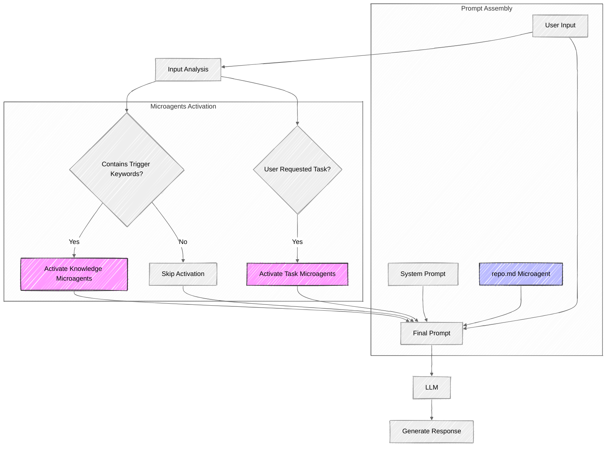

# Microagents Overview

Microagents are specialized prompts that enhance OpenHands with domain-specific knowledge, repository-specific context
and task-specific workflows. They help by providing expert guidance, automating common tasks, and ensuring
consistent practices across projects.

## Microagent Categories

Currently OpenHands supports two categories of microagents:

- [Repository-specific Microagents](./microagents-repo): Repository-specific context and guidelines for OpenHands.
- [Public Microagents](./microagents-public): General guidelines triggered by keywords for all OpenHands users.

A microagent is classified as repository-specific or public depending on its location:

- Repository-specific microagents are located in a repository's `.openhands/microagents/` directory
- Public microagents are located in the official OpenHands repository inside the `/microagents` folder

When OpenHands works with a repository, it:

1. Loads **repository-specific** microagents from `.openhands/microagents/` if present in the repository.
2. Loads **public knowledge** microagents triggered by keywords in conversations
3. Loads **public tasks** microagents when explicitly requested by the user

You can check out the existing public microagents at the [official OpenHands repository](https://github.com/All-Hands-AI/OpenHands/tree/main/microagents/).

## Microagents Discovery and Loading

OpenHands uses the following process to discover and load microagents:

1. For **repository-specific** microagents:

   - Searches for `.openhands/microagents/repo.md` as the main repository instruction file
   - Recursively scans the `.openhands/microagents/knowledge/` directory for knowledge microagents
   - Recursively scans the `.openhands/microagents/tasks/` directory for task microagents
   - All `.md` files within these directories are processed, regardless of their depth

2. For **public** microagents:
   - Loads from the official OpenHands repository's `/microagents/knowledge/` and `/microagents/tasks/` directories
   - Only processes files that match their expected location patterns

Note that `README.md` files are automatically skipped during the loading process.

## Microagents Assembly and Activation

OpenHands employs a systematic approach to microagent assembly and activation, as illustrated in the diagram below. This process ensures that relevant microagents are incorporated into the prompt at the right time based on the conversation context.

When a user interacts with OpenHands, the system processes the input through several key stages:

1. **Input Analysis**: The user's input is analyzed to identify potential triggers for relevant microagents. This analysis runs in parallel to including the user input in the final prompt.

2. **Repository Microagents Inclusion**: The repository-specific microagent (from `.openhands/microagents/repo.md`) is automatically loaded and included in every prompt when working within that repository, regardless of the conversation content.

3. **Public Microagents Activation**: Based on the input analysis, the system checks for trigger keywords:

   - If trigger keywords are detected, the relevant knowledge microagents are activated and included in the prompt.
   - If the user requested for specific tasks microagents, they are activated and included in the prompt.

4. **Prompt Assembly**: The final prompt combines:

   - The system prompt (core instructions for OpenHands)
   - The Repository microagent (if present)
   - The knowledge microagents (if triggered)
   - The tasks microagents (if asked by the user)
   - The user's input

5. **LLM Processing and Response**: The assembled prompt is sent to the LLM powering OpenHands, which generates a response incorporating expertise from all activated microagents.

This architecture allows OpenHands to dynamically adjust its capabilities based on the conversation context. The elements with colors in the diagram represent the microagents that enhance the base system prompt with specialized knowledge and capabilities, creating a more context-aware and powerful AI assistant.

## Microagent Format

All microagents use markdown files with YAML frontmatter that have special instructions to help OpenHands activate them.

Check out the [syntax documentation](./microagents-syntax) for a comprehensive guide on how to configure your microagents.
