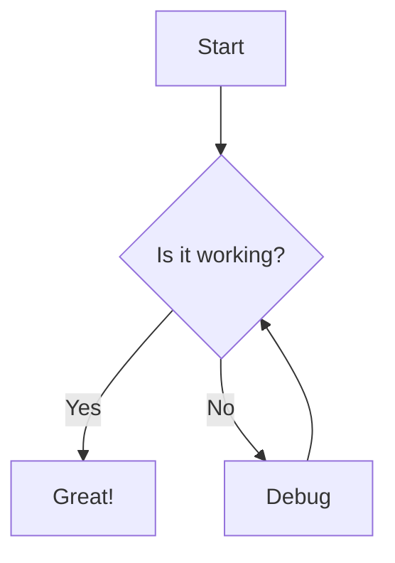

# Mermaid Diagram Panel - Product Specification

## Overview

This document outlines the specifications for adding a new panel to the OpenHands application that renders Mermaid diagrams. Mermaid is a JavaScript-based diagramming and charting tool that renders Markdown-inspired text definitions to create and modify diagrams dynamically.

## Problem Statement

Currently, OpenHands does not have native support for rendering diagrams, which limits the agent's ability to visually communicate complex information such as:
- Flowcharts
- Sequence diagrams
- Class diagrams
- Entity-relationship diagrams
- State diagrams
- Gantt charts

Adding Mermaid diagram support will enhance the agent's ability to explain complex systems, processes, and relationships visually, improving user understanding and collaboration.

## User Stories

1. As a user, I want to see Mermaid diagrams rendered in the chat interface when the agent includes diagram code in its responses.
2. As a user, I want to be able to copy the Mermaid code from rendered diagrams to use elsewhere.
3. As a user, I want to be able to expand/collapse diagram panels for better space management.
4. As a developer, I want to be able to include Mermaid diagrams in my documentation that will be properly rendered in the OpenHands interface.

## Requirements

### Functional Requirements

1. **Mermaid Syntax Detection**: The system should detect Mermaid syntax in markdown code blocks with the `mermaid` language identifier.
2. **Diagram Rendering**: The system should render Mermaid diagrams from the detected syntax.
3. **Diagram Panel**: Rendered diagrams should be displayed in a dedicated, collapsible panel.
4. **Copy Functionality**: Users should be able to copy the Mermaid code with a single click.
5. **Error Handling**: The system should gracefully handle and display errors in Mermaid syntax.
6. **Responsive Design**: Diagrams should be responsive and adapt to different screen sizes.

### Non-Functional Requirements

1. **Performance**: Diagram rendering should not significantly impact application performance.
2. **Accessibility**: Diagram panels should be accessible according to WCAG 2.1 AA standards.
3. **Compatibility**: The feature should work across all supported browsers.
4. **Internationalization**: UI elements should support localization.

## Technical Design

### Dependencies

- `mermaid`: Core library for parsing and rendering Mermaid diagrams
- `@mermaid-js/mermaid-react`: React component wrapper for Mermaid

### Components

1. **MermaidDiagram Component**
   - Renders a Mermaid diagram from provided code
   - Handles error states
   - Provides copy functionality

2. **MermaidPanel Component**
   - Collapsible container for the diagram
   - Includes header with title and controls

3. **Custom Markdown Renderer**
   - Extension of existing markdown rendering to detect and process Mermaid code blocks

### Integration Points

1. **Markdown Rendering Pipeline**
   - Extend the existing markdown code component to detect and handle Mermaid code blocks
   - Update the `code` component in `/frontend/src/components/features/markdown/code.tsx`

2. **Action Handling**
   - Update the chat slice to properly handle and display Mermaid diagrams
   - Add Mermaid-specific handling in `/frontend/src/state/chat-slice.ts`

3. **UI Integration**
   - Add styling for Mermaid panels in the appropriate CSS files
   - Ensure proper responsiveness and theme compatibility

### Data Flow

1. Agent includes Mermaid code in a response
2. Markdown renderer detects Mermaid code block
3. MermaidDiagram component renders the diagram
4. User interacts with the diagram panel (expand/collapse, copy code)

## UI/UX Design

### Diagram Panel

The Mermaid diagram panel should have:
- A header with:
  - "Diagram" title
  - Expand/collapse toggle
  - Copy code button
- The rendered diagram in the body
- A collapsible code view showing the Mermaid syntax

### Visual Style

- The panel should match the existing application theme
- Diagrams should use colors that are compatible with both light and dark themes
- The panel should have subtle borders and shadow to distinguish it from regular text content

### Interactions

- Clicking the expand/collapse toggle should show/hide the diagram
- Hovering over the diagram should show a copy button
- Clicking the copy button should copy the Mermaid code to the clipboard with visual feedback

## Implementation Plan

### Phase 1: Setup and Basic Rendering

1. Add Mermaid dependencies to the project
2. Create basic MermaidDiagram component
3. Extend markdown code component to detect Mermaid syntax
4. Implement basic rendering of Mermaid diagrams

### Phase 2: UI Enhancement and Interaction

1. Create MermaidPanel component with expand/collapse functionality
2. Add copy code functionality
3. Implement error handling for invalid Mermaid syntax
4. Add styling and animations

### Phase 3: Testing and Refinement

1. Write unit tests for new components
2. Perform integration testing
3. Optimize performance
4. Address accessibility concerns
5. Add internationalization support

## Testing Strategy

1. **Unit Tests**:
   - Test MermaidDiagram component rendering
   - Test MermaidPanel interactions
   - Test markdown code detection

2. **Integration Tests**:
   - Test end-to-end flow from agent response to diagram rendering
   - Test interaction with existing components

3. **Browser Compatibility**:
   - Test across Chrome, Firefox, Safari, and Edge

4. **Accessibility Testing**:
   - Verify keyboard navigation
   - Check screen reader compatibility
   - Ensure proper color contrast

## Metrics and Success Criteria

1. **Usage Metrics**:
   - Number of diagrams rendered
   - User interactions with diagram panels (expand/collapse, copy)

2. **Performance Metrics**:
   - Rendering time for diagrams
   - Impact on overall application performance

3. **Success Criteria**:
   - Diagrams render correctly for all supported Mermaid syntax
   - Users can interact with diagrams without issues
   - No significant performance degradation

## Future Enhancements

1. **Interactive Diagrams**: Allow users to interact with diagram elements
2. **Diagram Export**: Add functionality to export diagrams as images
3. **Diagram Editing**: Allow users to edit diagram code and see live updates
4. **Theme Customization**: Allow users to customize diagram themes
5. **Integration with Other Diagram Types**: Support for other diagram formats like PlantUML

## Appendix

### Example Mermaid Syntax

### Supported Diagram Types

1. Flowcharts
2. Sequence diagrams
3. Class diagrams
4. State diagrams
5. Entity-relationship diagrams
6. Gantt charts
7. Pie charts
8. User journey diagrams