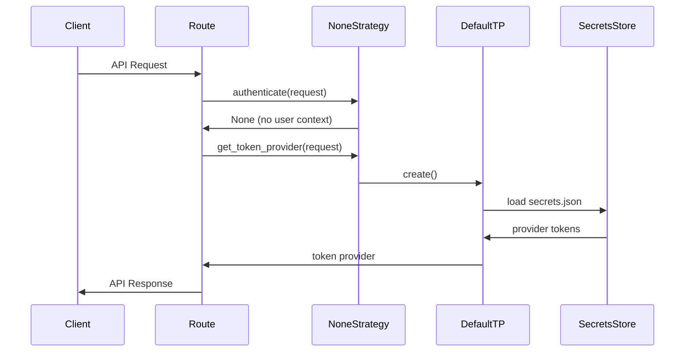
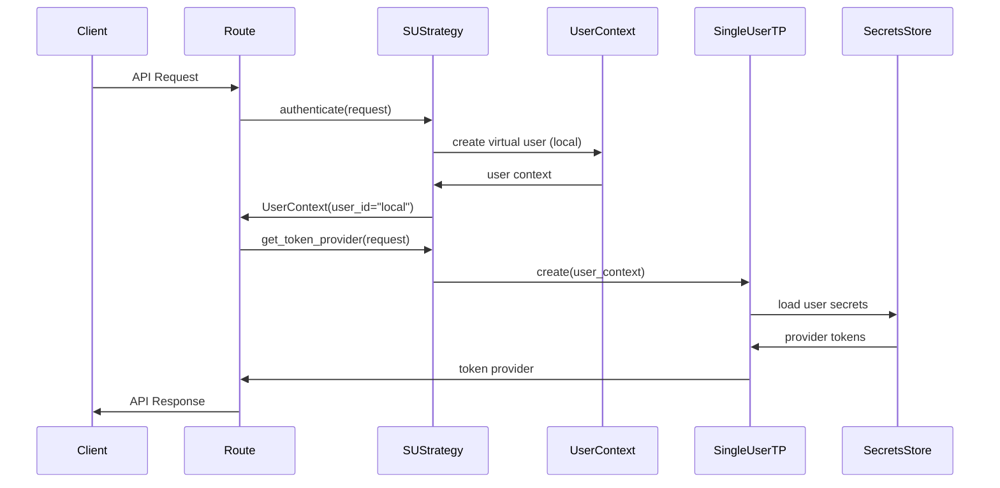
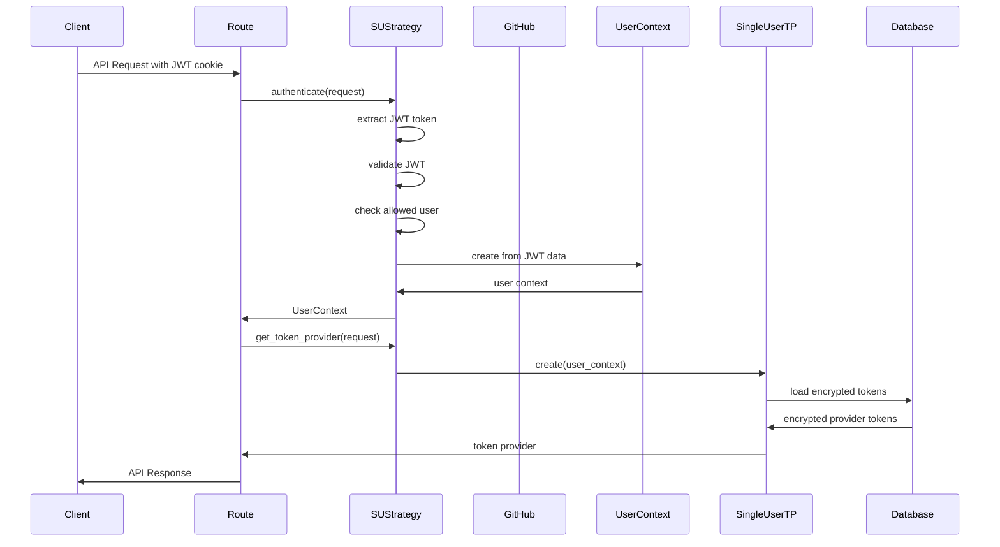
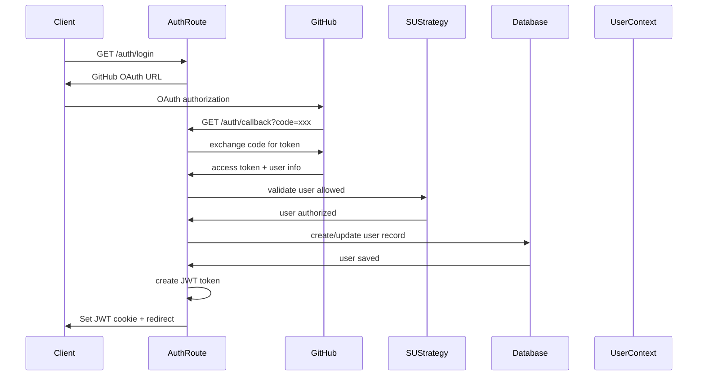
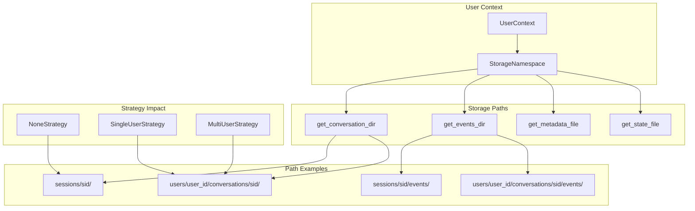
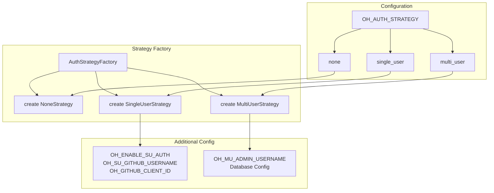

# OpenHands AuthSystem Design

## Executive Summary

This document proposes a comprehensive AuthSystem design for OpenHands that supports three authentication strategies: **None** (current behavior), **Single User (SU)** with GitHub OAuth, and **Multi User (MU)** (for custom builds). The design introduces clean abstraction boundaries, eliminates scattered `user_id` threading, and provides a foundation for future authentication enhancements.

## Problem Statement

### Current Issues

1. **No Auth Strategy Abstraction**: OpenHands currently has a monolithic `DefaultUserAuth` that always returns `None` for `user_id`, with no clear path to support different authentication modes.

2. **Scattered user_id Threading**: 339+ occurrences of `user_id` across 68 files, with complex threading through:
   - Storage partitioning (`users/{user_id}/` paths)
   - Conversation/session scoping
   - API route dependencies
   - Provider token resolution
   - Data model fields

3. **Provider Token Pollution**: Routes accept `provider_tokens` parameters and thread them through `ProviderHandler`, creating security risks and complex signatures.

4. **No Single User Support**: No way to enable GitHub OAuth for personal/single-user deployments while maintaining the simplicity of the current "None" mode.

5. **Boundary Violations**: Auth concerns are mixed with business logic throughout the codebase, making it difficult to switch between authentication modes.

### Requirements from GitHub Issues

From **Issue #10751** (user_id audit):
- Support None, SU, and MU modes
- Introduce `UserContext` and `StorageNamespace` abstractions
- Remove redundant `if user_id` guards (7 identified)
- Clean up storage path helpers

From **Issue #10730** (token provider):
- Remove `provider_tokens` from route signatures
- Introduce `TokenProvider` boundary abstraction
- Support backend-only credential resolution
- Enable custom builds with token refresh/rotation patterns

## Solution Architecture

### Core Components

#### 1. AuthStrategy Interface

```python
# openhands/auth/strategies/base.py
from abc import ABC, abstractmethod
from typing import Optional
from fastapi import Request
from openhands.auth.user_context import UserContext
from openhands.auth.token_provider import TokenProvider

class AuthStrategy(ABC):
    """Base class for authentication strategies"""
    
    @abstractmethod
    def get_name(self) -> str:
        """Return strategy name for logging/debugging"""
    
    @abstractmethod
    def requires_auth(self) -> bool:
        """Whether this strategy requires user authentication"""
    
    @abstractmethod
    async def authenticate(self, request: Request) -> Optional[UserContext]:
        """Authenticate request and return UserContext or None"""
    
    @abstractmethod
    async def get_token_provider(self, request: Request) -> TokenProvider:
        """Get token provider for this request"""
    
    @abstractmethod
    def get_login_url(self) -> Optional[str]:
        """Get login URL for frontend, None if no auth required"""
```

#### 2. UserContext

```python
# openhands/auth/user_context.py
from dataclasses import dataclass
from typing import Optional
from datetime import datetime

@dataclass(frozen=True)
class UserContext:
    """Immutable user context for authenticated requests"""
    
    user_id: str
    email: Optional[str] = None
    username: Optional[str] = None
    github_id: Optional[int] = None
    github_username: Optional[str] = None
    is_admin: bool = False
    created_at: Optional[datetime] = None
    last_login: Optional[datetime] = None
    
    @property
    def storage_namespace(self) -> str:
        """Get storage namespace for this user"""
        return self.user_id
```

#### 3. TokenProvider Interface

```python
# openhands/auth/token_provider.py
from abc import ABC, abstractmethod
from typing import Optional, Mapping
from openhands.integrations.service_types import ProviderType
from openhands.integrations.provider import ProviderToken

class TokenProvider(ABC):
    """Abstract token provider for git integrations"""
    
    @abstractmethod
    async def get_token(self, provider: ProviderType) -> Optional[ProviderToken]:
        """Get token for specific provider"""
    
    @abstractmethod
    async def get_all_tokens(self) -> Mapping[ProviderType, ProviderToken]:
        """Get all available provider tokens"""
```

#### 4. StorageNamespace

```python
# openhands/auth/storage_namespace.py
from dataclasses import dataclass
from typing import Optional

@dataclass(frozen=True)
class StorageNamespace:
    """Encapsulates storage path logic for user data"""
    
    namespace: Optional[str]
    
    def get_conversation_dir(self, sid: str) -> str:
        if self.namespace:
            return f'users/{self.namespace}/conversations/{sid}/'
        return f'sessions/{sid}/'
    
    def get_conversation_events_dir(self, sid: str) -> str:
        return f'{self.get_conversation_dir(sid)}events/'
    
    def get_conversation_metadata_filename(self, sid: str) -> str:
        return f'{self.get_conversation_dir(sid)}metadata.json'
    
    # ... other path methods
```

### Authentication Strategies

#### 1. None Strategy (Current Behavior)

```python
# openhands/auth/strategies/none_strategy.py
from typing import Optional
from fastapi import Request
from openhands.auth.strategies.base import AuthStrategy
from openhands.auth.user_context import UserContext
from openhands.auth.token_provider import TokenProvider, DefaultTokenProvider

class NoneStrategy(AuthStrategy):
    """No authentication - current OpenHands behavior"""
    
    def get_name(self) -> str:
        return "none"
    
    def requires_auth(self) -> bool:
        return False
    
    async def authenticate(self, request: Request) -> Optional[UserContext]:
        return None  # No user context
    
    async def get_token_provider(self, request: Request) -> TokenProvider:
        return DefaultTokenProvider()  # Uses secrets.json
    
    def get_login_url(self) -> Optional[str]:
        return None
```

#### 2. Single User Strategy

```python
# openhands/auth/strategies/single_user_strategy.py
from typing import Optional
from fastapi import Request, HTTPException
from openhands.auth.strategies.base import AuthStrategy
from openhands.auth.user_context import UserContext
from openhands.auth.token_provider import TokenProvider, SingleUserTokenProvider
from openhands.server.shared import server_config

class SingleUserStrategy(AuthStrategy):
    """Single user with GitHub OAuth"""
    
    def get_name(self) -> str:
        return "single_user"
    
    def requires_auth(self) -> bool:
        return server_config.enable_su_auth
    
    async def authenticate(self, request: Request) -> Optional[UserContext]:
        if not self.requires_auth():
            # SU mode without auth - create virtual user
            return UserContext(
                user_id="local",
                username="local_user",
                is_admin=True
            )
        
        # Extract JWT token from cookie/header
        token = self._extract_token(request)
        if not token:
            return None
            
        # Validate JWT and extract user info
        user_data = self._validate_jwt(token)
        if not user_data:
            return None
            
        # Verify user is allowed (if configured)
        if (server_config.su_github_username and 
            user_data.get('github_username') != server_config.su_github_username):
            raise HTTPException(403, "Access denied")
            
        return UserContext(
            user_id=user_data['github_username'],
            email=user_data.get('email'),
            username=user_data['github_username'],
            github_id=user_data.get('github_id'),
            github_username=user_data['github_username'],
            is_admin=True  # SU user is always admin
        )
    
    async def get_token_provider(self, request: Request) -> TokenProvider:
        user_context = await self.authenticate(request)
        return SingleUserTokenProvider(user_context)
    
    def get_login_url(self) -> Optional[str]:
        if not self.requires_auth():
            return None
        return f"/api/auth/github/login"
```

#### 3. Multi User Strategy (Custom Build Extension Point)

```python
# openhands/auth/strategies/multi_user_strategy.py
from typing import Optional
from fastapi import Request
from openhands.auth.strategies.base import AuthStrategy
from openhands.auth.user_context import UserContext
from openhands.auth.token_provider import TokenProvider

class MultiUserStrategy(AuthStrategy):
    """Multi-user strategy - extension point for custom builds"""
    
    def get_name(self) -> str:
        return "multi_user"
    
    def requires_auth(self) -> bool:
        return True
    
    async def authenticate(self, request: Request) -> Optional[UserContext]:
        # This would be implemented by custom builds/applications built on OH
        raise NotImplementedError("Multi-user strategy not available in base OpenHands")
    
    async def get_token_provider(self, request: Request) -> TokenProvider:
        raise NotImplementedError("Multi-user strategy not available in base OpenHands")
    
    def get_login_url(self) -> Optional[str]:
        return "/api/auth/login"
```

### Integration Points

#### 1. Updated UserAuth

```python
# openhands/server/user_auth/strategy_user_auth.py
from fastapi import Request
from openhands.auth.strategies.base import AuthStrategy
from openhands.auth.user_context import UserContext
from openhands.auth.storage_namespace import StorageNamespace
from openhands.server.user_auth.user_auth import UserAuth
from openhands.storage.settings.settings_store import SettingsStore
from openhands.storage.secrets.secrets_store import SecretsStore

class StrategyUserAuth(UserAuth):
    """UserAuth implementation using AuthStrategy pattern"""
    
    def __init__(self, strategy: AuthStrategy, user_context: Optional[UserContext]):
        self.strategy = strategy
        self.user_context = user_context
        self._storage_namespace = StorageNamespace(
            user_context.storage_namespace if user_context else None
        )
    
    async def get_user_id(self) -> str | None:
        return self.user_context.user_id if self.user_context else None
    
    async def get_user_email(self) -> str | None:
        return self.user_context.email if self.user_context else None
    
    # ... other methods using storage_namespace
```

#### 2. FastAPI Dependencies

```python
# openhands/server/dependencies/auth.py
from fastapi import Depends, Request
from openhands.auth.strategies.base import AuthStrategy
from openhands.auth.user_context import UserContext
from openhands.auth.token_provider import TokenProvider
from openhands.server.shared import get_auth_strategy

async def get_current_user(
    request: Request,
    strategy: AuthStrategy = Depends(get_auth_strategy)
) -> Optional[UserContext]:
    """Get current user context"""
    return await strategy.authenticate(request)

async def get_token_provider(
    request: Request,
    strategy: AuthStrategy = Depends(get_auth_strategy)
) -> TokenProvider:
    """Get token provider for current request"""
    return await strategy.get_token_provider(request)

async def require_auth(
    user: Optional[UserContext] = Depends(get_current_user)
) -> UserContext:
    """Require authentication"""
    if not user:
        raise HTTPException(401, "Authentication required")
    return user
```

#### 3. Updated Routes

```python
# openhands/server/routes/git.py (AFTER)
from fastapi import APIRouter, Depends
from openhands.auth.token_provider import TokenProvider
from openhands.auth.user_context import UserContext
from openhands.server.dependencies.auth import get_token_provider, get_current_user
from openhands.integrations.provider import ProviderHandler

app = APIRouter(prefix='/api/user')

@app.get('/repositories')
async def get_user_repositories(
    sort: str = "pushed",
    selected_provider: ProviderType | None = None,
    token_provider: TokenProvider = Depends(get_token_provider),
    user: Optional[UserContext] = Depends(get_current_user)
):
    """Get user repositories - no provider_tokens parameter!"""
    client = ProviderHandler(token_provider=token_provider)
    return await client.get_repositories(sort, selected_provider)
```

## Before/After Code Comparison

### Before: Current Implementation

```python
# BEFORE: openhands/server/routes/git.py
@app.get('/repositories', response_model=list[Repository])
async def get_user_repositories(
    sort: str = Query(default='pushed'),
    selected_provider: ProviderType | None = Query(default=None),
    page: int | None = Query(default=None),
    per_page: int | None = Query(default=None),
    installation_id: str | None = Query(default=None),
    provider_tokens: PROVIDER_TOKEN_TYPE | None = Depends(get_provider_tokens),
    access_token: SecretStr | None = Depends(get_access_token),
    user_id: str | None = Depends(get_user_id),
):
    if provider_tokens:
        client = ProviderHandler(
            provider_tokens=provider_tokens,
            external_auth_token=access_token,
            external_auth_id=user_id,
        )
        # ... complex logic
```

```python
# BEFORE: openhands/storage/locations.py
def get_conversation_dir(sid: str, user_id: str | None = None) -> str:
    if user_id:
        return f'users/{user_id}/conversations/{sid}/'
    else:
        return f'sessions/{sid}/'
```

```python
# BEFORE: openhands/server/user_auth/default_user_auth.py
class DefaultUserAuth(UserAuth):
    async def get_user_id(self) -> str | None:
        return None  # Always None - no multi-tenancy support
    
    async def get_provider_tokens(self) -> PROVIDER_TOKEN_TYPE | None:
        user_secrets = await self.get_user_secrets()
        if user_secrets is None:
            return None
        return user_secrets.provider_tokens
```

### After: Proposed Implementation

```python
# AFTER: openhands/server/routes/git.py
@app.get('/repositories', response_model=list[Repository])
async def get_user_repositories(
    sort: str = Query(default='pushed'),
    selected_provider: ProviderType | None = Query(default=None),
    page: int | None = Query(default=None),
    per_page: int | None = Query(default=None),
    installation_id: str | None = Query(default=None),
    token_provider: TokenProvider = Depends(get_token_provider),
    user: Optional[UserContext] = Depends(get_current_user),
):
    client = ProviderHandler(token_provider=token_provider)
    return await client.get_repositories(
        sort, server_config.app_mode, selected_provider, page, per_page, installation_id
    )
```

```python
# AFTER: openhands/auth/storage_namespace.py
@dataclass(frozen=True)
class StorageNamespace:
    namespace: Optional[str]
    
    def get_conversation_dir(self, sid: str) -> str:
        if self.namespace:
            return f'users/{self.namespace}/conversations/{sid}/'
        return f'sessions/{sid}/'
```

```python
# AFTER: openhands/server/user_auth/strategy_user_auth.py
class StrategyUserAuth(UserAuth):
    def __init__(self, strategy: AuthStrategy, user_context: Optional[UserContext]):
        self.strategy = strategy
        self.user_context = user_context
        self.storage_namespace = StorageNamespace(
            user_context.storage_namespace if user_context else None
        )
    
    async def get_user_id(self) -> str | None:
        return self.user_context.user_id if self.user_context else None
```

## Configuration

### Environment Variables

```bash
# Authentication Strategy
OH_AUTH_STRATEGY=none  # Options: none, single_user, multi_user

# Single User Mode Settings
OH_ENABLE_SU_AUTH=false  # Enable GitHub OAuth in SU mode
OH_SU_GITHUB_USERNAME=your_username  # Restrict access to specific user
OH_GITHUB_CLIENT_ID=your_client_id
OH_GITHUB_CLIENT_SECRET=your_client_secret

# Multi User Mode (custom build extension point)
OH_MU_ADMIN_USERNAME=admin_user
```

### Configuration Modes

#### 1. None Mode (Current Default)
```bash
OH_AUTH_STRATEGY=none
# No additional config needed
```

#### 2. Single User - No Auth
```bash
OH_AUTH_STRATEGY=single_user
OH_ENABLE_SU_AUTH=false
```

#### 3. Single User - GitHub Auth
```bash
OH_AUTH_STRATEGY=single_user
OH_ENABLE_SU_AUTH=true
OH_SU_GITHUB_USERNAME=your_username
OH_GITHUB_CLIENT_ID=your_client_id
OH_GITHUB_CLIENT_SECRET=your_client_secret
```

## Implementation Benefits

### 1. Clean Separation of Concerns
- Auth logic isolated in strategy classes
- Business logic doesn't need to know about user_id
- Clear boundaries between auth and core functionality

### 2. Reduced Complexity
- Eliminates 7 redundant `if user_id` guards
- Removes provider_tokens from route signatures
- Simplifies method signatures throughout codebase

### 3. Forward Compatibility
- custom builds can extend with custom strategies
- Token refresh/rotation support built-in
- Multi-tenancy ready without core changes

### 4. Security Improvements
- Tokens never exposed in route parameters
- Centralized token management
- Immutable user context prevents tampering

### 5. Developer Experience
- Clear configuration options
- Easy mode switching
- Consistent patterns across codebase

## Migration Strategy

### Phase 1: Foundation
1. Introduce auth strategy interfaces
2. Add UserContext and StorageNamespace
3. Create TokenProvider abstraction
4. Update core dependencies

### Phase 2: Strategy Implementation
1. Implement NoneStrategy (backward compatible)
2. Implement SingleUserStrategy
3. Add configuration support
4. Update UserAuth integration

### Phase 3: Route Migration
1. Update FastAPI dependencies
2. Remove provider_tokens from routes
3. Update ProviderHandler integration
4. Clean up redundant if-guards

### Phase 4: Storage Migration
1. Replace storage path helpers
2. Update conversation managers
3. Migrate event stores
4. Clean up legacy code

## Testing Strategy

### Unit Tests
- Strategy implementations
- UserContext immutability
- StorageNamespace path generation
- TokenProvider implementations

### Integration Tests
- End-to-end auth flows
- Route authentication
- Storage partitioning
- Configuration switching

### Migration Tests
- Backward compatibility
- Data migration paths
- Configuration validation

## Future Extensions

### custom builds Integration Points
```python
# custom builds can provide their own strategies
class custom buildsMultiUserStrategy(AuthStrategy):
    async def authenticate(self, request: Request) -> Optional[UserContext]:
        # Custom custom builds authentication logic
        pass
    
    async def get_token_provider(self, request: Request) -> TokenProvider:
        # custom builds token refresh/rotation
        return CustomBuildTokenProvider(request)
```

### Additional Auth Methods
- SAML/OIDC strategies
- API key authentication
- Custom JWT providers
- Enterprise SSO integration

## Architecture Diagrams

### 1. Overall Auth System Architecture

```mermaid
graph TB
    subgraph "FastAPI Application"
        Routes[API Routes]
        Deps[FastAPI Dependencies]
    end
    
    subgraph "Auth Layer"
        AuthStrategy[AuthStrategy Interface]
        NoneStrategy[NoneStrategy]
        SUStrategy[SingleUserStrategy]
        MUStrategy[MultiUserStrategy]
    end
    
    subgraph "Core Abstractions"
        UserContext[UserContext]
        TokenProvider[TokenProvider Interface]
        StorageNamespace[StorageNamespace]
    end
    
    subgraph "Token Providers"
        DefaultTP[DefaultTokenProvider]
        SingleUserTP[SingleUserTokenProvider]
        custom buildsTP[CustomBuildTokenProvider]
    end
    
    subgraph "Storage Layer"
        SecretsStore[SecretsStore]
        SettingsStore[SettingsStore]
        ConversationStore[ConversationStore]
    end
    
    Routes --> Deps
    Deps --> AuthStrategy
    AuthStrategy --> UserContext
    AuthStrategy --> TokenProvider
    UserContext --> StorageNamespace
    
    NoneStrategy --> DefaultTP
    SUStrategy --> SingleUserTP
    MUStrategy --> custom buildsTP
    
    TokenProvider --> SecretsStore
    StorageNamespace --> ConversationStore
    StorageNamespace --> SettingsStore
```

### 2. Authentication Flow - None Strategy



### 3. Authentication Flow - Single User Strategy (No Auth)



### 4. Authentication Flow - Single User Strategy (GitHub Auth)



### 5. GitHub OAuth Flow - Single User Strategy



### 6. Storage Namespace Architecture



### 7. Token Provider Architecture

```mermaid
graph TB
    subgraph "Token Provider Interface"
        TP[TokenProvider]
        TP --> GetToken[get_token(provider)]
        TP --> GetAllTokens[get_all_tokens()]
    end
    
    subgraph "Implementations"
        DefaultTP2[DefaultTokenProvider]
        SingleUserTP2[SingleUserTokenProvider]
        custom buildsTP2[CustomBuildTokenProvider]
    end
    
    subgraph "Token Sources"
        SecretsJSON[secrets.json]
        UserDB[User Database]
        Custom Build API[custom builds Token API]
    end
    
    subgraph "Provider Integration"
        ProviderHandler[ProviderHandler]
        GitHubService[GitHubService]
        GitLabService[GitLabService]
        BitBucketService[BitBucketService]
    end
    
    DefaultTP2 --> SecretsJSON
    SingleUserTP2 --> UserDB
    custom buildsTP2 --> Custom Build API
    
    TP --> ProviderHandler
    ProviderHandler --> GitHubService
    ProviderHandler --> GitLabService
    ProviderHandler --> BitBucketService
```

### 8. Configuration-Driven Strategy Selection



## Conclusion

This AuthSystem design provides OpenHands with a robust, extensible authentication foundation that:

1. **Maintains backward compatibility** with the current "None" mode
2. **Enables Single User mode** with optional GitHub OAuth
3. **Provides extension points** for custom builds with multi-user implementations
4. **Cleans up the codebase** by removing scattered user_id threading
5. **Improves security** by centralizing token management
6. **Simplifies development** with clear abstractions and patterns

The design is ready for implementation and will significantly improve OpenHands' authentication capabilities while maintaining its current simplicity for users who don't need authentication.