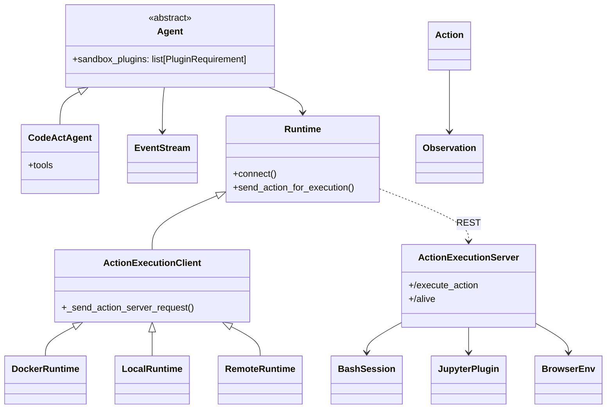

This is a high-level overview of the system architecture. The system is divided into two main components: the frontend and the backend. The frontend is responsible for handling user interactions and displaying the results. The backend is responsible for handling the business logic and executing the agents.

# Frontend architecture

```mermaid
graph LR;
  U[User] --> FE[Frontend (SPA)];
  FE -->|HTTP/WS| BE[OpenHands Backend];
  BE --> ES[(EventStream)];
  BE --> ST[(Storage)];
  BE --> RT[Runtime Interface];
  BE --> LLM[LLM Providers];

  subgraph Runtime
    RT --> DRT[Docker Runtime];
    RT --> LRT[Local Runtime];
    RT --> RRT[Remote Runtime];
    DRT --> AES[Action Execution Server];
    LRT --> AES;
    RRT --> AES;
    AES --> Bash[Bash Session];
    AES --> Jupyter[Jupyter Plugin];
    AES --> Browser[BrowserEnv];
  end
```

This Overview is simplified to show the main components and their interactions. For a more detailed view of the backend architecture, see the Backend Architecture section below.

# Backend Architecture

_**Disclaimer**: The backend architecture is a work in progress and is subject to change. The following diagram shows the current architecture of the backend based on the commit that is shown in the footer of the diagram._



<details>
  <summary>Updating this Diagram</summary>
  <div>
    The generation of the backend architecture diagram is partially automated.
    The diagram is generated from the type hints in the code using the py2puml
    tool. The diagram is then manually reviewed, adjusted and exported to PNG
    and SVG.

    ## Prerequisites

    - Running python environment in which openhands is executable
    (according to the instructions in the README.md file in the root of the repository)
    - [py2puml](https://github.com/lucsorel/py2puml) installed

## Steps

1.  We now maintain diagrams inline with Mermaid directly in this MDX. If regeneration is needed, update the Mermaid blocks below instead of PlantUML artifacts.

2.  Update the Mermaid diagrams in this file directly and review the diff to verify correctness. Keep class relationships concise and aligned with stable abstractions (agents, runtime client/server, plugins).


  </div>
</details>
