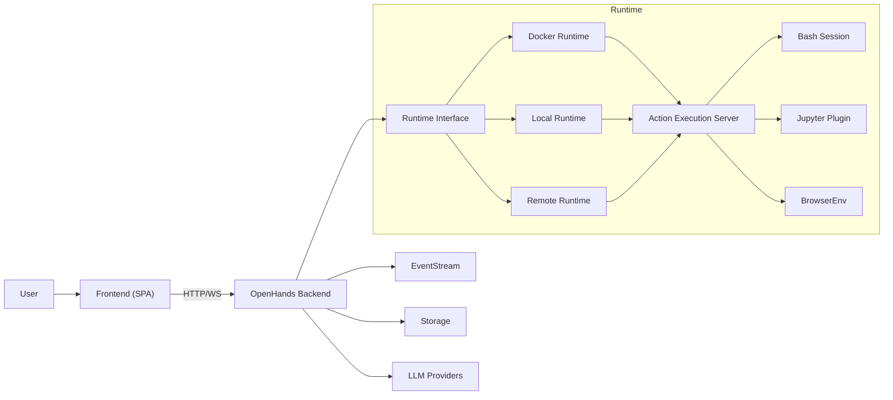
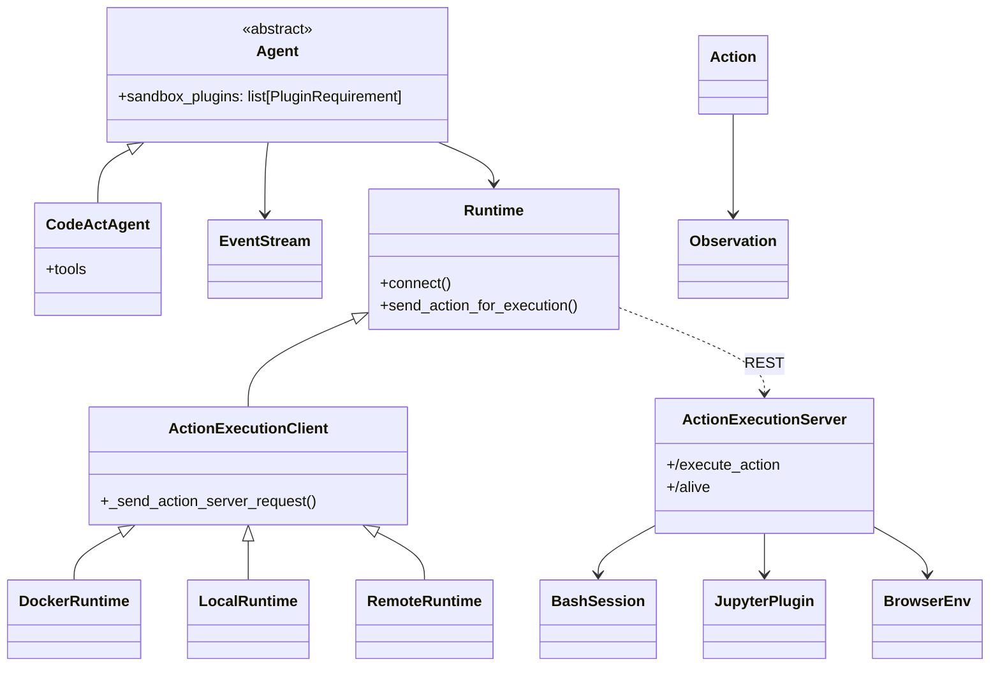

This is a high-level overview of the system architecture. The system is divided into two main components: the frontend and the backend. The frontend is responsible for handling user interactions and displaying the results. The backend is responsible for handling the business logic and executing the agents.

# Frontend architecture

This Overview is simplified to show the main components and their interactions. For a more detailed view of the backend architecture, see the Backend Architecture section below.

# Backend Architecture

_**Disclaimer**: The backend architecture is a work in progress and is subject to change. The following diagram shows the current architecture of the backend based on the commit that is shown in the footer of the diagram._

  
Updating this Diagram

  

    We maintain architecture diagrams inline with Mermaid in this MDX.

    Guidance:
    - Edit the Mermaid blocks directly (flowchart/classDiagram).
    - Quote labels and edge text for GitHub preview compatibility.
    - Keep relationships concise and reflect stable abstractions (agents, runtime client/server, plugins).
    - Verify accuracy against code:
      - openhands/runtime/impl/action_execution/action_execution_client.py
      - openhands/runtime/impl/docker/docker_runtime.py
      - openhands/runtime/impl/local/local_runtime.py
      - openhands/runtime/action_execution_server.py
      - openhands/runtime/plugins/*
    - Build docs locally or view on GitHub to confirm diagrams render.

  

