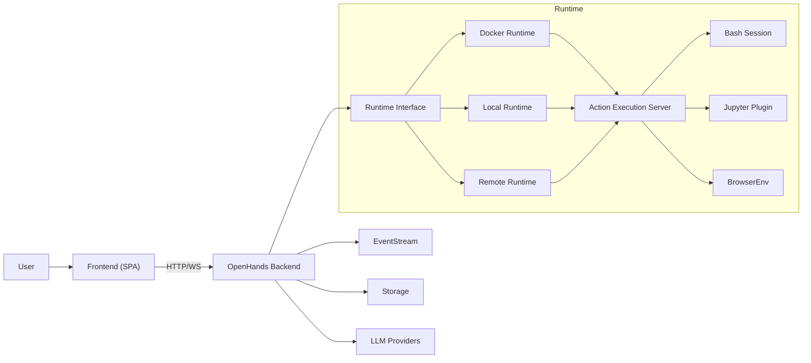
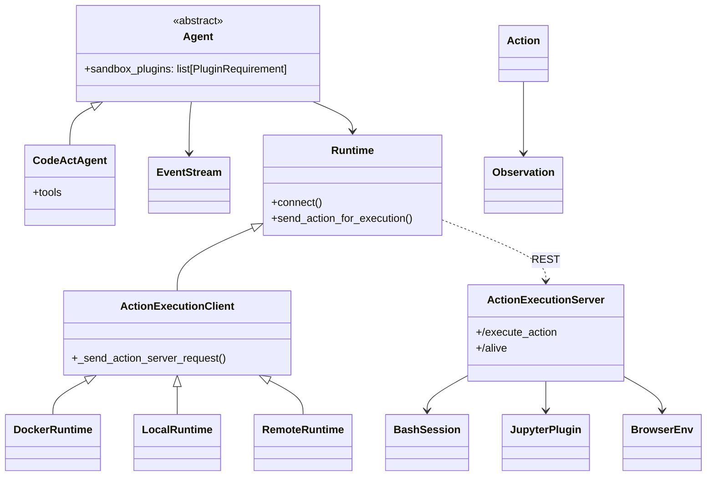
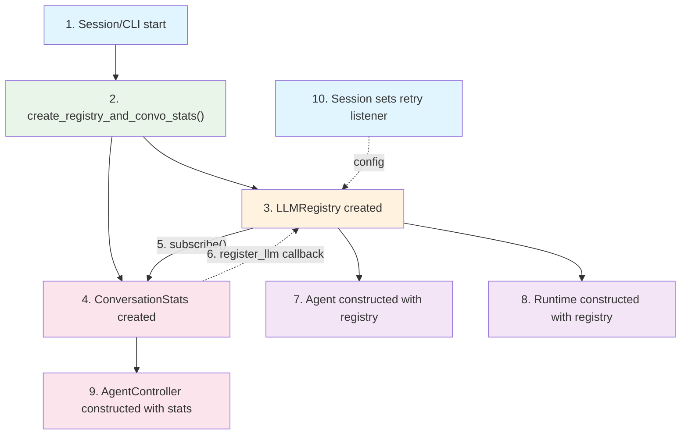
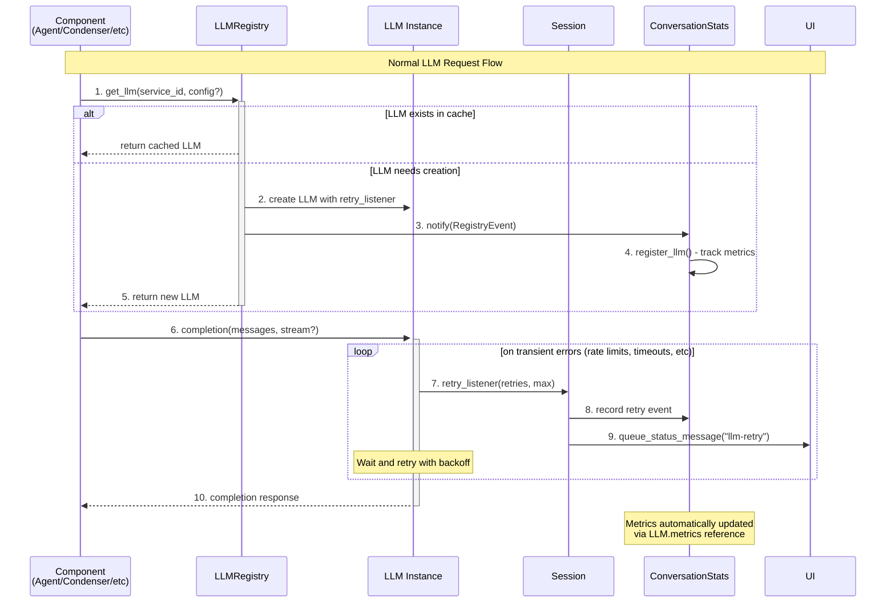
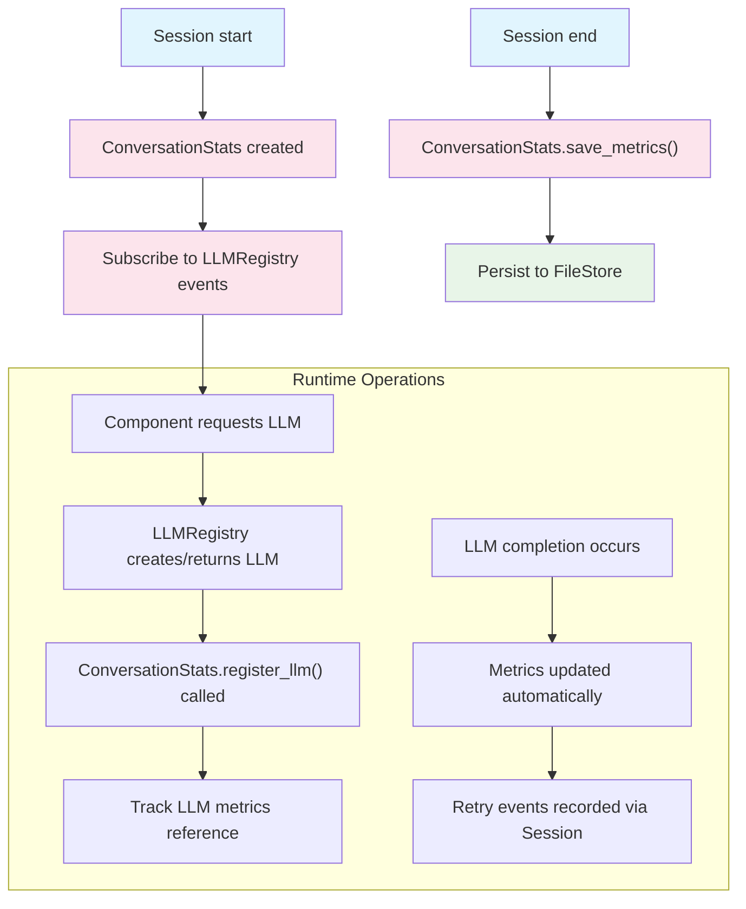

This is a high-level overview of the system architecture. The system is divided into two main components: the frontend and the backend. The frontend is responsible for handling user interactions and displaying the results. The backend is responsible for handling the business logic and executing the agents.

# System overview



This Overview is simplified to show the main components and their interactions. For a more detailed view of the backend architecture, see the Backend Architecture section below.

# Backend Architecture




<details>
  <summary>Updating this Diagram</summary>
  <div>
    We maintain architecture diagrams inline with Mermaid in this MDX.

    Guidance:
    - Edit the Mermaid blocks directly (flowchart/classDiagram).
    - Quote labels and edge text for GitHub preview compatibility.
    - Keep relationships concise and reflect stable abstractions (agents, runtime client/server, plugins).
    - Verify accuracy against code:
      - openhands/runtime/impl/action_execution/action_execution_client.py
      - openhands/runtime/impl/docker/docker_runtime.py
      - openhands/runtime/impl/local/local_runtime.py
      - openhands/runtime/action_execution_server.py
      - openhands/runtime/plugins/*
    - Build docs locally or view on GitHub to confirm diagrams render.

  </div>
</details>

## LLM architecture: LLMRegistry and ConversationStats

The LLMRegistry centralizes creation, caching, and configuration of all LLM instances across the backend. Components request LLMs by service_id (e.g., "agent", "condenser", "guardrail") rather than directly constructing them. This enables per-service configuration, unified retries, and consistent accounting via ConversationStats.

Key points:
- **Single source of truth**: LLMRegistry manages all LLM instances per conversation/session
- **Service-scoped instances**: Components request LLMs by service_id, no direct construction
- **Unified retry handling**: Registry attaches retry listeners for consistent error handling
- **Usage tracking**: ConversationStats subscribes to registry events for accounting
- **Extraneous completions**: One-off utility calls (e.g., title generation) go through registry

### 1. System initialization and wiring



### 2. Core classes and relationships

```mermaid
classDiagram
  direction TB

  class LLMRegistry {
    -config: OpenHandsConfig
    -retry_listener: Callable
    -service_to_llm: Map~string,LLM~
    +get_llm(service_id, config?) LLM
    +subscribe(callback) void
    +notify(event) void
  }

  class LLM {
    -service_id: string
    -config: LLMConfig
    -retry_listener: Callable
    +completion(messages, stream) Response
  }

  class ConversationStats {
    -service_to_metrics: Map~string,Metrics~
    +register_llm(event) void
    +get_combined_metrics() Metrics
  }

  class Agent {
    -llm_registry: LLMRegistry
    -llm: LLM
  }

  class Session {
    -llm_registry: LLMRegistry
    -convo_stats: ConversationStats
    +_notify_on_llm_retry(retries, max) void
  }

  %% Creation relationships
  LLMRegistry -->|"creates & caches"| LLM
  
  %% Usage relationships  
  Agent -->|"requests LLM by service_id"| LLMRegistry
  Agent -->|"uses for completions"| LLM
  
  %% Configuration relationships
  Session -.->|"sets retry_listener"| LLMRegistry
  
  %% Event flow relationships
  LLM -->|"calls on retry"| Session
  LLMRegistry -->|"notifies on LLM creation"| ConversationStats
  Session -->|"updates on retry/tokens"| ConversationStats
```

### 3. Runtime flow: LLM request and completion



### 4. ConversationStats lifecycle



### Practical usage examples

- Agent resolution (base Agent resolves the LLM via the registry):

```python
agent = CodeActAgent(config=agent_config, llm_registry=llm_registry)
# self.llm is automatically resolved from config via the registry
```

- LLM-backed condenser from config:

```python
condenser = Condenser.from_config(config.condenser, llm_registry)
```

- One-off utility call (e.g., conversation title generation):

```python
title = llm_registry.request_extraneous_completion(
    'conversation_title',
    messages=[{'role': 'user', 'content': first_user_message}],
)
```

