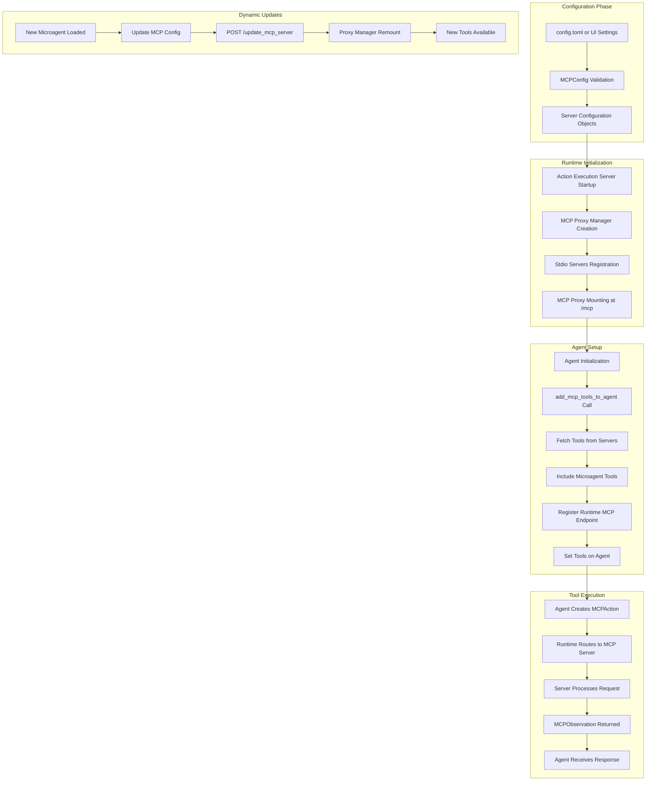

## Overview

Model Context Protocol (MCP) is a standardized protocol that enables OpenHands agents to interact with external tool servers and services. This document provides a comprehensive technical overview of how MCP is implemented and deployed within the OpenHands architecture.

MCP in OpenHands is based on the open standard defined at [modelcontextprotocol.io](https://modelcontextprotocol.io) and uses the [FastMCP](https://github.com/jlowin/fastmcp) library for implementation.

## Architecture Components

### Core MCP Components

#### 1. MCP Configuration (`openhands/core/config/mcp_config.py`)

The MCP configuration system supports three types of server connections:

- **SSE Servers** (`MCPSSEServerConfig`): External servers using Server-Sent Events
- **SHTTP Servers** (`MCPSHTTPServerConfig`): External servers using streamable HTTP
- **Stdio Servers** (`MCPStdioServerConfig`): Local processes communicating via stdin/stdout

```python
class MCPConfig(BaseModel):
    sse_servers: list[MCPSSEServerConfig] = Field(default_factory=list)
    stdio_servers: list[MCPStdioServerConfig] = Field(default_factory=list)
    shttp_servers: list[MCPSHTTPServerConfig] = Field(default_factory=list)
```

#### 2. MCP Client (`openhands/mcp/client.py`)

The `MCPClient` class manages connections to MCP servers and handles tool discovery:

- Establishes connections using FastMCP transports
- Discovers available tools from connected servers
- Manages authentication and session headers
- Converts server tools to `MCPClientTool` instances

#### 3. MCP Tools (`openhands/mcp/tool.py`)

`MCPClientTool` represents individual tools from MCP servers:

- Extends the base MCP `Tool` class
- Provides conversion to function call format for LLM agents
- Maintains tool metadata (name, description, input schema)

#### 4. MCP Utilities (`openhands/mcp/utils.py`)

Core orchestration functions that handle:

- Client creation and connection management
- Tool fetching and conversion
- Agent integration
- Microagent MCP tool discovery

### Runtime Integration

#### MCP Proxy Manager (`openhands/runtime/mcp/proxy/manager.py`)

The `MCPProxyManager` runs within the Action Execution Server and:

- Manages FastMCP proxy instances for stdio servers
- Handles server lifecycle (initialization, mounting, shutdown)
- Provides HTTP endpoints for MCP communication
- Supports dynamic server configuration updates

#### Action Execution Server Integration

The Action Execution Server (`openhands/runtime/action_execution_server.py`) integrates MCP through:

1. **Initialization**: Creates and mounts MCP Proxy Manager
2. **Dynamic Updates**: Provides `/update_mcp_server` endpoint for adding stdio servers
3. **Tool Routing**: Routes MCP actions to appropriate servers

### Agent Integration

#### Tool Registration

MCP tools are integrated into agents through the `add_mcp_tools_to_agent()` function:

1. Fetches tools from configured MCP servers
2. Includes tools from microagents
3. Adds runtime's own MCP endpoint
4. Registers tools with the agent for LLM function calling

#### Action/Observation Flow

- **MCPAction**: Represents a call to an MCP tool with name and arguments
- **MCPObservation**: Contains the response from the MCP server
- **Tool Execution**: Routed through the runtime to the appropriate MCP server

## MCP Deployment Flow



## Configuration and Deployment

### Configuration Sources

MCP configuration can be specified through multiple sources:

1. **config.toml file**:
```toml
[mcp]
sse_servers = [
    "http://external-server:8080/mcp",
    {url="https://secure-server.com/mcp", api_key="key123"}
]

stdio_servers = [
    {name="filesystem", command="npx", args=["-y", "@modelcontextprotocol/server-filesystem", "/workspace"]},
    {name="custom-tool", command="python", args=["-m", "my_mcp_server"], env={"DEBUG": "true"}}
]
```

2. **OpenHands UI Settings**: MCP tab in the settings interface

3. **Microagent Metadata**: Repository-specific tools defined in `.openhands/microagents/`

### Deployment Process

#### 1. Configuration Loading
- Configuration is parsed and validated during OpenHands startup
- Server configurations are converted to appropriate config objects
- URL validation and duplicate checking is performed

#### 2. Runtime Setup
- Action Execution Server initializes MCP Proxy Manager
- Stdio servers are registered with the proxy
- MCP endpoints are mounted at `/mcp` path
- Authentication headers are configured if API keys are provided

#### 3. Agent Integration
- `add_mcp_tools_to_agent()` is called during agent initialization
- Tools are fetched from all configured servers
- Microagent MCP tools are discovered and included
- Runtime's own MCP endpoint is added as a server
- All tools are registered with the agent for function calling

#### 4. Dynamic Updates
- New microagents can add stdio servers dynamically
- `/update_mcp_server` endpoint allows runtime configuration updates
- MCP Proxy Manager handles server addition and remounting

## Built-in MCP Tools

OpenHands provides several built-in MCP tools through the server routes (`openhands/server/routes/mcp.py`):

### GitHub Integration
- **create_pr**: Creates pull requests in GitHub repositories
- Handles authentication via provider tokens
- Automatically appends conversation links in SaaS mode

### GitLab Integration
- **create_mr**: Creates merge requests in GitLab repositories
- Supports both project ID and URL-encoded path formats

### Bitbucket Integration
- **create_bitbucket_pr**: Creates pull requests in Bitbucket repositories
- Follows similar authentication patterns as GitHub/GitLab

### Search Engine Integration
- **Tavily Search**: Automatically configured when `SEARCH_API_KEY` is provided
- Added as stdio server with Tavily MCP implementation

## Security and Authentication

### Authentication Flow
- API keys are passed via HTTP headers (`Authorization`, `s`, `X-Session-API-Key`)
- Conversation context is maintained via `X-OpenHands-ServerConversation-ID` header
- Provider tokens are used for GitHub/GitLab/Bitbucket integrations

### Security Considerations
- MCP functionality is disabled on Windows platforms
- Server URLs are validated during configuration
- Authentication is required for external server connections
- Stdio servers run in isolated runtime environment

## Error Handling and Logging

### Error Scenarios
- **Connection Failures**: Logged and gracefully handled, non-blocking for other servers
- **Tool Execution Errors**: Converted to `ErrorObservation` objects
- **Configuration Errors**: Validation errors prevent startup
- **Platform Limitations**: Windows platform returns empty configurations

### Logging
- Comprehensive logging at debug, info, warning, and error levels
- FastMCP library logging is configurable
- Server connection status and tool discovery is logged
- Dynamic updates and remounting operations are tracked

## Platform Support

### Supported Platforms
- **Linux**: Full MCP support with all transport types
- **macOS**: Full MCP support with all transport types
- **Windows**: MCP functionality is disabled due to platform limitations

### Transport Support
- **SSE (Server-Sent Events)**: External servers, real-time communication
- **SHTTP (Streamable HTTP)**: External servers, HTTP-based communication
- **Stdio**: Local processes, standard input/output communication

## Integration with Microagents

### Microagent MCP Tools
Microagents can define MCP tools in their metadata:

```python
class MicroagentMetadata(BaseModel):
    name: str
    type: MicroagentType
    mcp_tools: MCPConfig | None = None
```

### Discovery Process
1. Repository microagents are scanned for MCP tool definitions
2. Tools are extracted via `memory.get_microagent_mcp_tools()`
3. Stdio servers from microagents are added to runtime configuration
4. Tools become available to the agent automatically

## Performance Considerations

### Connection Management
- Connections are established on-demand for tool execution
- Client sessions are created and closed per operation
- Connection pooling is handled by the FastMCP library

### Tool Discovery
- Tools are discovered once during server connection
- Tool metadata is cached in `MCPClient` instances
- Dynamic server updates trigger tool rediscovery

### Resource Management
- Stdio servers are managed by the MCP Proxy Manager
- Server processes are properly cleaned up on shutdown
- Memory usage is optimized through on-demand connections

## References

This documentation is based on the following source code components:

- **Configuration**: `openhands/core/config/mcp_config.py`
- **Client Implementation**: `openhands/mcp/client.py`, `openhands/mcp/tool.py`
- **Utilities**: `openhands/mcp/utils.py`
- **Runtime Integration**: `openhands/runtime/mcp/proxy/manager.py`
- **Action Execution Server**: `openhands/runtime/action_execution_server.py`
- **Server Routes**: `openhands/server/routes/mcp.py`
- **Events**: `openhands/events/action/mcp.py`, `openhands/events/observation/mcp.py`
- **Agent Integration**: `openhands/core/main.py`, `openhands/controller/agent.py`
- **Memory Integration**: `openhands/memory/memory.py`
- **Microagent Types**: `openhands/microagent/types.py`

For the latest implementation details, refer to the source code in the OpenHands repository.
