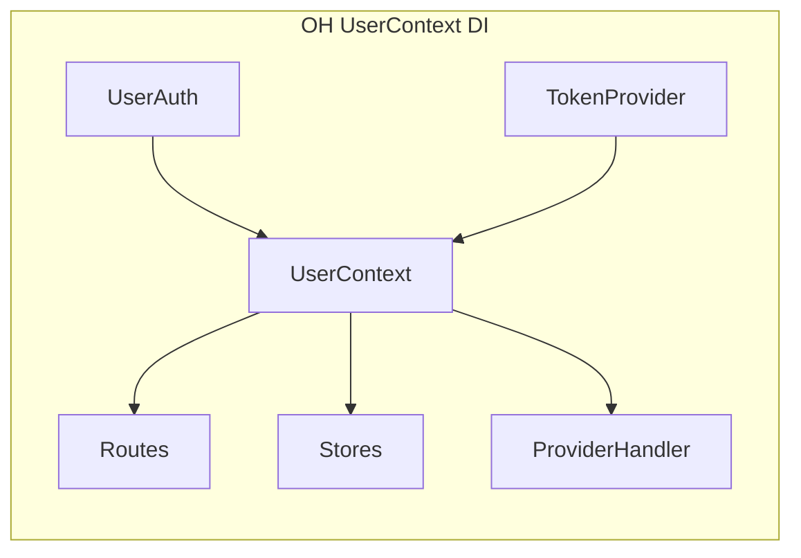
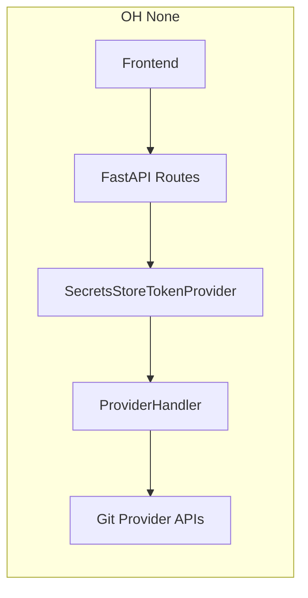
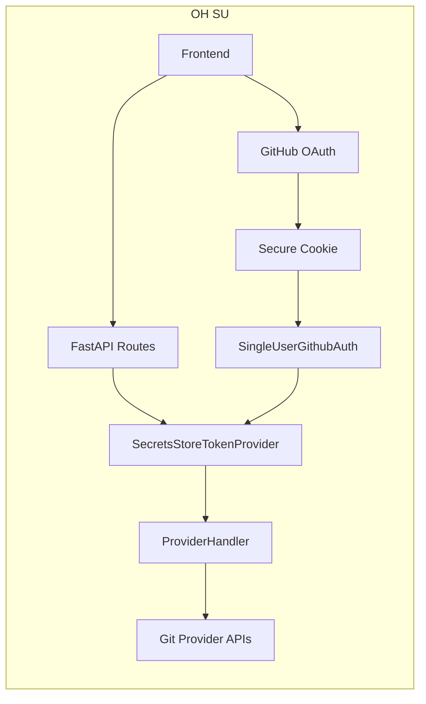
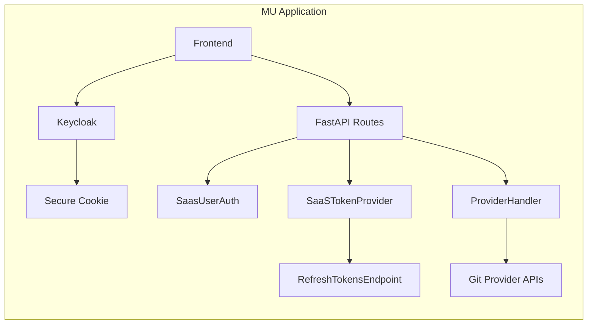
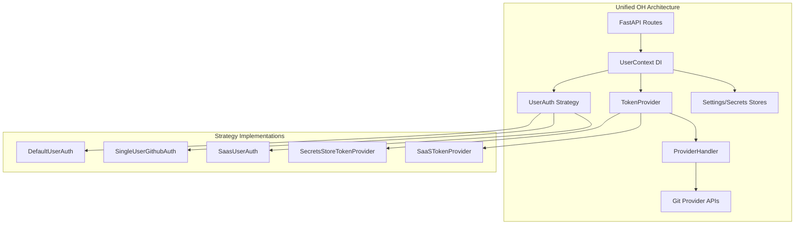
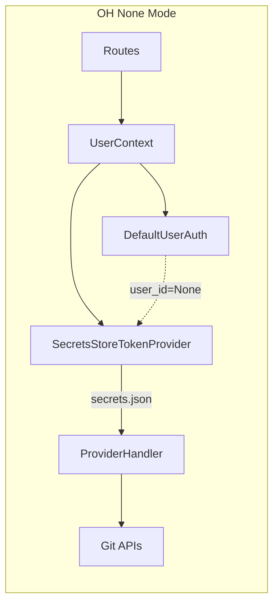
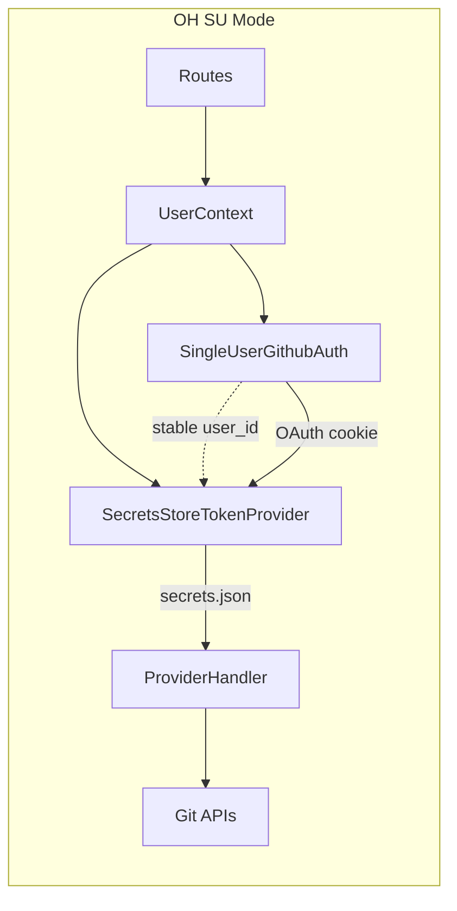
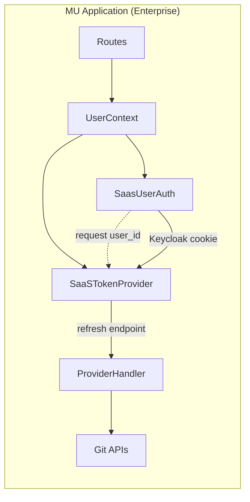
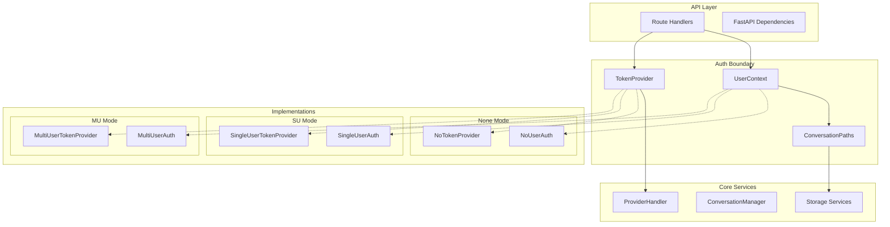

# OpenHands AuthSystem Design (None, SU, MU)

## Summary

This document proposes the introduction of an auth system in OpenHands. This system addresses current coupling issues and enables unified support for three strategies:

- **None**: No authentication (with or without git token; current default behavior)
- **Single User (SU)**: Single authenticated user with pre-configured identity
- **Multi User (MU)**: Full multi-tenant system (enterprise/SaaS)

In the following, the proposal assumes inclusion of SU strategy in OpenHands.

Introduces two key abstractions:
1. **TokenSource** (fka TokenProvider): Boundary for provider token access and refresh
2. **UserContext**: Dependency injection for user identity and storage namespacing

We may want a few auxiliary ones, too:
- ConversationPaths:

**Reference**: This design addresses GitHub issues [#10730](https://github.com/All-Hands-AI/OpenHands/issues/10730) and [#10751](https://github.com/All-Hands-AI/OpenHands/issues/10751).


## Problem

- OH currently supports “None” (no identity) with optional Git provider tokens saved locally (secrets store). Routes and services accept `provider_tokens` widely, which leaks auth details across the codebase and couples many components.
- OH currently has over 350 occurrences of `user_id` scattered in business logic, which are not in use, spread auth details across the codebase and couple auth concerns into code logic.
- OH currently has MU business logic in points related to auth (e.g., `REFRESH_TOKEN_URL` in `ProviderHandler`).
- Custom MU applications implement full multi-tenant auth (e.g., via Keycloak) with cookie/bearer flows and token refresh endpoints. Some of this logic currently leaks into OH via `user_id`, `ProviderHandler` (refresh URL) and route signatures.
- I propose an auth system that supports:
  - None (no auth, optional GH token)
  - SU (single user via GitHub OAuth)
  - MU (multi-user), implemented in a separate MU application (e.g., enterprise build on top of OH)

## Solution Overview

Introduce a small set of clearly defined boundaries and strategies:

- Auth Strategy (existing seam): `UserAuth` (or `UserContext`)
  - None: `DefaultUserAuth` (existing)
  - SU: `SingleUserGithubAuth` (new in OH)
  - MU: `SaasUserAuth` (existing, in a custom MU application)
- Token Provider boundary (new): `TokenProvider` (or `TokenSource`)
  - Encapsulates how Git provider tokens are obtained (local file, refresh endpoint, etc.)
  - Routes depend on `TokenProvider` instead of `provider_tokens`
- Provider handler consumes tokens via `TokenProvider` to instantiate concrete Git services

This decouples identity and token resolution from core routes/services and removes MU concerns from OH core. A custom MU application can keep MU entirely outside OH (e.g., in an enterprise codebase) by implementing its own `TokenProvider` and `UserAuth`.

## Before (Selected Relevant Code)

1) user_id propagation in utilities and services (current OH):

```python
# openhands/server/utils.py (fragment)
async def get_conversation_store(request: Request) -> ConversationStore | None:
    conversation_store: ConversationStore | None = getattr(request.state, 'conversation_store', None)
    if conversation_store:
        return conversation_store
    user_id = await get_user_id(request)
    conversation_store = await ConversationStoreImpl.get_instance(config, user_id)
    request.state.conversation_store = conversation_store
    return conversation_store
```


2) Route taking provider_tokens (current OH):

```python
# openhands/server/routes/manage_conversations.py (fragment)
from openhands.server.user_auth import (
    get_provider_tokens,
    get_user_id,
)
from openhands.integrations.provider import ProviderHandler

@app.post("/api/conversations/{conversation_id}/start")
async def start_conversation(
    conversation_id: str,
    user_id: str = Depends(get_user_id),
    provider_tokens: PROVIDER_TOKEN_TYPE = Depends(get_provider_tokens),
):
    provider_handler = ProviderHandler(provider_tokens)
    # ...
```

3) ProviderHandler constructed with provider_tokens mapping (current OH):

```python
# openhands/integrations/provider.py (fragment)
class ProviderHandler:
    def __init__(
        self,
        provider_tokens: PROVIDER_TOKEN_TYPE,
        external_auth_id: str | None = None,
        external_auth_token: SecretStr | None = None,
        external_token_manager: bool = False,
        session_api_key: str | None = None,
        sid: str | None = None,
    ):
        # ...
        self._provider_tokens = provider_tokens
        WEB_HOST = os.getenv('WEB_HOST', '').strip()
        self.REFRESH_TOKEN_URL = (
            f'https://{WEB_HOST}/api/refresh-tokens' if WEB_HOST else None
        )
```

4) Default UserAuth returns None identity and pulls tokens from local stores:

```python
# openhands/server/user_auth/default_user_auth.py (fragment)
class DefaultUserAuth(UserAuth):
    async def get_user_id(self) -> str | None:
        return None

    async def get_provider_tokens(self) -> PROVIDER_TOKEN_TYPE | None:
        user_secrets = await self.get_user_secrets()
        if user_secrets is None:
            return None
        return user_secrets.provider_tokens
```

### Motivation: From user_id clutter to a DI-provided UserContext

Today many route and service signatures accept user_id, provider_tokens, and stores explicitly. This increases coupling and spreads auth/storage concerns across the codebase. We introduce a DI-provided UserContext that centralizes identity, tokens, and storage access.


## After (Design) — including SU locking and fewer configuration points

### A. TokenProvider boundary (new)

```python
# openhands/auth/token_provider.py
from __future__ import annotations
from types import MappingProxyType
from typing import Mapping, Protocol, Optional
from pydantic import SecretStr
from openhands.integrations.provider import ProviderToken
from openhands.integrations.service_types import ProviderType

class TokenProvider(Protocol):
    async def get(self, provider: ProviderType) -> Optional[ProviderToken]:
        ...
    async def get_all(self) -> Mapping[ProviderType, ProviderToken]:
        ...

class SecretsStoreTokenProvider(TokenProvider):
    def __init__(self, tokens: Mapping[ProviderType, ProviderToken] | None):
        self._tokens = MappingProxyType(tokens or {})
    async def get(self, provider: ProviderType) -> Optional[ProviderToken]:
        return self._tokens.get(provider)
    async def get_all(self) -> Mapping[ProviderType, ProviderToken]:
        return self._tokens
```

OH dependency to construct it from the local stores:

```python
# openhands/server/dependencies_token_provider.py
from fastapi import Depends
from openhands.server.user_auth import get_user_secrets
from openhands.auth.token_provider import SecretsStoreTokenProvider, TokenProvider

async def get_token_provider(
    user_secrets = Depends(get_user_secrets),
) -> TokenProvider:
    tokens = user_secrets.provider_tokens if user_secrets else None
    return SecretsStoreTokenProvider(tokens)
```

A custom MU application can provide its own `SaaSTokenProvider` that calls a refresh-tokens endpoint; this lives entirely outside OH in the MU codebase.

### B. ProviderHandler consumes TokenProvider

```python
# openhands/integrations/provider.py (proposed shape)
from openhands.auth.token_provider import TokenProvider

class ProviderHandler:
    def __init__(self, token_provider: TokenProvider):
        self.token_provider = token_provider
        self.service_class_map = { ... }

    async def _get_service(self, provider: ProviderType) -> GitService:
        pt = await self.token_provider.get(provider)
        if not pt or not pt.token:
            raise AuthenticationError(f"No token for {provider.value}")
        service_class = self.service_class_map[provider]
        return service_class(token=pt.token, base_domain=pt.host)
```

This removes the need for `REFRESH_TOKEN_URL` and any MU-specific logic from OH core.

### C. Routes depend on TokenProvider rather than provider_tokens

```python
# openhands/server/routes/manage_conversations.py (after)
from openhands.auth.token_provider import TokenProvider
from openhands.server.dependencies_token_provider import get_token_provider
from openhands.integrations.provider import ProviderHandler

@app.post("/api/conversations/{conversation_id}/start")
async def start_conversation(
    conversation_id: str,
    token_provider: TokenProvider = Depends(get_token_provider),

### C2. UserContext for DI (new)

```python
# openhands/server/user_context.py
from dataclasses import dataclass
from typing import Optional
from fastapi import Depends
from openhands.server.user_auth import get_user_auth
from openhands.server.user_auth.user_auth import AuthType
from openhands.auth.token_provider import TokenProvider
from openhands.storage.settings.settings_store import SettingsStore
from openhands.storage.secrets.secrets_store import SecretsStore
from openhands.storage.locations import get_conversation_dir

@dataclass
class UserContext:
    user_id: Optional[str]
    auth_type: Optional[AuthType]
    token_provider: TokenProvider
    settings_store: SettingsStore
    secrets_store: SecretsStore

    # Convenience: conversation paths without threading user_id
    def conversation_dir(self, sid: str) -> str:
        return get_conversation_dir(sid, self.user_id)

# Dependency provider (simplified)
async def get_user_context(
    user_auth = Depends(get_user_auth),
    token_provider: TokenProvider = Depends(get_token_provider),
) -> UserContext:
    user_id = await user_auth.get_user_id()
    settings_store = await user_auth.get_user_settings_store()
    secrets_store = await user_auth.get_secrets_store()
    auth_type = await user_auth.get_auth_type()
    return UserContext(user_id, auth_type, token_provider, settings_store, secrets_store)
```

Routes then depend on a single UserContext interface:

```python
# openhands/server/routes/manage_conversations.py (after)
from openhands.server.user_context import UserContext, get_user_context

@app.post('/conversations')
async def new_conversation(
    data: InitSessionRequest,
    user: UserContext = Depends(get_user_context),
) -> ConversationResponse:
    # Build stores and paths from user
    conversation_dir = user.conversation_dir(conversation_id)
    # Continue with conversation creation using conversation_dir

    if data.repository:
        provider_handler = ProviderHandler(user.token_provider)
        await provider_handler.verify_repo_provider(data.repository, data.git_provider)
    # Use user.conversation_dir(conversation_id) downstream
```


### C3. From `user_id` to `ConversationPaths`
From the 350+ occurrences of `user_id` in OH codebase, a majority are in the storage layer or about the storage layer: they simply attempt to isolate users' data (event stream, conversation metadata, etc). That's request scope. We can wrap this scoping logic in a `ConversationPaths` class that centralizes this logic.

```python
# openhands/storage/paths.py (optional wrapper)
from dataclasses import dataclass
from typing import Optional
from openhands.storage.locations import (
    get_conversation_dir,
    get_conversation_events_dir,
    get_conversation_event_filename,
    get_conversation_metadata_filename,
)

@dataclass
class ConversationPaths:
    user_id: Optional[str]
    def dir(self, sid: str) -> str: return get_conversation_dir(sid, self.user_id)
    def events_dir(self, sid: str) -> str: return get_conversation_events_dir(sid, self.user_id)
    def event(self, sid: str, id: int) -> str: return get_conversation_event_filename(sid, id, self.user_id)
    def metadata(self, sid: str) -> str: return get_conversation_metadata_filename(sid, self.user_id)

# Bound into UserContext
@dataclass
class UserContext:
    ...
    paths: ConversationPaths

# Construction
return UserContext(user_id, auth_type, token_provider, settings_store, secrets_store, paths=ConversationPaths(user_id))
```

Route/service signatures migrate from threading user_id to accepting UserContext:

Before:
```python
async def get_conversation(conversation_id: str, user_id: str | None = Depends(get_user_id)):
    ...
```

After:
```python
async def get_conversation(conversation_id: str, user: UserContext = Depends(get_user_context)):
    ...
```


### D. SU Auth Strategy (OH)

Implement a single-user OAuth strategy using the existing `UserAuth` seam. It issues a secure cookie with the OAuth result and maps it to a single (pre-configured) allowed user.

```python
# openhands/server/user_auth/single_user_github_auth.py (concept)
from dataclasses import dataclass
from fastapi import Request
from pydantic import SecretStr

```


from openhands.server.user_auth.user_auth import AuthType, UserAuth
from openhands.storage.settings.settings_store import SettingsStore
from openhands.storage.secrets.secrets_store import SecretsStore

@dataclass
class SingleUserGithubAuth(UserAuth):
    user_id: str | None
    access_token: SecretStr | None
    auth_type: AuthType = AuthType.COOKIE

    async def get_user_id(self) -> str | None:
        return self.user_id

    async def get_access_token(self) -> SecretStr | None:
        return self.access_token

    async def get_user_settings_store(self) -> SettingsStore:
        # same as DefaultUserAuth but with stable user_id
from openhands.server.user_auth.user_auth import AuthType, UserAuth
from openhands.storage.settings.settings_store import SettingsStore
from openhands.storage.secrets.secrets_store import SecretsStore

        ...

    async def get_secrets_store(self) -> SecretsStore:
        # same as DefaultUserAuth but with stable user_id
        ...

    @classmethod
    async def get_instance(cls, request: Request) -> UserAuth:
        # Parse secure cookie or return None -> UI can redirect to GH OAuth
        # For None mode (no OAuth), return instance with user_id=None and access_token=None
        ...
```


### E. SU configuration and locking (config.toml primary)

- config.toml (preferred):

```
[auth]
strategy = "single_user_github"
allowed = "12345678"          # numeric -> GitHub ID; non-numeric -> login
github_client_id = "<client_id>"
github_client_secret = "<client_secret>"
```

- Environment-only fallback:
  - OPENHANDS_AUTH_MODE=su
  - SU_GITHUB_ALLOWED=12345678 (or octocat)
  - GITHUB_OAUTH_CLIENT_ID=...
  - GITHUB_OAUTH_CLIENT_SECRET=...

Rules:
- Identity must be preconfigured. ID preferred; fallback to login. No bind-on-first-login.
- On OAuth callback, if identity != allowed, deny with 401/403.
- On success, issue secure cookie, set stable user_id (GitHub numeric ID), and persist ProviderToken[GitHub] from OAuth token.
- Secrets/Settings stores scope to that user_id.

Selection is still configured via `server_config.user_auth_class`, which OH already supports. For None (no auth), continue using `DefaultUserAuth`.

## Diagrams (After)

Simple flows for three strategies (None, SU, MU).







Notes:
- OH implements the auth system and SU strategy; MU components (Keycloak, SaaSTokenProvider, refresh endpoint) remain outside OH in the MU application.
- both OH and MU applications retain and respect the auth boundary.

## Security considerations

- Secrets are never logged; TokenProvider interface returns `SecretStr` values. Event streams mask secrets as today.
- Session API keys and nested runtimes remain MU application concerns and are not introduced into OH tokens.
- SU cookie is HttpOnly, SameSite=Lax for localhost, Strict otherwise. JWT secret is reused from existing config.

## Migration guidance

- Step 1: Refactor most occurrences of `user_id` scattered in business logic to `UserContext`, both in OH and /enterprise; add OH dependency `get_user_context`.
- Step 2: Introduce `TokenProvider` in OH; add OH dependency `get_token_provider`.
- Step 3: Update routes to use `UserContext` and `TokenProvider`.
- Step 4: Remove MU-specific refresh logic in `ProviderHandler` once all routes use `TokenProvider`.
- Step 5: Add `SingleUserGithubAuth` and expose via `server_config.user_auth_class` override.


This plan keeps behavior identical for None mode, enables SU via a clean strategy, and isolates MU to the enterprise layer.

---

# OpenHands AuthSystem Design (None, SU, MU) - Revised

This proposal defines a unified, strategy-based authentication architecture for OpenHands that eliminates coupling issues and provides consistent patterns across None, SU, and MU modes.

## Problem: Coupling and Architectural Inconsistency

### Current `user_id` Clutter (350+ occurrences)

The codebase has `user_id` scattered throughout business logic where it's primarily used for data isolation:

**Route signatures:**
```python
# openhands/server/routes/manage_conversations.py
async def new_conversation(
    data: InitSessionRequest,
    user_id: str = Depends(get_user_id),                    # Threading user_id
    provider_tokens: PROVIDER_TOKEN_TYPE = Depends(get_provider_tokens),  # Threading tokens
    user_secrets: UserSecrets = Depends(get_user_secrets),  # Threading secrets
    auth_type: AuthType | None = Depends(get_auth_type),    # Threading auth type
):
```

**Storage path construction:**
```python
# openhands/server/utils.py
async def get_conversation_store(request: Request) -> ConversationStore | None:
    user_id = await get_user_id(request)  # user_id just for path isolation
    conversation_store = await ConversationStoreImpl.get_instance(config, user_id)
```

**Service instantiation:**
```python
# Throughout codebase
provider_handler = ProviderHandler(provider_tokens)  # Tokens threaded everywhere
```

### Architectural Inconsistency Across Modes

- **None mode**: `DefaultUserAuth` → `user_id=None`, tokens from local files
- **SU mode**: Not implemented in OH core
- **MU mode**: Custom patterns (`request.state.user`, middleware) that bypass OH's `UserAuth` strategy

### MU-Specific Logic in OH Core

```python
# openhands/integrations/provider.py
class ProviderHandler:
    def __init__(self, provider_tokens, ...):
        WEB_HOST = os.getenv('WEB_HOST', '').strip()
        self.REFRESH_TOKEN_URL = (  # MU-specific logic in OH core
            f'https://{WEB_HOST}/api/refresh-tokens' if WEB_HOST else None
        )
```

## Solution: Unified Architecture with Clean Boundaries

### Core Abstractions

1. **TokenProvider boundary** - Encapsulates token resolution (local files, refresh endpoints, etc.)
2. **UserContext DI** - Centralizes identity, tokens, and storage access in a single dependency
3. **Unified UserAuth strategy** - All modes (None/SU/MU) use the same `UserAuth` interface

### Architecture Overview



## Before/After: Eliminating user_id Clutter

### Before: user_id Threading

```python
# Route accepts multiple auth-related dependencies
async def new_conversation(
    data: InitSessionRequest,
    user_id: str = Depends(get_user_id),
    provider_tokens: PROVIDER_TOKEN_TYPE = Depends(get_provider_tokens),
    user_secrets: UserSecrets = Depends(get_user_secrets),
    auth_type: AuthType | None = Depends(get_auth_type),
):
    # user_id threaded to storage layer
    conversation_store = await ConversationStoreImpl.get_instance(config, user_id)

    # provider_tokens threaded to services
    provider_handler = ProviderHandler(provider_tokens)
```

### After: UserContext Abstraction

```python
# Single dependency encapsulates all auth concerns
async def new_conversation(
    data: InitSessionRequest,
    user: UserContext = Depends(get_user_context),
):
    # Storage paths handled by UserContext
    conversation_store = await user.get_conversation_store()

    # Token provider handles token resolution
    provider_handler = ProviderHandler(user.token_provider)
```

### UserContext Implementation

```python
@dataclass
class UserContext:
    """Centralized user context eliminating user_id threading"""
    user_id: Optional[str]
    auth_type: Optional[AuthType]
    token_provider: TokenProvider
    settings_store: SettingsStore
    secrets_store: SecretsStore

    # Encapsulate storage path logic
    def conversation_dir(self, sid: str) -> str:
        return get_conversation_dir(sid, self.user_id)

    async def get_conversation_store(self) -> ConversationStore:
        return await ConversationStoreImpl.get_instance(config, self.user_id)

# Single DI dependency replaces multiple auth dependencies
async def get_user_context(
    user_auth: UserAuth = Depends(get_user_auth),
    token_provider: TokenProvider = Depends(get_token_provider),
) -> UserContext:
    return UserContext(
        user_id=await user_auth.get_user_id(),
        auth_type=user_auth.get_auth_type(),
        token_provider=token_provider,
        settings_store=await user_auth.get_user_settings_store(),
        secrets_store=await user_auth.get_secrets_store(),
    )
```

## TokenProvider: Decoupling Token Management

### Interface

```python
class TokenProvider(Protocol):
    async def get(self, provider: ProviderType) -> Optional[ProviderToken]:
        """Get token for provider"""

    async def get_all(self) -> Mapping[ProviderType, ProviderToken]:
        """Get all available tokens"""
```

### Implementations by Mode

**None/SU Mode (OH):**
```python
class SecretsStoreTokenProvider(TokenProvider):
    """Reads tokens from local secrets store"""
    def __init__(self, secrets_store: SecretsStore, user_id: str | None):
        self.secrets_store = secrets_store
        self.user_id = user_id
```

**MU Mode (Enterprise):**
```python
class SaaSTokenProvider(TokenProvider):
    """Refreshes tokens via enterprise endpoint"""
    def __init__(self, refresh_url: str, session_api_key: str):
        self.refresh_url = refresh_url
        self.session_api_key = session_api_key
```

### Updated ProviderHandler

```python
class ProviderHandler:
    """Decoupled from MU-specific logic"""
    def __init__(self, token_provider: TokenProvider):
        self.token_provider = token_provider
        # No more REFRESH_TOKEN_URL or MU-specific logic

    async def _get_service(self, provider: ProviderType) -> GitService:
        token = await self.token_provider.get(provider)
        if not token:
            raise AuthenticationError(f"No token for {provider}")
        return self.service_class_map[provider](token=token.token, base_domain=token.host)
```

## Unified Mode Architecture

### None Mode (No Auth)


### SU Mode (Single User)


### MU Mode (Multi-User)


**Key Insight:** All three modes now use the same `UserContext → TokenProvider → ProviderHandler` flow, with only the strategy implementations differing.

## MU Integration: Replacing `request.state.user`

### Current MU Pattern
```python
# Enterprise middleware sets request.state.user
class SetAuthCookieMiddleware:
    async def __call__(self, request: Request, call_next):
        # Parse Keycloak cookie
        request.state.user = user_data  # Custom pattern

# Routes access via request.state
async def some_route(request: Request):
    user_data = request.state.user  # Bypasses OH UserAuth
```

### Unified MU Pattern
```python
# MU SaasUserAuth integrates with OH patterns
class SaasUserAuth(UserAuth):
    def __init__(self, request: Request):
        self.request = request

    async def get_user_id(self) -> str | None:
        # Parse from Keycloak cookie or bearer token
        return self._parse_user_id_from_auth()

    @classmethod
    async def get_instance(cls, request: Request) -> UserAuth:
        return cls(request)

# Routes use standard OH UserContext
async def some_route(user: UserContext = Depends(get_user_context)):
    # Same pattern as None/SU modes
    user_id = user.user_id  # Consistent across all modes
```

## Migration Strategy (High-Level)

### Phase 1: UserContext Introduction
- Add `UserContext` and `get_user_context` dependency
- Update routes to accept `UserContext` instead of individual auth dependencies
- **Result:** Eliminates user_id threading, reduces route signature complexity

### Phase 2: TokenProvider Boundary
- Add `TokenProvider` interface and implementations
- Update `ProviderHandler` to use `TokenProvider`
- **Result:** Removes MU-specific logic from OH core

### Phase 3: MU Unification
- Update MU applications to use `UserAuth` strategy instead of `request.state.user`
- Implement `SaaSTokenProvider` for token refresh
- **Result:** All modes use consistent architecture

### Phase 4: SU Implementation
- Add `SingleUserGithubAuth` implementation
- Add OAuth routes and configuration
- **Result:** Complete unified architecture across None/SU/MU

## Benefits

1. **Eliminates Coupling:** No more `user_id` scattered throughout business logic
2. **Consistent Architecture:** All modes use the same `UserContext → TokenProvider → ProviderHandler` flow
3. **Clean Boundaries:** Auth concerns isolated to strategy implementations
4. **MU Integration:** Enterprise applications integrate cleanly with OH patterns
5. **Maintainability:** Single pattern to understand and maintain across all modes

## Configuration

```toml
[auth]
strategy = "none"  # none | single_user_github | custom

# For SU mode
[auth.single_user_github]
allowed_user = "12345678"  # GitHub user ID or login
client_id = "..."
client_secret = "..."
```

---

# OpenHands Auth System Design Proposal

## Executive Summary

This document proposes a comprehensive refactoring of OpenHands' authentication and authorization system to address current coupling issues and enable clean support for three deployment modes:

- **None**: No authentication (current default behavior)
- **Single User (SU)**: Single authenticated user with persistent identity
- **Multi User (MU)**: Full multi-tenant system (enterprise/SaaS)

The proposal introduces two key abstractions:
1. **TokenProvider**: Boundary for provider token access and refresh
2. **UserContext**: Dependency injection for user identity and storage namespacing

**Reference**: This design addresses GitHub issues [#10730](https://github.com/All-Hands-AI/OpenHands/issues/10730) and [#10751](https://github.com/All-Hands-AI/OpenHands/issues/10751).

## Problem Statement

### Current Coupling Issues

**Reference**: Analysis based on examination of `openhands/server/routes/git.py`, `openhands/integrations/provider.py`, and `openhands/storage/locations.py`.

The existing system suffers from tight coupling that makes it difficult to support different authentication modes:

1. **Provider Token Threading**: Routes explicitly depend on `provider_tokens` parameters, threading them through multiple layers
2. **User ID Clutter**: `user_id` is passed through many functions but often unused in the function body
3. **Scattered Token Management**: Token refresh and provider token management logic is distributed across components
4. **Storage Path Coupling**: Direct `user_id` usage in storage path construction throughout the codebase

### Current Architecture Problems

**Reference**: `openhands/server/routes/git.py:65-102`

```python
# Current problematic pattern in routes
@app.get('/repositories')
async def get_user_repositories(
    provider_tokens: PROVIDER_TOKEN_TYPE | None = Depends(get_provider_tokens),
    user_id: str | None = Depends(get_user_id),
):
    if provider_tokens:
        client = ProviderHandler(
            provider_tokens=provider_tokens,
            external_auth_id=user_id,
        )
        return await client.get_repositories()
```

**Reference**: `openhands/storage/locations.py:4-8`

```python
# Current problematic pattern in storage
def get_conversation_dir(sid: str, user_id: str | None = None) -> str:
    if user_id:
        return f'users/{user_id}/conversations/{sid}/'
    else:
        return f'{CONVERSATION_BASE_DIR}/{sid}/'
```

## Proposed Solution

### Architecture Overview

The proposed architecture introduces clean boundaries between authentication concerns and core business logic:



### 1. TokenProvider Boundary

The `TokenProvider` abstracts provider token access and refresh, removing the need for routes to handle `provider_tokens` directly.

#### Interface Definition

**Reference**: Based on analysis of current token usage patterns in `openhands/integrations/provider.py:113-148`.

```python
# openhands/auth/token_provider.py
from __future__ import annotations
from abc import ABC, abstractmethod
from types import MappingProxyType
from typing import Optional, Mapping

from pydantic import SecretStr
from openhands.integrations.provider import ProviderToken
from openhands.integrations.service_types import ProviderType


class TokenProvider(ABC):
    """Abstract interface for provider token access and management."""

    @abstractmethod
    async def get(self, provider: ProviderType) -> Optional[ProviderToken]:
        """Return ProviderToken for a provider or None if unavailable."""
        ...

    @abstractmethod
    async def get_all(self) -> Mapping[ProviderType, ProviderToken]:
        """Return a read-only map of all available ProviderTokens."""
        ...
```

#### Implementation Strategies

**None Mode - No Token Provider**
```python
class NoTokenProvider(TokenProvider):
    """Token provider for None mode - no tokens available."""

    async def get(self, provider: ProviderType) -> Optional[ProviderToken]:
        return None

    async def get_all(self) -> Mapping[ProviderType, ProviderToken]:
        return MappingProxyType({})
```

**Single User Mode - Secrets-based Token Provider**

**Reference**: Based on `openhands/server/user_auth/default_user_auth.py:85-89`.

```python
class SingleUserTokenProvider(TokenProvider):
    """Token provider for SU mode - reads from SecretsStore."""

    def __init__(self, secrets: UserSecrets | None):
        self._tokens: Mapping[ProviderType, ProviderToken] = (
            secrets.provider_tokens if secrets else MappingProxyType({})
        )

    async def get(self, provider: ProviderType) -> Optional[ProviderToken]:
        return self._tokens.get(provider)

    async def get_all(self) -> Mapping[ProviderType, ProviderToken]:
        return self._tokens
```

**Multi User Mode - Dynamic Token Provider**

**Reference**: Based on `enterprise/server/auth/saas_user_auth.py:141-194`.

```python
class MultiUserTokenProvider(TokenProvider):
    """Token provider for MU mode - resolves tokens via session/identity."""

    def __init__(self, user_auth: SaasUserAuth):
        self.user_auth = user_auth
        self._cached_tokens: Optional[Mapping[ProviderType, ProviderToken]] = None

    async def get(self, provider: ProviderType) -> Optional[ProviderToken]:
        if self._cached_tokens is None:
            self._cached_tokens = await self.user_auth.get_provider_tokens() or {}
        return self._cached_tokens.get(provider)

    async def get_all(self) -> Mapping[ProviderType, ProviderToken]:
        if self._cached_tokens is None:
            self._cached_tokens = await self.user_auth.get_provider_tokens() or {}
        return self._cached_tokens
```

### 2. UserContext and ConversationPaths

The `UserContext` provides dependency injection for user identity, while `ConversationPaths` handles storage namespacing without exposing `user_id` to core logic.

#### UserContext Interface

**Reference**: Based on analysis of current user context usage in `openhands/server/user_auth/user_auth.py:38-73`.

```python
# openhands/auth/user_context.py
from __future__ import annotations
from abc import ABC, abstractmethod
from typing import Optional

from pydantic import SecretStr


class UserContext(ABC):
    """Abstract interface for user identity and context."""

    @abstractmethod
    async def get_user_id(self) -> Optional[str]:
        """Get the unique identifier for the current user."""
        ...

    @abstractmethod
    async def get_user_email(self) -> Optional[str]:
        """Get the email for the current user."""
        ...

    @abstractmethod
    async def get_access_token(self) -> Optional[SecretStr]:
        """Get the access token for the current user."""
        ...

    @abstractmethod
    def create_conversation_paths(self, sid: str) -> ConversationPaths:
        """Create a ConversationPaths instance for the given session ID."""
        ...
```

#### ConversationPaths Interface

**Reference**: Based on analysis of `openhands/storage/locations.py` functions.

```python
# openhands/auth/conversation_paths.py
from __future__ import annotations
from abc import ABC, abstractmethod


class ConversationPaths(ABC):
    """Abstract interface for conversation storage paths."""

    def __init__(self, sid: str):
        self.sid = sid

    @abstractmethod
    def get_conversation_dir(self) -> str:
        """Get the base conversation directory."""
        ...

    @abstractmethod
    def get_events_dir(self) -> str:
        """Get the events directory."""
        ...

    @abstractmethod
    def get_event_filename(self, event_id: int) -> str:
        """Get the filename for a specific event."""
        ...

    @abstractmethod
    def get_metadata_filename(self) -> str:
        """Get the metadata filename."""
        ...

    @abstractmethod
    def get_agent_state_filename(self) -> str:
        """Get the agent state filename."""
        ...

    # ... other path methods
```

### 3. FastAPI Dependencies

The system uses FastAPI's dependency injection to provide the appropriate implementations based on configuration.

**Reference**: Based on current dependency pattern in `openhands/server/user_auth/__init__.py:84-94`.

```python
# openhands/server/dependencies/auth.py
from fastapi import Depends, Request
from openhands.auth.token_provider import TokenProvider
from openhands.auth.user_context import UserContext
from openhands.server.shared import server_config
from openhands.server.user_auth import get_user_auth


async def get_token_provider(request: Request) -> TokenProvider:
    """Get the appropriate TokenProvider implementation."""
    user_auth = await get_user_auth(request)

    if isinstance(user_auth, DefaultUserAuth):
        # None mode
        return NoTokenProvider()
    elif isinstance(user_auth, SingleUserAuth):
        # SU mode
        secrets = await user_auth.get_user_secrets()
        return SingleUserTokenProvider(secrets)
    elif isinstance(user_auth, SaasUserAuth):
        # MU mode
        return MultiUserTokenProvider(user_auth)
    else:
        raise ValueError(f"Unsupported user auth type: {type(user_auth)}")


async def get_user_context(request: Request) -> UserContext:
    """Get the appropriate UserContext implementation."""
    user_auth = await get_user_auth(request)

    if isinstance(user_auth, DefaultUserAuth):
        # None mode
        return NoUserContext()
    elif isinstance(user_auth, SingleUserAuth):
        # SU mode
        user_id = await user_auth.get_user_id()
        email = await user_auth.get_user_email()
        return SingleUserContext(user_id, email)
    elif isinstance(user_auth, SaasUserAuth):
        # MU mode
        return MultiUserContext(user_auth)
    else:
        raise ValueError(f"Unsupported user auth type: {type(user_auth)}")
```

### 4. Updated Route Patterns

Routes no longer depend on `provider_tokens` or `user_id` directly, instead using the new abstractions.

#### Before (Current)

**Reference**: `openhands/server/routes/git.py:65-102`

```python
@app.get('/repositories', response_model=list[Repository])
async def get_user_repositories(
    sort: str = 'pushed',
    selected_provider: ProviderType | None = None,
    page: int | None = None,
    per_page: int | None = None,
    installation_id: str | None = None,
    provider_tokens: PROVIDER_TOKEN_TYPE | None = Depends(get_provider_tokens),
    access_token: SecretStr | None = Depends(get_access_token),
    user_id: str | None = Depends(get_user_id),
) -> list[Repository] | JSONResponse:
    if provider_tokens:
        client = ProviderHandler(
            provider_tokens=provider_tokens,
            external_auth_token=access_token,
            external_auth_id=user_id,
        )
        return await client.get_repositories(
            sort, server_config.app_mode, selected_provider, page, per_page, installation_id
        )

    raise AuthenticationError('Git provider token required.')
```

#### After (Proposed)

```python
@app.get('/repositories', response_model=list[Repository])
async def get_user_repositories(
    sort: str = 'pushed',
    selected_provider: ProviderType | None = None,
    page: int | None = None,
    per_page: int | None = None,
    installation_id: str | None = None,
    token_provider: TokenProvider = Depends(get_token_provider),
    user_context: UserContext = Depends(get_user_context),
) -> list[Repository] | JSONResponse:
    client = ProviderHandler(token_provider=token_provider, user_context=user_context)

    try:
        return await client.get_repositories(
            sort, server_config.app_mode, selected_provider, page, per_page, installation_id
        )
    except AuthenticationError:
        raise AuthenticationError('Git provider token required.')
```

### 5. Updated ProviderHandler

The `ProviderHandler` is refactored to use `TokenProvider` instead of accepting `provider_tokens` directly.

#### Before (Current)

**Reference**: `openhands/integrations/provider.py:113-160`

```python
class ProviderHandler:
    def __init__(
        self,
        provider_tokens: PROVIDER_TOKEN_TYPE,
        external_auth_id: str | None = None,
        external_auth_token: SecretStr | None = None,
        # ... other params
    ):
        self._provider_tokens = provider_tokens
        self.external_auth_id = external_auth_id
        self.external_auth_token = external_auth_token
        # ...

    def _get_service(self, provider: ProviderType) -> GitService:
        token = self.provider_tokens[provider]
        service_class = self.service_class_map[provider]
        return service_class(
            user_id=token.user_id,
            external_auth_id=self.external_auth_id,
            external_auth_token=self.external_auth_token,
            token=token.token,
            base_domain=token.host,
        )
```

#### After (Proposed)

```python
class ProviderHandler:
    def __init__(
        self,
        token_provider: TokenProvider,
        user_context: UserContext,
    ):
        self.token_provider = token_provider
        self.user_context = user_context
        # ...

    async def _get_service(self, provider: ProviderType) -> GitService:
        provider_token = await self.token_provider.get(provider)
        if not provider_token or not provider_token.token:
            raise AuthenticationError(f"No token for provider {provider.value}")

        service_class = self.service_class_map[provider]
        external_auth_id = await self.user_context.get_user_id()
        external_auth_token = await self.user_context.get_access_token()

        return service_class(
            user_id=provider_token.user_id,
            external_auth_id=external_auth_id,
            external_auth_token=external_auth_token,
            token=provider_token.token,
            base_domain=provider_token.host,
        )
```

### 6. Configuration and Mode Selection

The system supports configuration-driven mode selection through environment variables or configuration files.

**Reference**: Based on current configuration patterns in `openhands/server/shared.py`.

```python
# openhands/server/auth/config.py
from enum import Enum
from typing import Optional
from pydantic import BaseSettings


class AuthMode(str, Enum):
    NONE = "none"
    SINGLE_USER = "single_user"
    MULTI_USER = "multi_user"


class AuthConfig(BaseSettings):
    """Authentication configuration."""

    # Core auth mode
    auth_mode: AuthMode = AuthMode.NONE

    # Single User mode settings
    su_user_id: Optional[str] = None
    su_user_email: Optional[str] = None
    su_oauth_provider: Optional[str] = None  # github, gitlab, etc.

    # Multi User mode settings
    mu_keycloak_url: Optional[str] = None
    mu_jwt_secret: Optional[str] = None
    mu_database_url: Optional[str] = None

    class Config:
        env_prefix = "OPENHANDS_AUTH_"
        case_sensitive = False
```

Example configuration:

```bash
# None mode (default)
OPENHANDS_AUTH_MODE=none

# Single User mode
OPENHANDS_AUTH_MODE=single_user
OPENHANDS_AUTH_SU_USER_ID=local_user
OPENHANDS_AUTH_SU_USER_EMAIL=user@example.com
OPENHANDS_AUTH_SU_OAUTH_PROVIDER=github

# Multi User mode
OPENHANDS_AUTH_MODE=multi_user
OPENHANDS_AUTH_MU_KEYCLOAK_URL=https://auth.example.com
OPENHANDS_AUTH_MU_JWT_SECRET=your-jwt-secret
OPENHANDS_AUTH_MU_DATABASE_URL=postgresql://...
```

## Benefits

### 1. Clean Separation of Concerns

- **Auth Boundary**: Clear separation between authentication logic and core business logic
- **Mode Isolation**: Each auth mode has its own implementation without affecting others
- **Dependency Injection**: Clean dependency management through FastAPI's DI system

### 2. Reduced Coupling

- **No Provider Token Threading**: Routes no longer need to handle provider tokens directly
- **No User ID Clutter**: Core logic doesn't need to handle user_id parameters
- **Storage Abstraction**: Storage paths are handled through dedicated abstractions

### 3. Enhanced Maintainability

- **Strategy Pattern**: Easy to add new auth modes or modify existing ones
- **Clear Interfaces**: Well-defined contracts between components
- **Testability**: Each component can be tested in isolation

### 4. Future-Proof Architecture

- **Extensible**: Easy to add new authentication providers or modes
- **Scalable**: Supports both single-user and multi-tenant deployments
- **Configurable**: Runtime configuration of authentication behavior

## Security Considerations

### 1. Token Management

- **Secure Storage**: Provider tokens are handled through secure abstractions
- **Refresh Logic**: Token refresh is encapsulated within `TokenProvider` implementations
- **Minimal Exposure**: Tokens are not exposed in route signatures or logs

### 2. User Context Isolation

- **Namespace Isolation**: User data is properly namespaced in storage
- **Access Control**: User context ensures proper access control boundaries
- **Session Management**: Clean session lifecycle management

### 3. Configuration Security

- **Environment Variables**: Sensitive configuration through environment variables
- **Validation**: Configuration validation to prevent misconfigurations
- **Secrets Management**: Proper handling of secrets and credentials

## Conclusion

This design proposal addresses the current coupling issues in OpenHands' authentication system while providing a clean, extensible architecture that supports multiple deployment modes. The proposed abstractions create clear boundaries between authentication concerns and core business logic, making the system more maintainable and easier to extend.

The migration strategy ensures a smooth transition with minimal disruption to existing functionality, while the configuration-driven approach provides flexibility for different deployment scenarios.

The resulting system will be more secure, maintainable, and ready for future enhancements while maintaining backward compatibility during the transition period.

## References

All code examples and analysis in this document are based on examination of the following source files:

- `openhands/server/routes/git.py` - Current route patterns and provider token usage
- `openhands/integrations/provider.py` - ProviderHandler implementation and token structures
- `openhands/storage/locations.py` - Storage path construction patterns
- `openhands/server/user_auth/user_auth.py` - UserAuth interface definition
- `openhands/server/user_auth/default_user_auth.py` - Default authentication implementation
- `enterprise/server/auth/saas_user_auth.py` - Multi-user authentication implementation
- `openhands/server/shared.py` - Configuration patterns
- GitHub issues [#10730](https://github.com/All-Hands-AI/OpenHands/issues/10730) and [#10751](https://github.com/All-Hands-AI/OpenHands/issues/10751) - Requirements and problem statements

