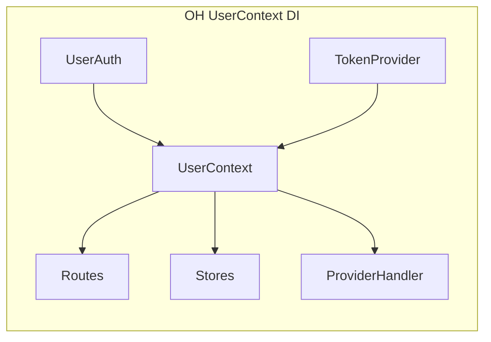
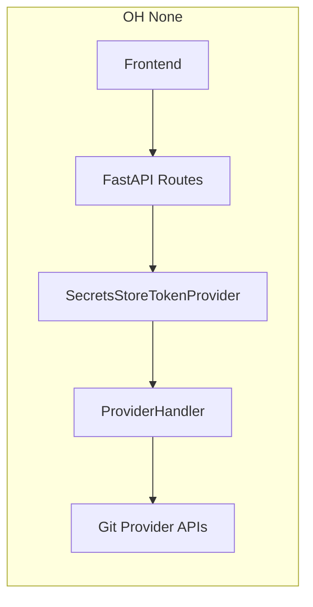
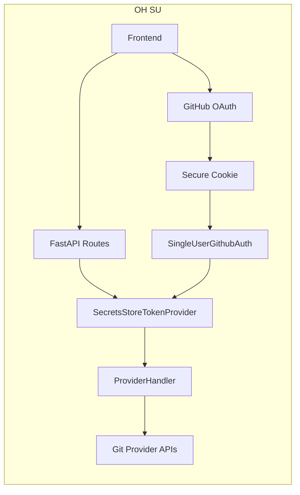
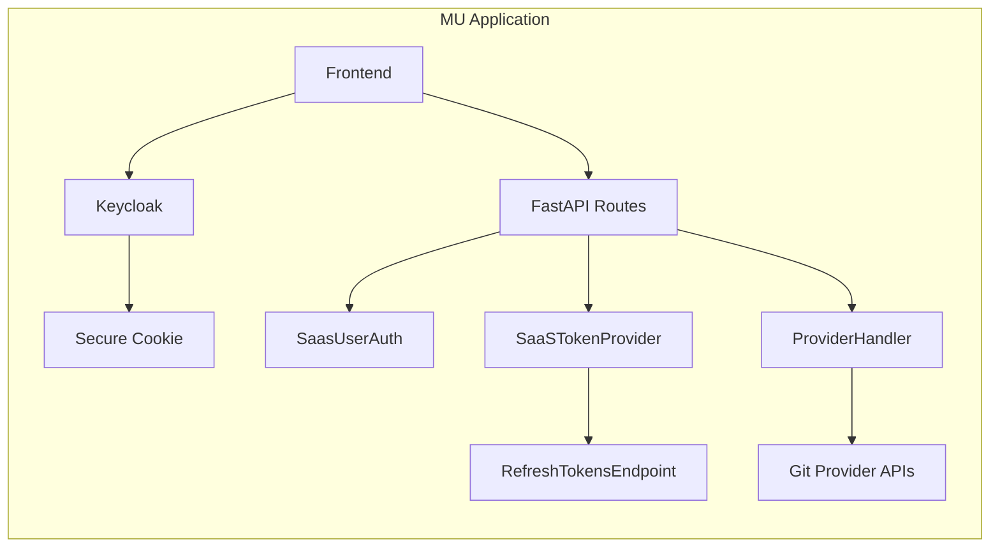

# OpenHands AuthSystem Design (None, SU, MU)

This proposal defines a clean, strategy-based authentication system for OpenHands (OH) that aligns with the existing codebase and cleanly separates OH core concerns (None, SU) from custom MU applications.

Scope: Design only. We describe the problem, the solution, and provide before/after code snippets and simple Mermaid diagrams.

## Problem

- OH currently supports “None” (no identity) with optional Git provider tokens saved locally (secrets store). Routes and services accept `provider_tokens` widely, which leaks auth details across the codebase and couples many components.
- OH currently has over 350 occurrences of `user_id` scattered in business logic, which are not in use, spread auth details across the codebase and couple auth concerns into code logic.
- OH currently has MU business logic in points related to auth (e.g., `REFRESH_TOKEN_URL` in `ProviderHandler`).
- Custom MU applications implement full multi-tenant auth (e.g., via Keycloak) with cookie/bearer flows and token refresh endpoints. Some of this logic currently leaks into OH via `user_id`, `ProviderHandler` (refresh URL) and route signatures.
- I propose an auth system that supports:
  - None (no auth, optional GH token)
  - SU (single user via GitHub OAuth)
  - MU (multi-user), implemented in a separate MU application (e.g., enterprise build on top of OH)

## Solution Overview

Introduce a small set of clearly defined boundaries and strategies:

- Auth Strategy (existing seam): `UserAuth` (or `UserContext`)
  - None: `DefaultUserAuth` (existing)
  - SU: `SingleUserGithubAuth` (new in OH)
  - MU: `SaasUserAuth` (existing, in a custom MU application)
- Token Provider boundary (new): `TokenProvider` (or `TokenSource`)
  - Encapsulates how Git provider tokens are obtained (local file, refresh endpoint, etc.)
  - Routes depend on `TokenProvider` instead of `provider_tokens`
- Provider handler consumes tokens via `TokenProvider` to instantiate concrete Git services

This decouples identity and token resolution from core routes/services and removes MU concerns from OH core. A custom MU application can keep MU entirely outside OH (e.g., in an enterprise codebase) by implementing its own `TokenProvider` and `UserAuth`.

## Before (Selected Relevant Code)

1) user_id propagation in utilities and services (current OH):

```python
# openhands/server/utils.py (fragment)
async def get_conversation_store(request: Request) -> ConversationStore | None:
    conversation_store: ConversationStore | None = getattr(request.state, 'conversation_store', None)
    if conversation_store:
        return conversation_store
    user_id = await get_user_id(request)
    conversation_store = await ConversationStoreImpl.get_instance(config, user_id)
    request.state.conversation_store = conversation_store
    return conversation_store
```


2) Route taking provider_tokens (current OH):

```python
# openhands/server/routes/manage_conversations.py (fragment)
from openhands.server.user_auth import (
    get_provider_tokens,
    get_user_id,
)
from openhands.integrations.provider import ProviderHandler

@app.post("/api/conversations/{conversation_id}/start")
async def start_conversation(
    conversation_id: str,
    user_id: str = Depends(get_user_id),
    provider_tokens: PROVIDER_TOKEN_TYPE = Depends(get_provider_tokens),
):
    provider_handler = ProviderHandler(provider_tokens)
    # ...
```

3) ProviderHandler constructed with provider_tokens mapping (current OH):

```python
# openhands/integrations/provider.py (fragment)
class ProviderHandler:
    def __init__(
        self,
        provider_tokens: PROVIDER_TOKEN_TYPE,
        external_auth_id: str | None = None,
        external_auth_token: SecretStr | None = None,
        external_token_manager: bool = False,
        session_api_key: str | None = None,
        sid: str | None = None,
    ):
        # ...
        self._provider_tokens = provider_tokens
        WEB_HOST = os.getenv('WEB_HOST', '').strip()
        self.REFRESH_TOKEN_URL = (
            f'https://{WEB_HOST}/api/refresh-tokens' if WEB_HOST else None
        )
```

4) Default UserAuth returns None identity and pulls tokens from local stores:

```python
# openhands/server/user_auth/default_user_auth.py (fragment)
class DefaultUserAuth(UserAuth):
    async def get_user_id(self) -> str | None:
        return None

    async def get_provider_tokens(self) -> PROVIDER_TOKEN_TYPE | None:
        user_secrets = await self.get_user_secrets()
        if user_secrets is None:
            return None
        return user_secrets.provider_tokens
```

### Motivation: From user_id clutter to a DI-provided UserContext

Today many route and service signatures accept user_id, provider_tokens, and stores explicitly. This increases coupling and spreads auth/storage concerns across the codebase. We introduce a DI-provided UserContext that centralizes identity, tokens, and storage access.


## After (Design) — including SU locking and fewer configuration points

### A. TokenProvider boundary (new)

```python
# openhands/auth/token_provider.py
from __future__ import annotations
from types import MappingProxyType
from typing import Mapping, Protocol, Optional
from pydantic import SecretStr
from openhands.integrations.provider import ProviderToken
from openhands.integrations.service_types import ProviderType

class TokenProvider(Protocol):
    async def get(self, provider: ProviderType) -> Optional[ProviderToken]:
        ...
    async def get_all(self) -> Mapping[ProviderType, ProviderToken]:
        ...

class SecretsStoreTokenProvider(TokenProvider):
    def __init__(self, tokens: Mapping[ProviderType, ProviderToken] | None):
        self._tokens = MappingProxyType(tokens or {})
    async def get(self, provider: ProviderType) -> Optional[ProviderToken]:
        return self._tokens.get(provider)
    async def get_all(self) -> Mapping[ProviderType, ProviderToken]:
        return self._tokens
```

OH dependency to construct it from the local stores:

```python
# openhands/server/dependencies_token_provider.py
from fastapi import Depends
from openhands.server.user_auth import get_user_secrets
from openhands.auth.token_provider import SecretsStoreTokenProvider, TokenProvider

async def get_token_provider(
    user_secrets = Depends(get_user_secrets),
) -> TokenProvider:
    tokens = user_secrets.provider_tokens if user_secrets else None
    return SecretsStoreTokenProvider(tokens)
```

A custom MU application can provide its own `SaaSTokenProvider` that calls a refresh-tokens endpoint; this lives entirely outside OH in the MU codebase.

### B. ProviderHandler consumes TokenProvider

```python
# openhands/integrations/provider.py (proposed shape)
from openhands.auth.token_provider import TokenProvider

class ProviderHandler:
    def __init__(self, token_provider: TokenProvider):
        self.token_provider = token_provider
        self.service_class_map = { ... }

    async def _get_service(self, provider: ProviderType) -> GitService:
        pt = await self.token_provider.get(provider)
        if not pt or not pt.token:
            raise AuthenticationError(f"No token for {provider.value}")
        service_class = self.service_class_map[provider]
        return service_class(token=pt.token, base_domain=pt.host)
```

This removes the need for `REFRESH_TOKEN_URL` and any MU-specific logic from OH core.

### C. Routes depend on TokenProvider rather than provider_tokens

```python
# openhands/server/routes/manage_conversations.py (after)
from openhands.auth.token_provider import TokenProvider
from openhands.server.dependencies_token_provider import get_token_provider
from openhands.integrations.provider import ProviderHandler

@app.post("/api/conversations/{conversation_id}/start")
async def start_conversation(
    conversation_id: str,
    token_provider: TokenProvider = Depends(get_token_provider),

### C2. UserContext for DI (new)

```python
# openhands/server/user_context.py
from dataclasses import dataclass
from typing import Optional
from fastapi import Depends
from openhands.server.user_auth import get_user_auth
from openhands.server.user_auth.user_auth import AuthType
from openhands.auth.token_provider import TokenProvider
from openhands.storage.settings.settings_store import SettingsStore
from openhands.storage.secrets.secrets_store import SecretsStore
from openhands.storage.locations import get_conversation_dir

@dataclass
class UserContext:
    user_id: Optional[str]
    auth_type: Optional[AuthType]
    token_provider: TokenProvider
    settings_store: SettingsStore
    secrets_store: SecretsStore

    # Convenience: conversation paths without threading user_id
    def conversation_dir(self, sid: str) -> str:
        return get_conversation_dir(sid, self.user_id)

# Dependency provider (simplified)
async def get_user_context(
    user_auth = Depends(get_user_auth),
    token_provider: TokenProvider = Depends(get_token_provider),
) -> UserContext:
    user_id = await user_auth.get_user_id()
    settings_store = await user_auth.get_user_settings_store()
    secrets_store = await user_auth.get_secrets_store()
    auth_type = await user_auth.get_auth_type()
    return UserContext(user_id, auth_type, token_provider, settings_store, secrets_store)
```

Routes then depend on a single UserContext interface:

```python
# openhands/server/routes/manage_conversations.py (after)
from openhands.server.user_context import UserContext, get_user_context

@app.post('/conversations')
async def new_conversation(
    data: InitSessionRequest,
    user: UserContext = Depends(get_user_context),
) -> ConversationResponse:
    # Build stores and paths from user
    conversation_dir = user.conversation_dir(conversation_id)
    # Continue with conversation creation using conversation_dir

    if data.repository:
        provider_handler = ProviderHandler(user.token_provider)
        await provider_handler.verify_repo_provider(data.repository, data.git_provider)
    # Use user.conversation_dir(conversation_id) downstream
```


### C3. From `user_id` to `ConversationPaths`
From the 350+ occurrences of `user_id` in OH codebase, a majority are in the storage layer or about the storage layer: they simply attempt to isolate users' data (event stream, conversation metadata, etc). That's request scope. We can wrap this scoping logic in a `ConversationPaths` class that centralizes this logic.

```python
# openhands/storage/paths.py (optional wrapper)
from dataclasses import dataclass
from typing import Optional
from openhands.storage.locations import (
    get_conversation_dir,
    get_conversation_events_dir,
    get_conversation_event_filename,
    get_conversation_metadata_filename,
)

@dataclass
class ConversationPaths:
    user_id: Optional[str]
    def dir(self, sid: str) -> str: return get_conversation_dir(sid, self.user_id)
    def events_dir(self, sid: str) -> str: return get_conversation_events_dir(sid, self.user_id)
    def event(self, sid: str, id: int) -> str: return get_conversation_event_filename(sid, id, self.user_id)
    def metadata(self, sid: str) -> str: return get_conversation_metadata_filename(sid, self.user_id)

# Bound into UserContext
@dataclass
class UserContext:
    ...
    paths: ConversationPaths

# Construction
return UserContext(user_id, auth_type, token_provider, settings_store, secrets_store, paths=ConversationPaths(user_id))
```

Route/service signatures migrate from threading user_id to accepting UserContext:

Before:
```python
async def get_conversation(conversation_id: str, user_id: str | None = Depends(get_user_id)):
    ...
```

After:
```python
async def get_conversation(conversation_id: str, user: UserContext = Depends(get_user_context)):
    ...
```


### D. SU Auth Strategy (OH)

Implement a single-user OAuth strategy using the existing `UserAuth` seam. It issues a secure cookie with the OAuth result and maps it to a single (pre-configured) allowed user.

```python
# openhands/server/user_auth/single_user_github_auth.py (concept)
from dataclasses import dataclass
from fastapi import Request
from pydantic import SecretStr

```


from openhands.server.user_auth.user_auth import AuthType, UserAuth
from openhands.storage.settings.settings_store import SettingsStore
from openhands.storage.secrets.secrets_store import SecretsStore

@dataclass
class SingleUserGithubAuth(UserAuth):
    user_id: str | None
    access_token: SecretStr | None
    auth_type: AuthType = AuthType.COOKIE

    async def get_user_id(self) -> str | None:
        return self.user_id

    async def get_access_token(self) -> SecretStr | None:
        return self.access_token

    async def get_user_settings_store(self) -> SettingsStore:
        # same as DefaultUserAuth but with stable user_id
from openhands.server.user_auth.user_auth import AuthType, UserAuth
from openhands.storage.settings.settings_store import SettingsStore
from openhands.storage.secrets.secrets_store import SecretsStore

        ...

    async def get_secrets_store(self) -> SecretsStore:
        # same as DefaultUserAuth but with stable user_id
        ...

    @classmethod
    async def get_instance(cls, request: Request) -> UserAuth:
        # Parse secure cookie or return None -> UI can redirect to GH OAuth
        # For None mode (no OAuth), return instance with user_id=None and access_token=None
        ...
```


### E. SU configuration and locking (config.toml primary)

- config.toml (preferred):

```
[auth]
strategy = "single_user_github"
allowed = "12345678"          # numeric -> GitHub ID; non-numeric -> login
github_client_id = "<client_id>"
github_client_secret = "<client_secret>"
```

- Environment-only fallback:
  - OPENHANDS_AUTH_MODE=su
  - SU_GITHUB_ALLOWED=12345678 (or octocat)
  - GITHUB_OAUTH_CLIENT_ID=...
  - GITHUB_OAUTH_CLIENT_SECRET=...

Rules:
- Identity must be preconfigured. ID preferred; fallback to login. No bind-on-first-login.
- On OAuth callback, if identity != allowed, deny with 401/403.
- On success, issue secure cookie, set stable user_id (GitHub numeric ID), and persist ProviderToken[GitHub] from OAuth token.
- Secrets/Settings stores scope to that user_id.

Selection is still configured via `server_config.user_auth_class`, which OH already supports. For None (no auth), continue using `DefaultUserAuth`.

## Diagrams (After)

Simple flows for three strategies (None, SU, MU).







Notes:
- OH implements the auth system and SU strategy; MU components (Keycloak, SaaSTokenProvider, refresh endpoint) remain outside OH in the MU application.
- both OH and MU applications retain and respect the auth boundary.

## Security considerations

- Secrets are never logged; TokenProvider interface returns `SecretStr` values. Event streams mask secrets as today.
- Session API keys and nested runtimes remain MU application concerns and are not introduced into OH tokens.
- SU cookie is HttpOnly, SameSite=Lax for localhost, Strict otherwise. JWT secret is reused from existing config.

## Migration guidance

- Step 1: Refactor most occurrences of `user_id` scattered in business logic to `UserContext`, both in OH and /enterprise; add OH dependency `get_user_context`.
- Step 2: Introduce `TokenProvider` in OH; add OH dependency `get_token_provider`.
- Step 3: Update routes to use `UserContext` and `TokenProvider`.
- Step 4: Remove MU-specific refresh logic in `ProviderHandler` once all routes use `TokenProvider`.
- Step 5: Add `SingleUserGithubAuth` and expose via `server_config.user_auth_class` override.


This plan keeps behavior identical for None mode, enables SU via a clean strategy, and isolates MU to the enterprise layer.
