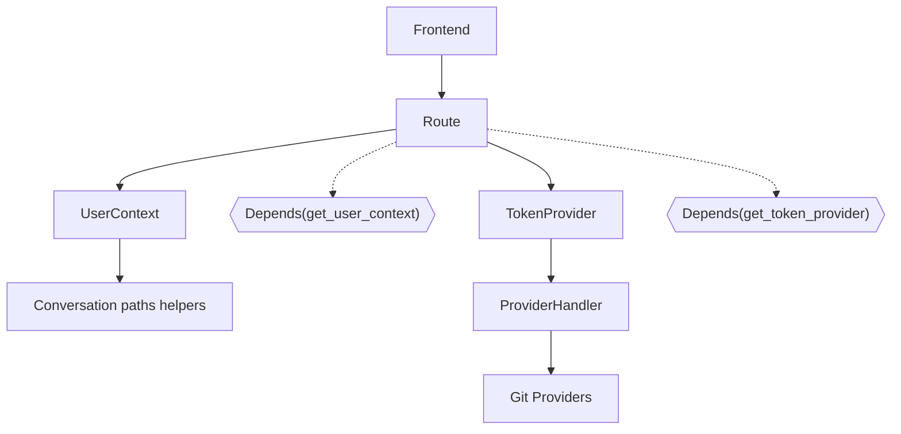
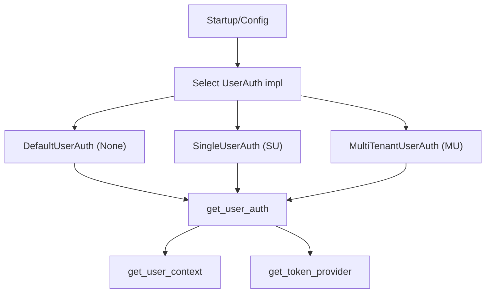

# Proposal: Auth System (None, SU, MU)

This document proposes a unified authentication system for OpenHands that plugs cleanly into the boundary-first refactor. It defines three modes and shows how they integrate without leaking into core.

- None: no authentication (current default)
- Single User (SU): one authenticated user with stable identity
- Multi User (MU): multi-tenant system implemented outside OpenHands

Key interfaces used at the boundary:
- UserAuth: strategy for identity and request auth context
- UserContext: dependency that surfaces stable user_id (or None) and helpers
- TokenProvider: dependency that supplies provider tokens; core never sees access_token

See also: Proposal: Boundary-first Auth/Scope Refactor and Auth System – Auxiliary Code Snippets and Evidence.

## Goals
- Keep core clean: no access_token or MU refresh logic in core signatures/services
- Uniform route shape: same endpoints for all modes
- Strategy-based: choose UserAuth implementation at composition/config time

## Modes and strategies (sketch)

```python
# UserAuth seam (existing in OH; clarified usage)
class UserAuth(Protocol):
    async def get_user_id(self, request: Request) -> str | None: ...
    async def get_access_token(self, request: Request) -> SecretStr | None: ...
    async def get_user_secrets(self, request: Request) -> UserSecrets | None: ...
```

Implementations (minimal responsibilities):
- DefaultUserAuth (None): user_id=None; no access_token; secrets readable for anon
- SingleUserAuth (SU): stable user_id; OAuth cookie establishes identity; secrets are namespaced to that user
- MultiTenantUserAuth (MU): parses cookie/bearer; no local secrets; MU app mints provider tokens from access_token

## Boundary wiring

- get_user_context uses get_user_auth, exposes user_id and path helpers
- get_token_provider uses get_user_auth; OH default builds a SecretsStore-backed TokenProvider
- MU app can override get_token_provider to create a remote TokenProvider using its access_token

Mermaid (Auth at boundary; same routes)


## Mode selection

Pick a UserAuth implementation at startup/config. Core dependencies remain the same.



## SU: what and why (brief)
- Why: secure, single-identity OpenHands usable remotely without full MU stack
- What: OAuth with a single allowed identity; establishes a stable user_id; secrets/tokens stored server-side under that id
- Shape in OH: an implementation of UserAuth (SingleUserAuth), plus cookie-based callback route; no route signature changes

## MU: what and why (brief)
- Why: enterprise/SaaS multi-tenant deployments
- What: separate app handles login/session; exposes refresh-tokens endpoint; provides a TokenProvider via dependency override
- Shape vs OH: MU implements its own UserAuth and TokenProvider outside OpenHands; OH core remains unchanged

## Notes
- Dependency overrides can swap get_token_provider without matching the original’s parameters; only the return value contract matters (FastAPI allows this).
- Keep “Linus’ No Special Cases” principle: boundary decides scope/auth; core uses uniform interfaces.

## References
- PR #10823 and linked issues #10730, #10751
- Prototype: enyst/test-auth (strategy wiring ideas)
- See: Proposal: Boundary-first Auth/Scope Refactor
- See: Auth System – Auxiliary Code Snippets and Evidence
