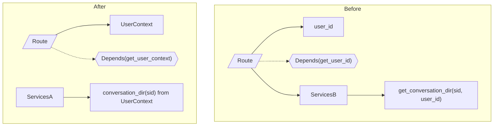
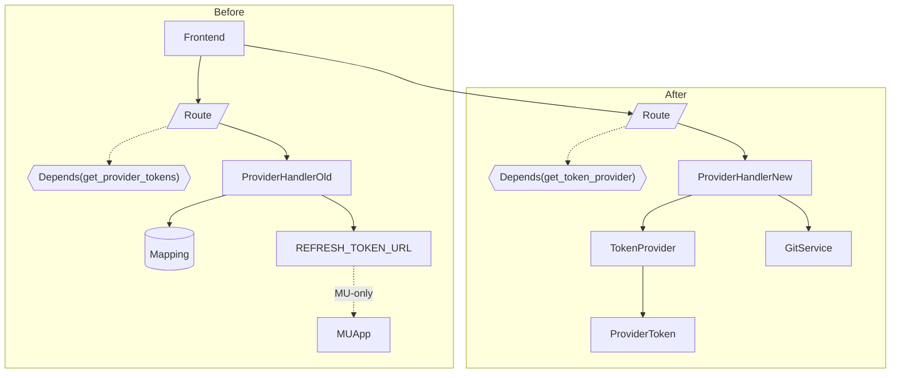

# OpenHands Auth System Proposal

This proposal addresses two tightly related, but distinct problems in OpenHands core:

1) user_id clutter used for request-scoped, user-scoped resources — solved by introducing a UserContext boundary and optional ConversationPaths
2) provider token threading and MU–specific refresh logic leaking into core — solved by introducing a TokenProvider boundary that ProviderHandler consumes

The goals are to keep authentication and request scoping at the boundary, simplify route/service signatures, and remove multi-tenant (MU) details from OpenHands core.

## 1) Problem: user_id sprawl (request/user scope expressed deep in core)

Evidence from the user_id audit (issue #10751):
- 339 total occurrences across 68 files (including docs); excluding tests and sandbox/uid code paths: 290 lines across 53 files
- Many of these are server-layer usages to express request scope and user isolation, not business logic conditions
- Typical responsibilities using user_id today:
  - user-specific paths for Event Streams and Event Stores
  - conversation metadata/state save/restore paths
  - conversation store/session filtering and attach/detach
  - dependency factories that derive a namespaced store (e.g., get_conversation_store)

What it is actually used for:
- Resource namespacing and isolation (directory paths and file names)
- Selecting the right user’s conversation/store/session
- Never for core algorithmic logic: it’s almost entirely scoping/partitioning

Representative “before” snippets (current main):

openhands/server/utils.py (request-scoped conversation store)
```python
async def get_conversation_store(request: Request) -> ConversationStore | None:
    conversation_store: ConversationStore | None = getattr(request.state, 'conversation_store', None)
    if conversation_store:
        return conversation_store
    user_id = await get_user_id(request)
    conversation_store = await ConversationStoreImpl.get_instance(config, user_id)
    request.state.conversation_store = conversation_store
    return conversation_store
```

openhands/storage/locations.py (user-scoped paths)
```python
CONVERSATION_BASE_DIR = 'sessions'

def get_conversation_dir(sid: str, user_id: str | None = None) -> str:
    if user_id:
        return f'users/{user_id}/conversations/{sid}/'
    else:
        return f'{CONVERSATION_BASE_DIR}/{sid}/'
```

openhands/controller/state/state.py (dual path save/cleanup because of user_id)
```python
file_store.write(get_conversation_agent_state_filename(sid, user_id), encoded)
if user_id:
    filename = get_conversation_agent_state_filename(sid)
    try:
        file_store.delete(filename)
    except Exception:
        pass
```

openhands/server/routes/manage_conversations.py (threading user_id)
```python
@app.post('/conversations')
async def new_conversation(
    data: InitSessionRequest,
    user_id: str = Depends(get_user_id),
    ...
):
    ...
```

### Proposal: Introduce a UserContext boundary (and optional ConversationPaths)

Rationale: user-specific resource scoping is a boundary concern. It should be established once per request and injected where needed, not threaded through every method. Keeping request and auth details at the boundary:
- avoids signature bloat and scattered if-guards
- clarifies separation between business logic (core services) and policy (who/where)
- makes SU/MU/None pluggable without touching core

A minimal UserContext centralizes identity and provides a path helper so internals don’t need to accept user_id.

Proposed shape:

```python
# openhands/server/user_context.py
from dataclasses import dataclass
from typing import Optional
from fastapi import Depends
from openhands.server.user_auth import get_user_auth
from openhands.auth.token_provider import TokenProvider  # defined later
from openhands.storage.locations import get_conversation_dir

@dataclass
class UserContext:
    user_id: Optional[str]
    token_provider: TokenProvider  # injected later via dependency

    def conversation_dir(self, sid: str) -> str:
        return get_conversation_dir(sid, self.user_id)

async def get_user_context(
    user_auth = Depends(get_user_auth),
    token_provider: TokenProvider = Depends(get_token_provider),  # see section 2
) -> UserContext:
    user_id = await user_auth.get_user_id()
    return UserContext(user_id, token_provider)
```

Optionally, make the path surface explicit if desired:
```python
# openhands/storage/paths.py (optional)
from dataclasses import dataclass
from typing import Optional
from openhands.storage.locations import (
    get_conversation_dir,
    get_conversation_events_dir,
    get_conversation_event_filename,
    get_conversation_metadata_filename,
)

@dataclass
class ConversationPaths:
    user_id: Optional[str]
    def dir(self, sid: str) -> str: return get_conversation_dir(sid, self.user_id)
    def events_dir(self, sid: str) -> str: return get_conversation_events_dir(sid, self.user_id)
    def event(self, sid: str, id: int) -> str: return get_conversation_event_filename(sid, id, self.user_id)
    def metadata(self, sid: str) -> str: return get_conversation_metadata_filename(sid, self.user_id)
```

Routes/services then depend on UserContext rather than user_id directly; internals call user.conversation_dir(sid) or paths.* helpers.

Mermaid (Before and After) for user-scoped resources


Security note on SU (single user)
- SU can be offered as a secure way to run OpenHands and access it remotely: the user authenticates (e.g., via GitHub OAuth in an SU flow), a stable user id is established, and server-side resources are properly scoped. No multi-tenant DB is required for SU; tokens/settings can remain in local secure stores. The important part for core is that UserContext surfaces a stable user_id when SU is enabled, and None otherwise.


## 2) Problem: provider token threading and MU refresh logic in core

Today, routes accept provider_tokens and pass them into ProviderHandler; ProviderHandler also knows how to refresh tokens via an MU endpoint by composing REFRESH_TOKEN_URL from env.

Representative “before” snippets:

openhands/server/routes/git.py (threading provider_tokens)
```python
provider_tokens: PROVIDER_TOKEN_TYPE | None = Depends(get_provider_tokens)
...
client = ProviderHandler(
    provider_tokens=provider_tokens,
    external_auth_token=access_token,
    external_auth_id=user_id,
)
```

openhands/integrations/provider.py (MU refresh leak)
```python
WEB_HOST = os.getenv('WEB_HOST', '').strip()
self.REFRESH_TOKEN_URL = (
    f'https://{WEB_HOST}/api/refresh-tokens' if WEB_HOST else None
)
...
resp = await client.get(
    self.REFRESH_TOKEN_URL,
    headers={'X-Session-API-Key': self.session_api_key},
    params={'provider': provider.value, 'sid': self.sid},
)
```

### Proposal: Introduce a TokenProvider boundary and have ProviderHandler consume it

Rationale: acquiring, caching, and refreshing provider tokens is an auth boundary concern. Core should only request a token for a provider, not know how to mint/refresh it. This:
- stops threading token maps through signatures
- removes MU refresh URLs and headers from OH core
- lets MU apps implement their own TokenProvider entirely outside OH


#### Access token dependency in routes (noisy -> fix)
- Why it’s noisy: In OH default mode, `get_access_token()` returns None; threading it through route signatures creates bloat and conditional branches without value.
- Fix: Core routes depend on `TokenProvider` only. MU apps override the dependency that builds the `TokenProvider` and derive provider tokens from their own `get_access_token()` behind the boundary. Core never sees `access_token` directly.
- FastAPI note: Dependency overrides don’t need identical function signatures. The override can have different parameters/sub-dependencies; FastAPI just uses the returned value in place of the original dependency. See FastAPI docs: https://fastapi.tiangolo.com/advanced/testing-dependencies/ (example overrides a dependency taking `q, skip, limit` with one taking only `q`).

Protocol and OpenHands (secrets-driven) implementation:

```python
# openhands/auth/token_provider.py
from types import MappingProxyType
from typing import Mapping, Protocol, Optional
from pydantic import SecretStr
from openhands.integrations.provider import ProviderToken
from openhands.integrations.service_types import ProviderType

class TokenProvider(Protocol):
    async def get(self, provider: ProviderType) -> Optional[ProviderToken]: ...
    async def get_all(self) -> Mapping[ProviderType, ProviderToken]: ...

class SecretsStoreTokenProvider(TokenProvider):
    def __init__(self, tokens: Mapping[ProviderType, ProviderToken] | None):
        self._tokens = MappingProxyType(tokens or {})
    async def get(self, provider: ProviderType) -> Optional[ProviderToken]:
        return self._tokens.get(provider)
    async def get_all(self) -> Mapping[ProviderType, ProviderToken]:
        return self._tokens
```

FastAPI dependency in OH core (reads from SecretsStore):
```python
# openhands/server/dependencies_token_provider.py
from fastapi import Depends
from openhands.server.user_auth import get_user_secrets
from openhands.auth.token_provider import SecretsStoreTokenProvider, TokenProvider

async def get_token_provider(
    user_secrets = Depends(get_user_secrets),
) -> TokenProvider:
    tokens = user_secrets.provider_tokens if user_secrets else None
    return SecretsStoreTokenProvider(tokens)
```

ProviderHandler consuming TokenProvider instead of provider_tokens:
```python
# openhands/integrations/provider.py (proposed)
from openhands.auth.token_provider import TokenProvider

class ProviderHandler:
    def __init__(self, token_provider: TokenProvider):
        self.token_provider = token_provider
        self.service_class_map = { ... }

    async def _get_service(self, provider: ProviderType) -> GitService:
        pt = await self.token_provider.get(provider)
        if not pt or not pt.token:
            raise AuthenticationError(f"No token for {provider.value}")
        service_class = self.service_class_map[provider]
        return service_class(token=pt.token, base_domain=pt.host)
```

Routes depend on TokenProvider (no provider_tokens argument):
```python
from fastapi import Depends
from openhands.auth.token_provider import TokenProvider
from openhands.server.dependencies_token_provider import get_token_provider
from openhands.integrations.provider import ProviderHandler

@app.get('/repositories', response_model=list[Repository])
async def get_user_repositories(
    sort: str = 'pushed',
    selected_provider: ProviderType | None = None,
    page: int | None = None,
    per_page: int | None = None,
    installation_id: str | None = None,
    token_provider: TokenProvider = Depends(get_token_provider),
):
    client = ProviderHandler(token_provider=token_provider)
    return await client.get_repositories(sort, server_config.app_mode, selected_provider, page, per_page, installation_id)
```

Mermaid (Before and After) for token flow


## Why this belongs at the boundary (auth and request scope)
- Auth is about who/what; request scope/user scope is about where resources live. Both are configuration/policy that should be decided at the web/app boundary per request and injected, not hard-coded into core signatures and services.
- Boundaries (UserContext, TokenProvider) make those policies explicit and replace ad-hoc threading, while keeping business logic focused on its job.


## Linus' Philosophy: No Special Cases (Fun section)

> Core code sees uniform interfaces. Only the boundary decides scope (auth/request), then injects a context. No per-call if/else.

Second Layer: Special Case Identification
- Identify branches observed today:
  - Path building: if user_id then users/{user_id}/conversations/{sid}/ else sessions/{sid}/
  - State save/cleanup: write(user-path) then if user_id: delete old non-user path
  - Factories/DI: get_instance(config, user_id) patterns and repeated None checks
- Keep as true business logic:
  - Access validation (e.g., attach_to_conversation(conversation_id, user_id) ensuring the caller can access the resource)
  - Policy enforcement/tenancy checks at the edges
- Remove as design patches by redesigning data/abstractions:
  - Make scope first-class and non-optional via UserContext (or ScopeKey)
  - Standardize storage layout so callers do not branch on user_id
  - Encapsulate path derivations in ConversationPaths or UserContext helpers
  - Optionally namespace conversation IDs (composite) to avoid threading multiple params and prevent cross-scope access
  - Perform a one-time migration; then delete cleanup branches

Conceptual uniform path (no special case):
```python
from dataclasses import dataclass
from typing import Literal

@dataclass(frozen=True)
class ScopeKey:
    kind: Literal["anon", "user"]
    id: str  # e.g., "_" for anon

def conversation_dir(scope: ScopeKey, sid: str) -> str:
    return f"root/{scope.kind}/{scope.id}/conversations/{sid}/"
```

This aligns with the proposal’s boundaries: the boundary constructs UserContext once per request (deciding scope); core uses uniform helpers and never branches on user identity.

## SU note (secure single-user mode)
- SU is a practical, secure way to run OpenHands for an individual: authenticate once (e.g., GitHub OAuth), establish a stable user id, and keep secrets/namespacing server-side. You can reach the server from anywhere via browser, while core remains unchanged. The MU case stays in a separate app that implements its own UserAuth/TokenProvider.

## References
- Issue #10751 (user_id audit: counts, categories, file concentrations)
- Issue #10730 (TokenProvider boundary design)
- Current code references in main:
  - openhands/server/utils.py (get_conversation_store)
  - openhands/storage/locations.py (path namespacing)
  - openhands/controller/state/state.py (save/restore dual paths)
  - openhands/server/routes/manage_conversations.py and routes/git.py (signature threading)
  - openhands/integrations/provider.py (refresh URL)
