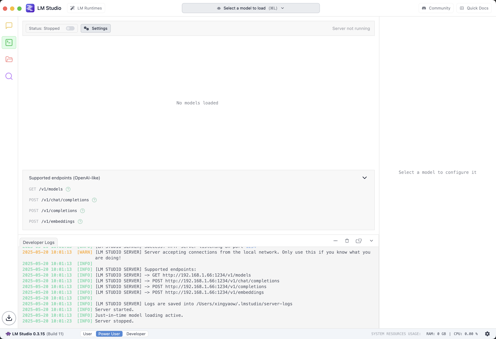
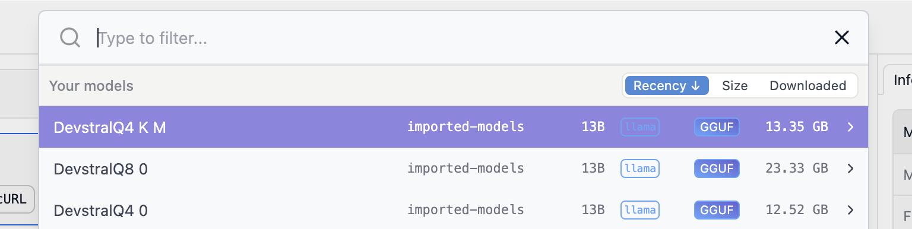
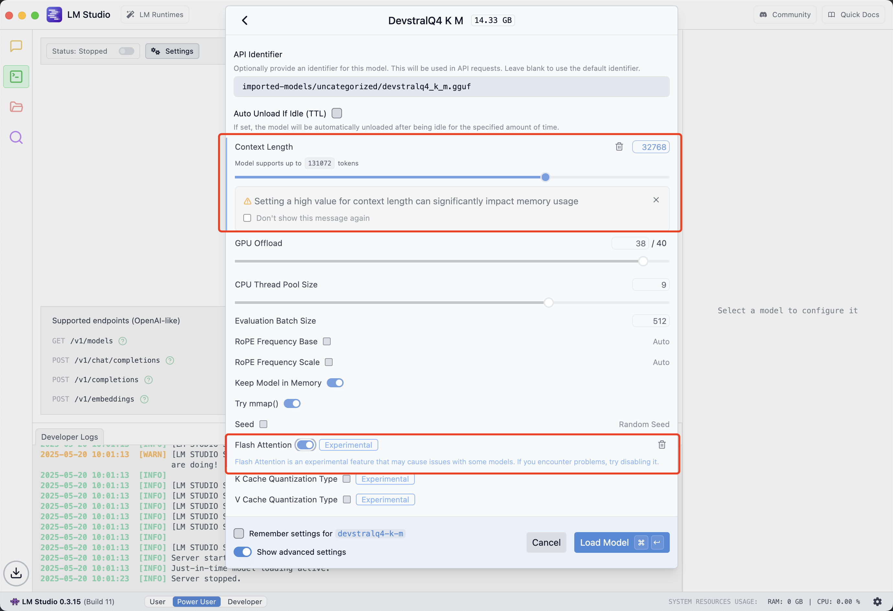
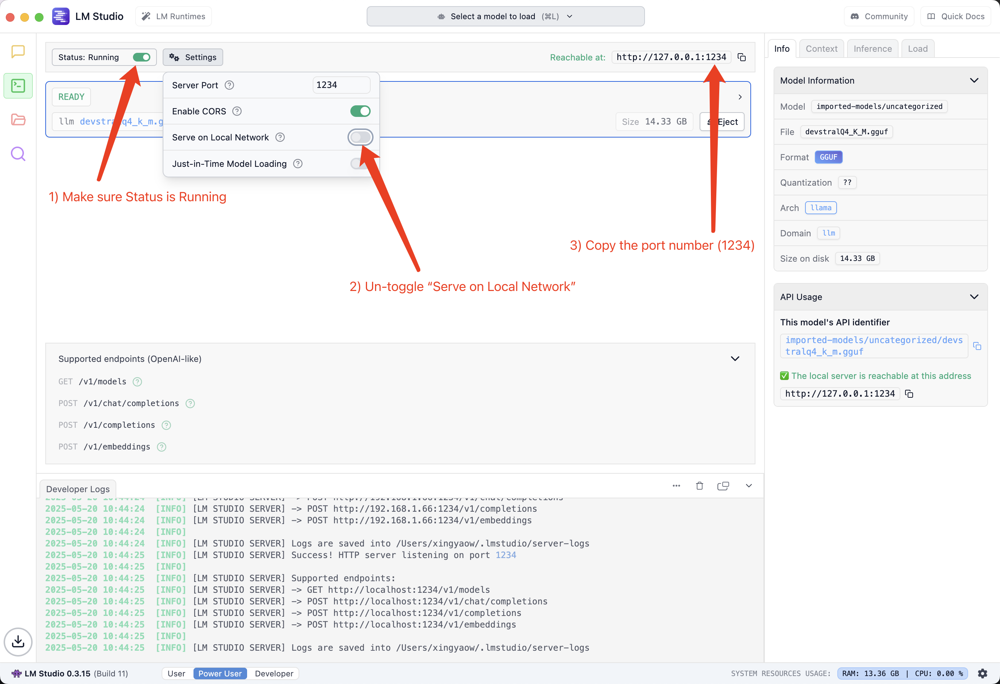
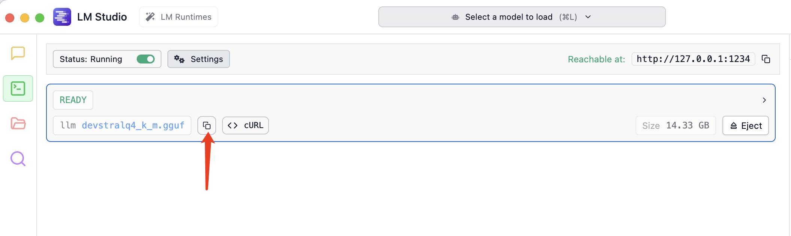

## News

- 2025/05/21: We collaborated with Mistral AI and released [Devstral Small](https://mistral.ai/news/devstral) that achieves [46.8% on SWE-Bench Verified](https://github.com/SWE-bench/experiments/pull/228)!
- 2025/03/31: We released an open model OpenHands LM v0.1 32B that achieves 37.1% on SWE-Bench Verified
([blog](https://www.all-hands.dev/blog/introducing-openhands-lm-32b----a-strong-open-coding-agent-model), [model](https://huggingface.co/all-hands/openhands-lm-32b-v0.1)).


## Quickstart: Running OpenHands on Your Macbook

### Serve the model on your Macbook

We recommend using [LMStudio](https://lmstudio.ai/) for serving these models locally.

1. Download [LM Studio](https://lmstudio.ai/) and install it

2. Download the model:
   - Option 1: Directly download the LLM from [this link](https://lmstudio.ai/model/devstral-small-2505-mlx) or by searching for the name `Devstral-Small-2505` in LM Studio
   - Option 2: Download a LLM in GGUF format. For example, to download [Devstral Small 2505 GGUF](https://huggingface.co/mistralai/Devstral-Small-2505_gguf), using `huggingface-cli download mistralai/Devstral-Small-2505_gguf --local-dir mistralai/Devstral-Small-2505_gguf`. Then in bash terminal, run `lms import {model_name}` in the directory where you've downloaded the model checkpoint (e.g. run `lms import devstralQ4_K_M.gguf` in `mistralai/Devstral-Small-2505_gguf`)

3. Open LM Studio application, you should first switch to `power user` mode, and then open the developer tab:


4. Then click `Select a model to load` on top of the application:



5. And choose the model you want to use, holding `option` on mac to enable advanced loading options:



6. You should then pick an appropriate context window for OpenHands based on your hardware configuration (larger than 32768 is recommended for using OpenHands, but too large may cause you to run out of memory); Flash attention is also recommended if it works on your machine.



7. And you should start the server (if it is not already in `Running` status), un-toggle `Serve on Local Network` and remember the port number of the LMStudio URL (`1234` is the port number for `http://127.0.0.1:1234` in this example):



8. Finally, you can click the `copy` button near model name to copy the model name (`imported-models/uncategorized/devstralq4_k_m.gguf` in this example):



### Start OpenHands with locally served model

Check [the installation guide](/usage/local-setup) to make sure you have all the prerequisites for running OpenHands.

```bash
export LMSTUDIO_MODEL_NAME="imported-models/uncategorized/devstralq4_k_m.gguf" # <- Replace this with the model name you copied from LMStudio
export LMSTUDIO_URL="http://host.docker.internal:1234"  # <- Replace this with the port from LMStudio

docker pull docker.all-hands.dev/all-hands-ai/runtime:0.45-nikolaik

mkdir -p ~/.openhands && echo '{"language":"en","agent":"CodeActAgent","max_iterations":null,"security_analyzer":null,"confirmation_mode":false,"llm_model":"lm_studio/'$LMSTUDIO_MODEL_NAME'","llm_api_key":"dummy","llm_base_url":"'$LMSTUDIO_URL/v1'","remote_runtime_resource_factor":null,"github_token":null,"enable_default_condenser":true,"user_consents_to_analytics":true}' > ~/.openhands/settings.json

docker run -it --rm --pull=always \
    -e SANDBOX_RUNTIME_CONTAINER_IMAGE=docker.all-hands.dev/all-hands-ai/runtime:0.45-nikolaik \
    -e LOG_ALL_EVENTS=true \
    -v /var/run/docker.sock:/var/run/docker.sock \
    -v ~/.openhands:/.openhands \
    -p 3000:3000 \
    --add-host host.docker.internal:host-gateway \
    --name openhands-app \
    docker.all-hands.dev/all-hands-ai/openhands:0.45
```

> **Note**: If you used OpenHands before version 0.44, you may want to run `mv ~/.openhands-state ~/.openhands` to migrate your conversation history to the new location.

Once your server is running -- you can visit `http://localhost:3000` in your browser to use OpenHands with local Devstral model:
```
Digest: sha256:e72f9baecb458aedb9afc2cd5bc935118d1868719e55d50da73190d3a85c674f
Status: Image is up to date for docker.all-hands.dev/all-hands-ai/openhands:0.45
Starting OpenHands...
Running OpenHands as root
14:22:13 - openhands:INFO: server_config.py:50 - Using config class None
INFO:     Started server process [8]
INFO:     Waiting for application startup.
INFO:     Application startup complete.
INFO:     Uvicorn running on http://0.0.0.0:3000 (Press CTRL+C to quit)
```


## Advanced: Serving LLM on GPUs

### Download model checkpoints

<Note>
The model checkpoints downloaded here should NOT be in GGUF format.
</Note>

For example, to download [OpenHands LM 32B v0.1](https://huggingface.co/all-hands/openhands-lm-32b-v0.1):

```bash
huggingface-cli download all-hands/openhands-lm-32b-v0.1 --local-dir all-hands/openhands-lm-32b-v0.1
```

### Create an OpenAI-Compatible Endpoint With SGLang

- Install SGLang following [the official documentation](https://docs.sglang.ai/start/install.html).
- Example launch command for OpenHands LM 32B (with at least 2 GPUs):

```bash
SGLANG_ALLOW_OVERWRITE_LONGER_CONTEXT_LEN=1 python3 -m sglang.launch_server \
    --model all-hands/openhands-lm-32b-v0.1 \
    --served-model-name openhands-lm-32b-v0.1 \
    --port 8000 \
    --tp 2 --dp 1 \
    --host 0.0.0.0 \
    --api-key mykey --context-length 131072
```

### Create an OpenAI-Compatible Endpoint with vLLM

- Install vLLM following [the official documentation](https://docs.vllm.ai/en/latest/getting_started/installation.html).
- Example launch command for OpenHands LM 32B (with at least 2 GPUs):

```bash
vllm serve all-hands/openhands-lm-32b-v0.1 \
    --host 0.0.0.0 --port 8000 \
    --api-key mykey \
    --tensor-parallel-size 2 \
    --served-model-name openhands-lm-32b-v0.1
    --enable-prefix-caching
```

### Create an OpenAI-Compatible Endpoint with Ollama

- Install Ollama following [the official documentation](https://ollama.com/download).
- For Ollama configuration, use `ollama/<modelname>` as custom model in web. Api key also can be set to `ollama`.
- Example launch command for Devstral LM 24B:

```bash
OLLAMA_CONTEXT_LENGTH=32768 OLLAMA_HOST=0.0.0.0:11434 OLLAMA_KEEP_ALIVE=-1 nohup ollama serve&
#The minimum context size is ~8196, even the system prompt won't fit smaller
ollama pull devstral:latest
```

## Advanced: Run and Configure OpenHands

### Run OpenHands

#### Using Docker

Run OpenHands using [the official docker run command](../installation#start-the-app).

#### Using Development Mode

Use the instructions in [Development.md](https://github.com/All-Hands-AI/OpenHands/blob/main/Development.md) to build OpenHands.
Ensure `config.toml` exists by running `make setup-config` which will create one for you. In the `config.toml`, enter the following:

```
[core]
workspace_base="/path/to/your/workspace"

[llm]
model="openhands-lm-32b-v0.1"
ollama_base_url="http://localhost:8000"
```

Start OpenHands using `make run`.

### Configure OpenHands

Once OpenHands is running, you'll need to set the following in the OpenHands UI through the Settings under the `LLM` tab:
1. Enable `Advanced` options.
2. Set the following:
- `Custom Model` to `openai/<served-model-name>` (e.g. `openai/openhands-lm-32b-v0.1`)
- `Base URL` to `http://host.docker.internal:8000`
- `API key` to the same string you set when serving the model (e.g. `mykey`)

<Note>
**API Key for Local LLMs**: When using local LLM servers (including Ollama, LM Studio, vLLM, etc.), you can enter any value as the API key if your server doesn't require authentication. The OpenHands UI requires an API key to be entered, but for local servers without authentication, you can use any placeholder value like `local-key`, `test123`, or `dummy`.
</Note>
