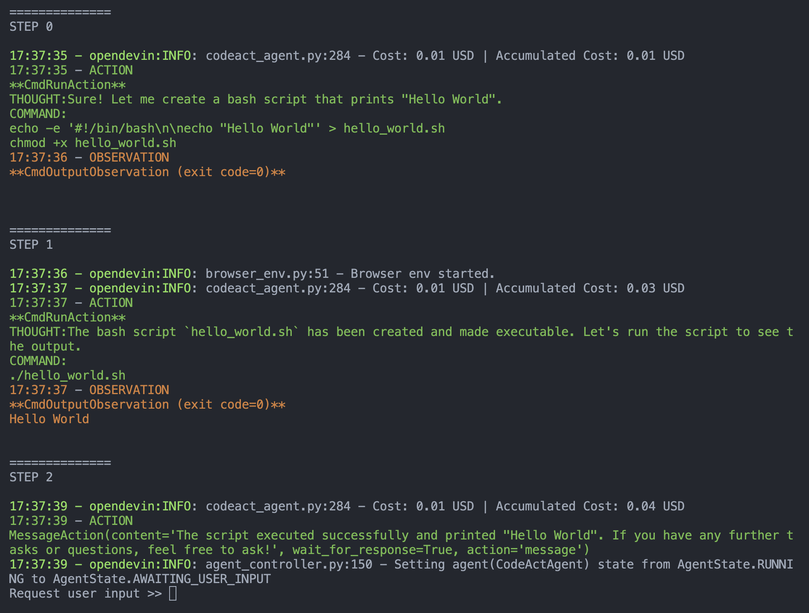

# Tutorial: How to add a New Evaluation Benchmark to OpenDevin

This tutorial provides a general guide on how to integrate your own evaluation benchmark into the OpenDevin framework.

You can read this for details, and also learn by example by looking at our existing evaluations:
- [swe_bench](swe_bench/)


## A quick walk-through of OpenDevin architecture

### Before everything begins

Please follow [this document](https://github.com/OpenDevin/OpenDevin/blob/main/Development.md) to setup local develop environment for OpenDevin.

### Configuration file

OpenDevin uses `config.toml` to keep track of most configurations.

Here's an example configuration file you can use:

```toml
[core]
max_iterations = 100
cache_dir = "/tmp/cache"

# IMPORTANT: You should set these two paths to YOUR WORKSPACE directory,
# which will be mounted into Sandbox for agent to interact with!
# The OpenDevin agent will be able to read/write files whatever they like (even rm -rf)
# in this directory, so be careful!!
workspace_base = "/path/to/your/workspace"
workspace_mount_path = "/path/to/your/workspace"
# ==========================

sandbox_container_image = "ghcr.io/opendevin/sandbox:latest"
sandbox_type = "ssh"
sandbox_timeout = 120
ssh_hostname = "localhost"

# SWEBench eval specific - but you can tweak it to your needs
use_host_network = false
run_as_devin = false
# linting python after editing helps LLM fix indentations
enable_auto_lint = true

[llm]
# IMPORTANT: add your API key here, and set the model to the one you want to evaluate
model = "gpt-4o-2024-05-13"
api_key = "sk-XXX"
```

### How to use OpenDevin programmatically

In this section, for the purpose of building an evaluation task, we don't use the standard OpenDevin web-based GUI, but rather run OpenDevin backend from CLI.

For example, you can run the following, which performs the specified task `-t`, with a particular model `-m` and agent `-c`, for a maximum number of iterations `-i`:

```bash
poetry run python ./opendevin/core/main.py \
        -i 10 \
        -t "Write me a bash script that print hello world." \
        -c CodeActAgent \
        -m gpt-4o-2024-05-13
```

After running the script, you will observe the following:



You can see the agent uses bash to write a script, makes it executable, and then tests it by running it to make sure it is working.

At the end of the above screenshot, OpenDevin actually requests user inputs when it think it finishes the task. This will cause issues in evaluation, since most evaluation don't assume additional user input. To fix this, we introduce the functionality of `fake_user_response_fn` in the `main` function, which we describe in the next section.

## The `main` function

The signature of `main` (in file [[`opendevin/core/main.py`](../opendevin/core/main.py)]) is as follows:

```python
async def main(
    task_str: str = '',
    exit_on_message: bool = False,
    fake_user_response_fn: Optional[Callable[[Optional[State]], str]] = None,
    sandbox: Optional[Sandbox] = None,
) -> Optional[State]:
```

- `task_str`: The task instruction to run. In the above example, it is "Write me a bash script that print hello world."
- `exit_on_message`: whether to quit if the agent asks for a message from user
- `fake_user_response_fn`: An optional function that receives the current state (could be None) and returns a fake user response.
- `sandbox`: An optional sandbox to run the agent in.

### `fake_user_response_fn`

Here's an example of `fake_user_response_fn` in the implementation for SWE-Bench in [`evaluation/swe_bench/run_infer.py`](swe_bench/run_infer.py):

```python
def codeact_user_response(state: State) -> str:
    msg = (
        'Please continue working on the task on whatever approach you think is suitable.\n'
        'If you think you have modified the code in a way that fixes the issue, please run the following command: <execute_bash> exit </execute_bash>.\n'
        'IMPORTANT: YOU SHOULD NEVER ASK FOR HUMAN HELP OR USE THE INTERNET TO SOLVE THIS TASK.\n'
    )
    if state.history:
        user_msgs = [
            action
            for action, _ in state.history
            if isinstance(action, MessageAction) and action.source == 'agent'
        ]
        if len(user_msgs) >= 2:
            # let the agent know that it can give up when it has tried 3 times
            return (
                msg
                + 'If you want to give up, run: <execute_bash> exit </execute_bash>.\n'
            )
    return msg
```


### Return value

The main function returns a `State`, which is defined in [`opendevin/controller/state/state.py`](../opendevin/controller/state/state.py). We are mainly using `state.history` here, which is the most important field of data. You can imagine it is being a more structured version of OpenAI's chat completion [messages](https://platform.openai.com/docs/guides/text-generation/chat-completions-api).

`history: list[tuple[Action, Observation]] = field(default_factory=list)` is a list of (action, observation) tuple. All the actions are defined at [`opendevin/events/action`](../opendevin/events/action) and observations are defined at [`opendevin/events/observation`](../opendevin/events/action).

The agent can emit different actions like `CmdRunAction`  (`opendevin/events/action/commands.py`) to execute bash commands and receive `CmdOutputObservation` (`opendevin/events/observation/commands.py`), `IPythonRunCellAction` to receive `IPythonRunCellObservation`, `BrowseInteractiveAction` (`opendevin/events/action/browse.py`) to browse the web and receive `BrowserOutputObservation` (`opendevin/events/observation/browse.py`).

The action we used in this example is `MessageAction` (`opendevin/events/action/message.py`), which actually denotes a message from either `agent` or `user`. In the [CodeAct agent example](https://github.com/OpenDevin/OpenDevin/blob/7ca560471bd262f22513f3863995d0a8e6121c07/agenthub/codeact_agent/codeact_agent.py#L239-L273), an agent is considered to emit a `MessageAction` when it does not trigger a `CmdRunAction`, `IPythonRunCellAction`, and/or `BrowseInteractiveAction`.

Typically, the agent returns `MessageAction` when it is confused about the task, and want to ask human for follow-up clarification, which is a good thing in real-world task, but not necessarily in evaluation. So in this example, we provide a dummy prompt to tell the agent "Please continue working on the task on whatever approach you think is suitable[...]".

If you see something like this, you can consider adding this to your evaluation pipeline as well.

### `sandbox`

Sandbox is a fully functioning docker container where the agent can perform all sorts of tasks, e.g., using bash, calling Python, install packages, and more. You can leave `sandbox` to `None` if you don't need to do anything special to pre-configure the `Sandbox`.

In SWE-Bench, we need to copy the proper repository directory to the workspace and activate the right python virtual environment before the agent can start performing the task, so we actually defined a custom [`SWEBenchSSHBox`](https://github.com/OpenDevin/OpenDevin/blob/7ca560471bd262f22513f3863995d0a8e6121c07/evaluation/swe_bench/swe_env_box.py#L12-L118) that inherit from the default sandbox [`SSHBox`](https://github.com/OpenDevin/OpenDevin/blob/7ca560471bd262f22513f3863995d0a8e6121c07/opendevin/runtime/docker/ssh_box.py#L188) and handles all these initial setup. If you need to configure the `sandbox` for your evaluation, check `SWEBenchSSHBox` for a reference of implementation.

## How to put together an evaluation script?

Now we know how to start running the agent end-to-end, and how `fake_user_response_fn` and `sandbox` work. We will walk through a piece of dummy code (simplified version of SWE-Bench's [`run_infer.py`](https://github.com/OpenDevin/OpenDevin/blob/main/evaluation/swe_bench/run_infer.py)) that outline the general workflow:

- Load the dataset and prepare the evaluation configuration.
- Filter out any instances that have already been processed.
- For each instance in the dataset:
  - Set up the sandbox environment.
  - Run the agent to generate a solution.
  - Apply the solution to the instance and execute the test command.
  - Collect the results and write them to the output file.
- Perform cleanup after the evaluation is complete.

You can see the [swe_bench/run_infer.py](swe_bench/run_infer.py) file for an example.

When you fully understand the `run_infer.py`, you can be ready to actually starting the evaluation!


## Run the evaluation!

You can write your `run_infer.sh` script mimicking SWE-Bench's [`run_infer.sh`](https://github.com/OpenDevin/OpenDevin/blob/main/evaluation/swe_bench/scripts/run_infer.sh).


You can start the evaluation by running:

```bash
./run_infer.sh eval_gpt_4o_2024_05_13
```
Where `eval_gpt_4o_2024_05_13` is the model config you defined on the config.toml.
Like this:

```toml
[core]
...

[llm]
model="gpt-4-32k"
...

[eval_gpt_4o_2024_05_13]
model="gpt-4o-2024-05-13"
api_key="sk-xxx"
```

If `[eval_gpt_4o_2024_05_13]` is not present, it will default to using the model configured in `[llm]`.