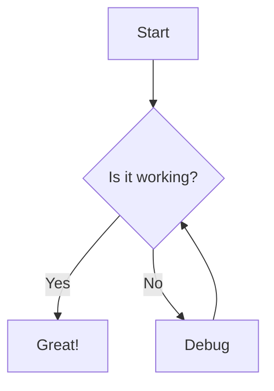

# Integrating Mermaid Diagrams into Chat Messages

To integrate Mermaid diagram support into the existing chat message component, you'll need to modify the markdown rendering component to use the `mermaidCode` component for code blocks.

## Step 1: Find the Chat Message Component

First, locate the component that renders chat messages. This is likely a component that uses `react-markdown` to render markdown content.

## Step 2: Import the mermaidCode Component

Import the mermaidCode component:

```tsx
import { mermaidCode } from "#/components/features/mermaid/mermaid-code";
```

## Step 3: Update the Markdown Component

Update the `react-markdown` component to use the mermaidCode component for code blocks:

```tsx
<Markdown
  components={{
    code: mermaidCode, // Use the enhanced code component that handles Mermaid
    // Keep any other custom components
    ul,
    ol,
    a: anchor,
    // etc.
  }}
  remarkPlugins={[remarkGfm]}
>
  {message}
</Markdown>
```

## Step 4: Initialize Mermaid

Make sure Mermaid is initialized when the application starts. You can do this in your main application file:

```tsx
// In your main application file (e.g., App.tsx or index.tsx)
import { initializeMermaid } from "#/utils/mermaid-init";

// Initialize Mermaid
initializeMermaid();
```

## Step 5: Add Dark Mode Support (Optional)

If your application supports dark mode, you can initialize Mermaid with dark theme when dark mode is enabled:

```tsx
import { initializeMermaid, initializeMermaidDarkTheme } from "#/utils/mermaid-init";

// In your theme context or wherever dark mode is toggled
useEffect(() => {
  if (isDarkMode) {
    initializeMermaidDarkTheme();
  } else {
    initializeMermaid();
  }
}, [isDarkMode]);
```

## Example Usage

Once integrated, users can include Mermaid diagrams in their messages using the standard markdown code block syntax with the "mermaid" language specifier:

````
Here's a flowchart:



This diagram shows a simple debugging process.
````

The diagram will be automatically rendered in the chat message.