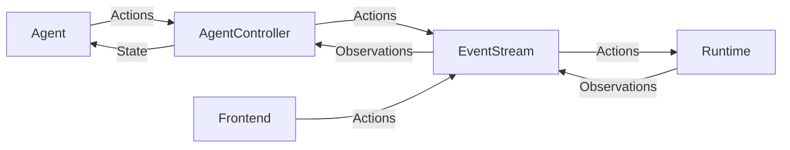

# OpenDevin Architecture

This directory contains the core components of OpenDevin.

## Classes
The key classes in OpenDevin are:

* LLM: brokers all interactions with large language models. Works with any underlying completion model, thanks to LiteLLM.
* Agent: responsible for looking at the current State, and producing an Action that moves one step closer toward the end-goal.
* AgentController: initializes the Agent, manages State, and drive the main loop that pushes the Agent forward, step by step
* State: represents the current state of the Agent's task. Includes things like the current step, a history of recent events, the Agent's long-term plan, etc
* EventStream: a central hub for Events, where any component can publish Events, or listen for Events published by other components
  * Event: an Action or Observeration
      * Action: represents a request to e.g. edit a file, run a command, or send a message
      * Observation: represents information collected from the environment, e.g. file contents or command output
* Runtime: responsible for performing Actions, and sending back Observations
    * Sandbox: the part of the runtime responsible for running commands, e.g. inside of Docker
* Server: brokers OpenDevin sessions over HTTP, e.g. to drive the frontend
    * Session: holds a single EventStream, a single AgentController, and a single Runtime. Generally represents a single task (but potentially including several user prompts)
    * SessionManager: keeps a list of active sessions, and ensures requests are routed to the correct Session

## Control Flow
Here's the basic loop (in pseudocode) that drives agents.
```python
while True:
  prompt = agent.generate_prompt(state)
  response = llm.completion(prompt)
  action = agent.parse_response(response)
  observation = runtime.run(action)
  state = state.update(action, observation)
```

In reality, most of this is achieved through message passing, via the EventStream.
The EventStream serves as the backbone for all communication in OpenDevin.



## Runtime
The Runtime class is abstract, and has a few different implementations:

* We have a LocalRuntime, which runs commands and edits files directly on the user's machine
* We have a DockerRuntime, which runs commands inside of a docker sandbox, and edits files directly on the user's machine
* We have an E2BRuntime, which uses [e2b.dev containers](https://github.com/e2b-dev/e2b) to sandbox file and command operations
