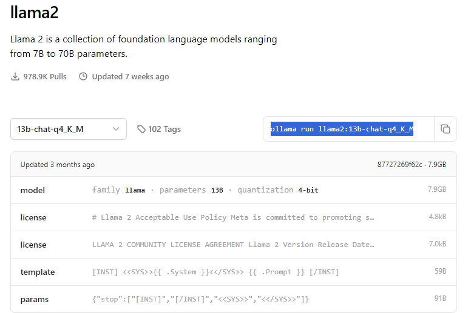

# Local LLM Guide with Ollama and Litellm

- This is a guide to use local LLM's with Ollama and Litellm

## 1. Follow the default installation:
```
git clone git@github.com:OpenDevin/OpenDevin.git
```
or 
```
git clone git@github.com:<YOUR-USERNAME>/OpenDevin.git
```

then `cd OpenDevin`

## 2. Run setup commands:
```
make build
make setup-config
```

## 3. Modify config file:

- after running `make setup-config` you will see a generated file called `config.toml` in `OpenDevin/`.

- open this file and modify it to your needs based on this template:

```
LLM_API_KEY="0"
LLM_MODEL="ollama/<model_name>"
LLM_BASE_URL="http://localhost:<port_number>"
WORKSPACE_DIR="./workspace"
```
`<port_number>` can be whatever you want just make sure it is not used by anything else.

ollama model names can be found [here](https://ollama.com/library) 

Example:


Note: The API key does not matter and the base url needs to be `localhost` with the port number you intend to use with litellm. By default this is `11434`.

## 4. Run Litellm in CLI:

- there are two options for this:

#### 1. Run litellm in linux terminal:
```
conda activate <env_name>
litellm --model ollama/<model_name>
```

#### 2. Create a batch script:
- The below example assumes the use of miniconda3 with default install settings, you will need to change this to the path to your `conda.sh` file if you use something else.
```
start /B wsl.exe -d <DISTRO_NAME> -e bash -c "source ~/miniconda3/etc/profile.d/conda.sh && conda activate <ENV_NAME> && litellm --model ollama/<MODEL_NAME> --port <PORT>"
```
- The above script will spawn a wsl instance in your cmd terminal, activate your conda environment and then run the litellm command with your model and port number.
- make sure you fill in all the <> brackets with the appropriate names.

Either way you do it you should see something like this to confirm you have started the server:


## 5. Start OpenDevin:

At this point everything should be set up and working properly. 
1. Start by running the litellm server using one of the methods outlined above
2. Run `make build` in your terminal `~/OpenDevin/`
3. Run `make run` in your terminal 
4. If that fails try running the server and front end in sepparate terminals:
 - In the first terminal `make start-backend`
 - In the second terminal `make start-frontend`
5. you should now be able to connect to `http://localhost:3001/` with your local model running!
