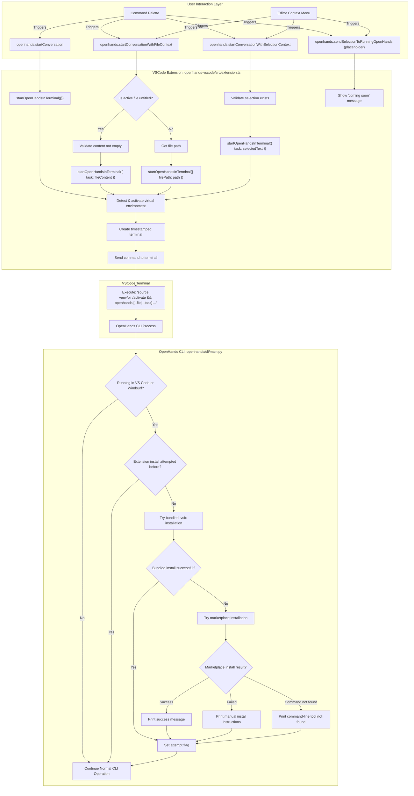

# VS Code Integration Plan for OpenHands

This document outlines the VS Code integration for OpenHands, focusing on three primary features:
1. Start OpenHands conversations from inside VS Code
2. Pass context from open files and text selections to OpenHands
3. Automatic extension installation when using OpenHands CLI from VS Code

## Part 1: VS Code Extension (`./openhands-vscode/`)

The extension is located in `openhands-vscode/` during development.

### 1. Project Setup

*   **Directory:** `./openhands-vscode/`
*   **`package.json`:**
    *   `name`: `openhands-vscode`
    *   `displayName`: "OpenHands Integration"
    *   `description`: "Integrates OpenHands with VS Code for easy conversation starting and context passing."
    *   `version`: `0.0.1`
    *   `publisher`: `openhands`
    *   `engines`: `{ "vscode": "^1.80.0" }`
    *   `activationEvents`:
        *   `"onCommand:openhands.startConversation"`
        *   `"onCommand:openhands.startConversationWithFileContext"`
        *   `"onCommand:openhands.startConversationWithSelectionContext"`
        *   `"onCommand:openhands.sendSelectionToRunningOpenHands"` (placeholder)
    *   `main`: `./out/extension.js`
    *   `contributes`:
        *   `commands`:
            *   `{ "command": "openhands.startConversation", "title": "OpenHands: Start New Conversation", "category": "OpenHands" }`
            *   `{ "command": "openhands.startConversationWithFileContext", "title": "OpenHands: Start Conversation with Active File Content", "category": "OpenHands" }`
            *   `{ "command": "openhands.startConversationWithSelectionContext", "title": "OpenHands: Start Conversation with Selected Text", "category": "OpenHands" }`
            *   `{ "command": "openhands.sendSelectionToRunningOpenHands", "title": "OpenHands: Send Selection to Running Instance", "category": "OpenHands" }` (placeholder)
        *   `menus`:
            *   `editor/context`:
                *   `{ "when": "editorHasSelection", "command": "openhands.startConversationWithSelectionContext", "group": "navigation@1" }`
                *   `{ "command": "openhands.startConversationWithFileContext", "group": "navigation@2" }`
                *   `{ "when": "editorHasSelection", "command": "openhands.sendSelectionToRunningOpenHands", "group": "navigation@3" }` (placeholder)
            *   `commandPalette`:
                *   `{ "command": "openhands.startConversation", "when": "true" }`
                *   `{ "command": "openhands.startConversationWithFileContext", "when": "editorIsOpen" }`
                *   `{ "command": "openhands.startConversationWithSelectionContext", "when": "editorHasSelection" }`
                *   `{ "command": "openhands.sendSelectionToRunningOpenHands", "when": "editorHasSelection" }` (placeholder)
    *   `scripts`:
        *   `"vscode:prepublish": "npm run compile"`
        *   `"compile": "tsc -p ./"`
        *   `"watch": "tsc -watch -p ./"`
        *   `"test": "npm run compile && node ./out/test/runTest.js"`
        *   `"package-vsix": "npm run compile && vsce package --no-dependencies"`
    *   `devDependencies`: Includes TypeScript, VS Code types, Mocha for testing, and VSCE for packaging
*   **`tsconfig.json`:** TypeScript configuration (module: "commonjs", target: "es2020", outDir: "out", strict: true, esModuleInterop: true)
*   **`src/extension.ts`:** Main extension logic
*   **`src/test/`:** Test suite with unit tests
*   **`.vscodeignore`:** Excludes source files, node_modules, and development files from packaging
*   **`README.md`:** User documentation and setup instructions
*   **Packaged extension:** `openhands-vscode-0.0.1.vsix`

### 2. Core Logic in `src/extension.ts`

*   **`activate(context: vscode.ExtensionContext)` function:**
    *   Registers all four commands (including placeholder for future feature)
*   **Helper Function: `startOpenHandsInTerminal(options: { task?: string; filePath?: string })`:**
    *   **Virtual Environment Detection:** Automatically detects and activates virtual environments (`.venv`, `venv`, `.virtualenv`) in the workspace
    *   **Terminal Management:** Creates a new terminal with timestamp (e.g., "OpenHands 14:30:25")
    *   **Command Construction:**
        *   If `options.filePath` is provided: `openhands --file "path/to/file"`
        *   If `options.task` is provided: `openhands --task "sanitized task content"`
        *   Otherwise: `openhands`
    *   **Path Sanitization:** Quotes file paths containing spaces
    *   **Task Sanitization:** Escapes backticks and quotes in task content
    *   **Debug Output:** Shows debug messages for troubleshooting (using error messages for visibility)
*   **Command Handlers:**
    *   **`openhands.startConversation`:**
        *   Calls `startOpenHandsInTerminal({})`
    *   **`openhands.startConversationWithFileContext`:**
        *   Gets the active text editor
        *   **For untitled files:**
            *   Gets document content
            *   Calls `startOpenHandsInTerminal({ task: fileContent })`
        *   **For saved files:**
            *   Gets file path from `editor.document.uri.fsPath`
            *   Calls `startOpenHandsInTerminal({ filePath: documentPath })`
    *   **`openhands.startConversationWithSelectionContext`:**
        *   Gets the active text editor
        *   Gets selected text: `editor.document.getText(editor.selection)`
        *   Calls `startOpenHandsInTerminal({ task: selectedText })`
    *   **`openhands.sendSelectionToRunningOpenHands` (placeholder):**
        *   Shows "coming soon" message
        *   TODO: Find running OpenHands terminal and send selection as input
*   **`deactivate()` function:**
    *   Empty (VS Code handles terminal cleanup)

### 3. User Experience

*   User installs `openhands` CLI (e.g., via PyPI), making it available in PATH
*   **Automatic Extension Installation:** When running OpenHands CLI from VS Code terminal for the first time, it automatically attempts to install the extension
*   **Virtual Environment Support:** Extension automatically detects and activates Python virtual environments in the workspace
*   Commands are accessible via Command Palette and editor context menus
*   Each OpenHands session runs in a new timestamped VS Code terminal
*   **Cross-Editor Support:** Also works with Windsurf

## Part 2: OpenHands CLI Enhancements (`odie/openhands/cli/main.py`)

The CLI includes automatic extension installation to improve the first-time user experience in VS Code and Windsurf.

### 1. Editor Detection and Extension Installation

*   **On CLI Startup (function: `attempt_vscode_extension_install()`):**
    1.  **Detect Editor Environment:**
        *   VS Code: Check `os.environ.get('TERM_PROGRAM') == 'vscode'`
        *   Windsurf: Check multiple environment variables and PATH for Windsurf indicators
    2.  **Check Attempt Flag:** Look for flag file (`~/.openhands/.vscode_extension_install_attempted` or `~/.openhands/.windsurf_extension_install_attempted`) to prevent repeated attempts
    3.  **Two-Stage Installation Process (if in supported editor & not previously attempted):**
        *   **Stage 1 - Bundled VSIX:** Try to install from bundled `.vsix` file using `importlib.resources`
            *   Command: `code --install-extension /path/to/bundled.vsix --force` (or `surf` for Windsurf)
        *   **Stage 2 - Marketplace Fallback:** If bundled installation fails, try marketplace installation
            *   Command: `code --install-extension openhands.openhands-vscode --force`
        *   **Error Handling:**
            *   `FileNotFoundError`: Inform user that editor command-line tool is not in PATH
            *   Non-zero exit code: Inform user that installation may need confirmation in the editor
            *   Zero exit code: Inform user of successful installation and suggest reloading editor
        *   **Set Attempt Flag:** Create flag file to prevent repeated attempts

## Workflow Diagram



## Part 3: Testing Strategy

The integration includes testing to ensure correctness.

### 1. VS Code Extension (`openhands-vscode/`) - TypeScript Unit Tests

*   **Framework:** Mocha with VS Code test utilities (`@vscode/test-electron`)
*   **Location:** `src/test/suite/extension.test.ts`
*   **Current Test Coverage:**
    *   **Extension Activation:**
        *   Verifies extension is found and activates successfully
    *   **Command Registration:**
        *   Verifies all four commands are registered (`openhands.startConversation`, `openhands.startConversationWithFileContext`, `openhands.startConversationWithSelectionContext`, `openhands.sendSelectionToRunningOpenHands`)
    *   **`startOpenHandsInTerminal` Helper Function (via command testing):**
        *   Mocks `vscode.window.createTerminal` and `terminal.sendText`
        *   Tests terminal creation with timestamped names
        *   Tests `terminal.show()` is called
        *   Tests correct command construction for different scenarios
    *   **Command Handler: `openhands.startConversation`:**
        *   Verifies correct terminal command: `openhands`
    *   **Command Handler: `openhands.startConversationWithFileContext`:**
        *   **No active editor:** Verifies error message shown
        *   **Untitled document:** Verifies `--task` command with file content
        *   **Saved document:** Verifies `--file` command with file path
    *   **Command Handler: `openhands.startConversationWithSelectionContext`:**
        *   **No active editor:** Verifies error message
        *   **No selection:** Verifies error message
        *   **With selection:** Verifies `--task` command with selected text
*   **Test Infrastructure:**
    *   Manual spy/stub implementation for VS Code API mocking
    *   Comprehensive setup/teardown for each test
    *   Proper VS Code API interface compliance

### 2. Areas Needing Enhanced Test Coverage

*   **Virtual Environment Detection:** Test venv detection logic across different scenarios
*   **Path Sanitization:** Test file paths with spaces and special characters
*   **Task Content Sanitization:** Test escaping of quotes and backticks
*   **Cross-platform Compatibility:** Test Windows vs Unix path handling
*   **Error Handling:** Test filesystem errors during venv detection

### 3. OpenHands CLI Enhancements (`openhands/cli/main.py`) - Python Unit Tests

*   **Framework:** `pytest` (as used throughout the project)
*   **Location:** `tests/unit/cli/test_cli_vscode.py`
*   **Current Test Coverage:**
    *   **Editor Environment Detection:**
        *   Tests VS Code detection via `TERM_PROGRAM` environment variable
        *   Tests Windsurf detection via multiple environment indicators
    *   **Flag File Handling:**
        *   Mocks `pathlib.Path.exists`, `pathlib.Path.touch`, `pathlib.Path.mkdir`
        *   Tests flag file checking prevents repeated attempts
        *   Tests flag file creation after installation attempts
    *   **Extension Installation Logic:**
        *   Mocks `subprocess.run` for different scenarios
        *   **Command not found (`FileNotFoundError`):** Verifies correct fallback message
        *   **Non-zero exit code:** Verifies informational message about potential confirmation needed
        *   **Zero exit code:** Verifies success message
        *   Tests that attempt flag is set in all scenarios
    *   **Error Handling:**
        *   Tests `OSError` during flag directory creation
        *   Tests `OSError` during flag file creation
        *   Verifies appropriate logging of errors
    *   **Overall Flow Integration:**
        *   Tests complete flow from environment detection through flag setting
        *   Tests that non-supported editors skip installation
        *   Tests that existing flag files prevent repeated attempts

### 4. Areas Needing Enhanced Test Coverage

**VS Code Extension:**
*   **Virtual Environment Detection:** Test detection across different venv structures and platforms
*   **Path Sanitization:** Test complex file paths with spaces, quotes, and special characters
*   **Task Content Sanitization:** Test edge cases in content escaping
*   **Cross-platform Terminal Commands:** Test Windows vs Unix command construction
*   **Filesystem Error Handling:** Test scenarios where venv directories exist but are inaccessible

**CLI Integration:**
*   **Bundled VSIX Installation:** Test the two-stage installation process (bundled → marketplace)
*   **Resource Loading:** Test `importlib.resources` edge cases
*   **Cross-Editor Support:** More comprehensive Windsurf detection testing
*   **Integration Testing:** End-to-end testing of CLI → extension installation → extension usage

### 5. Manual Testing Checklist

*   Install OpenHands CLI and run from VS Code terminal - verify extension auto-installation
*   Test all four commands from Command Palette
*   Test context menu commands with different file types
*   Test virtual environment activation in different project structures
*   Test with untitled files, saved files, and text selections
*   Verify terminal creation and command execution
*   Test cross-platform compatibility (Windows/macOS/Linux)

## Part 4: Future Enhancements

### 1. Send Selection to Running OpenHands (Placeholder Implementation)

**Current Status:** Placeholder command exists but shows "coming soon" message

**Implementation Plan:**
*   **Find Running Terminal:** Detect existing OpenHands terminals by name pattern
*   **Send Input:** Send selected text as input to the running CLI process
*   **Error Handling:** Handle cases where no OpenHands instance is running
*   **User Feedback:** Provide clear feedback about success/failure

**Technical Approach:**
```typescript
// Pseudo-code for future implementation
function sendToRunningOpenHands(text: string) {
    const openHandsTerminals = vscode.window.terminals.filter(
        terminal => terminal.name.startsWith('OpenHands')
    );

    if (openHandsTerminals.length === 0) {
        vscode.window.showErrorMessage('No running OpenHands instance found');
        return;
    }

    // Use most recent terminal or let user choose
    const targetTerminal = openHandsTerminals[openHandsTerminals.length - 1];
    targetTerminal.sendText(text, false); // false = don't add newline
    targetTerminal.show();
}
```

### 2. Enhanced Virtual Environment Support

**Current Status:** Basic detection of common venv patterns

**Potential Enhancements:**
*   Support for conda environments
*   Support for poetry virtual environments
*   Support for pipenv environments
*   Better cross-platform path handling
*   Configuration options for custom venv paths

### 3. Configuration Options

**Future Configuration Settings:**
*   Disable automatic venv detection
*   Custom OpenHands CLI command/path
*   Terminal naming preferences
*   Debug message visibility controls
*   Default OpenHands arguments

### 4. Integration with OpenHands Web UI

**Potential Integration:**
*   Launch OpenHands web interface from VS Code
*   Deep linking between VS Code files and OpenHands conversations
*   Bidirectional context sharing

## Part 5: Immediate Test Coverage Improvements Needed

### 1. VS Code Extension Test Gaps

**Missing from current test suite:**

1. **Fourth Command Registration:**
   ```typescript
   // Add to expectedCommands array in extension.test.ts
   'openhands.sendSelectionToRunningOpenHands'
   ```

2. **Virtual Environment Detection Tests:**
   ```typescript
   test('should detect and activate .venv virtual environment', async () => {
     // Mock workspace folder and .venv directory
     // Test venv activation command construction
   });

   test('should handle missing virtual environment gracefully', async () => {
     // Test behavior when no venv is found
   });

   test('should handle venv detection errors', async () => {
     // Test filesystem errors during venv detection
   });
   ```

3. **Path Sanitization Tests:**
   ```typescript
   test('should properly quote file paths with spaces', async () => {
     // Test file path: '/path/with spaces/file.py'
     // Expected: 'openhands --file "/path/with spaces/file.py"'
   });
   ```

4. **Task Content Sanitization Tests:**
   ```typescript
   test('should escape quotes and backticks in task content', async () => {
     // Test content with quotes and backticks
     // Verify proper escaping in command
   });
   ```

5. **Terminal Naming Tests:**
   ```typescript
   test('should create terminals with timestamp names', async () => {
     // Verify terminal name format: "OpenHands HH:MM:SS"
   });
   ```

6. **Empty File Validation Tests:**
   ```typescript
   test('should reject empty untitled files', async () => {
     // Test untitled file with empty or whitespace-only content
   });
   ```

### 2. CLI Integration Test Gaps

**Missing from current test suite:**

1. **Bundled VSIX Installation Tests:**
   ```python
   def test_bundled_vsix_installation_success():
       # Mock importlib.resources.as_file
       # Test successful bundled installation

   def test_bundled_vsix_not_found_fallback():
       # Test fallback to marketplace when bundled VSIX missing
   ```

2. **Windsurf Detection Tests:**
   ```python
   def test_windsurf_environment_detection():
       # Test various Windsurf environment indicators
       # Test 'surf' command usage instead of 'code'
   ```

3. **Resource Loading Error Tests:**
   ```python
   def test_importlib_resources_error_handling():
       # Test errors during resource file access
   ```

4. **Migration to pytest:**
   ```python
   # Current unittest style should be converted to:
   @pytest.fixture
   def mock_environment():
       # Setup test environment

   def test_vscode_detection(mock_environment):
       # Test using pytest style
       assert condition
   ```

### 3. Integration Test Framework Needed

**End-to-End Testing:**
*   Test complete workflow: CLI startup → extension installation → extension usage
*   Test across different operating systems
*   Test with different Python virtual environment setups
*   Test with different VS Code/Windsurf configurations

**Performance Testing:**
*   Test extension activation time
*   Test terminal creation performance
*   Test virtual environment detection performance

### 4. Test Infrastructure Improvements

**VS Code Extension:**
*   Add test utilities for common VS Code API mocking patterns
*   Add integration tests that run commands in actual VS Code environment

**CLI Integration:**
*   Add fixtures for different environment configurations
*   Add helper functions for common test scenarios
*   Add integration tests that actually invoke subprocess commands (with mocking)
