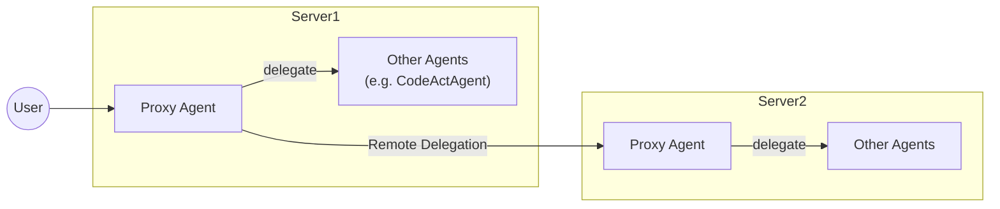

# Proxy Agent

This folder is an implementation of a Proxy Agent.
The Proxy Agent delegates a given task to an appropriate agent capable of accomplishing it.
The list of available agents is defined in agent_list.json, located in this directory.

A key feature of the Proxy Agent is that, in addition to delegating task to different agents available locally within OpenHands, it can also send messages to agents hosted on different OpenHands instances running on separate servers.

## How to run
### Set as the initial agent
This agent is designed to be the initial agent that receives user input at the start of a session.
Configure the Proxy Agent as the initial agent of a session.


### Place agent_list.json
Place agent_list.json under openhands/agenthub/proxy_agent. Below is an example of its structure:
```json
{
    "local": {
        "CodeActAgent": {
            "agent_name": "CodeActAgent",
            "description": "A helpful AI assistant that can interact with a computer to solve tasks."
        }
    },
    "remote": {
        "FooAgent": {
            "agent_name": "FooAgent",
            "url": "http(s)://IP or FQDN:port",
            "description": "A brief description of FooAgent."
        }
    }
}
```
The contents of this JSON file are simply passed as a string to the agent as part of its prompt, assisting the LLM in selecting the most suitable agent.
Therefore, there areno strict formatting requirements, but please keep the following points in mind:
- Clearly specify whether the agent is available locally within the same instance or hosted on a different instance.
- If an agent is hosted on a different instance, explicitly provide the URL where that instance is hosted.
