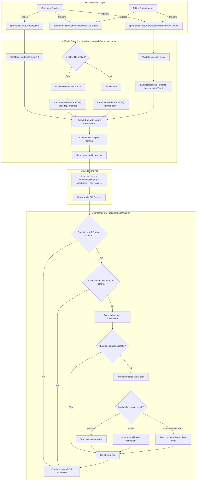

# VS Code Integration Plan for OpenHands

This document outlines the VS Code integration for OpenHands, focusing on three primary features:
1. Start OpenHands conversations from inside VS Code
2. Pass context from open files and text selections to OpenHands
3. Automatic extension installation when using OpenHands CLI from VS Code

## Part 1: VS Code Extension (`./openhands-vscode/`)

The extension is located in `openhands-vscode/` during development.

### 1. Project Setup

*   **Directory:** `./openhands-vscode/`
*   **`package.json`:**
    *   `name`: `openhands-vscode`
    *   `displayName`: "OpenHands Integration"
    *   `description`: "Integrates OpenHands with VS Code for easy conversation starting and context passing."
    *   `version`: `0.0.1`
    *   `publisher`: `openhands`
    *   `engines`: `{ "vscode": "^1.80.0" }`
    *   `activationEvents`:
        *   `"onCommand:openhands.startConversation"`
        *   `"onCommand:openhands.startConversationWithFileContext"`
        *   `"onCommand:openhands.startConversationWithSelectionContext"`
    *   `main`: `./out/extension.js`
    *   `contributes`:
        *   `commands`:
            *   `{ "command": "openhands.startConversation", "title": "OpenHands: Start New Conversation", "category": "OpenHands" }`
            *   `{ "command": "openhands.startConversationWithFileContext", "title": "OpenHands: Start Conversation with Active File Content", "category": "OpenHands" }`
            *   `{ "command": "openhands.startConversationWithSelectionContext", "title": "OpenHands: Start Conversation with Selected Text", "category": "OpenHands" }`
        *   `menus`:
            *   `editor/context`:
                *   `{ "when": "editorHasSelection", "command": "openhands.startConversationWithSelectionContext", "group": "navigation@1" }`
                *   `{ "command": "openhands.startConversationWithFileContext", "group": "navigation@2" }`
            *   `commandPalette`:
                *   `{ "command": "openhands.startConversation", "when": "true" }`
                *   `{ "command": "openhands.startConversationWithFileContext", "when": "editorIsOpen" }`
                *   `{ "command": "openhands.startConversationWithSelectionContext", "when": "editorHasSelection" }`
    *   `scripts`:
        *   `"vscode:prepublish": "npm run compile"`
        *   `"compile": "tsc -p ./"`
        *   `"watch": "tsc -watch -p ./"`
        *   `"test": "npm run compile && node ./out/test/runTest.js"`
        *   `"package-vsix": "npm run compile && vsce package --no-dependencies"`
        *   `"lint": "npm run typecheck && eslint src --ext .ts && prettier --check src/**/*.ts"`
        *   `"lint:fix": "eslint src --ext .ts --fix && prettier --write src/**/*.ts"`
        *   `"typecheck": "tsc --noEmit"`
    *   `devDependencies`: Includes TypeScript, VS Code types, Mocha for testing, VSCE for packaging, and linting tools (ESLint, Prettier)
*   **`tsconfig.json`:** TypeScript configuration (module: "commonjs", target: "es2020", outDir: "out", strict: true, esModuleInterop: true)
*   **`src/extension.ts`:** Main extension logic
*   **`src/test/`:** Test suite with unit tests
*   **`.vscodeignore`:** Excludes source files, node_modules, and development files from packaging
*   **`README.md`:** User documentation and setup instructions
*   **Packaged extension:** `openhands-vscode-0.0.1.vsix`

### 2. Code Quality and Linting

The extension uses ESLint and Prettier for code quality and formatting, adapted from the main OpenHands frontend configuration:

*   **`.eslintrc.json`:** ESLint configuration adapted from frontend, using airbnb-base rules for Node.js/VSCode extensions
    *   Extends: `airbnb-base`, `airbnb-typescript/base`, `prettier`, `@typescript-eslint/recommended`
    *   Plugins: `prettier`, `unused-imports`
    *   Special rules for VSCode extensions: allows leading underscores, console warnings
    *   Test file overrides: relaxed rules for test files (`@typescript-eslint/no-explicit-any` off, etc.)
*   **`.prettierrc.json`:** Prettier configuration matching frontend (`trailingComma: "all"`)
*   **`.eslintignore`:** Excludes `out/`, `node_modules/`, `.vscode-test/`, `*.vsix`
*   **Linting Commands:**
    *   `npm run lint`: Type check + ESLint check + Prettier check
    *   `npm run lint:fix`: ESLint fix + Prettier format
    *   `npm run typecheck`: TypeScript compilation check without output

### 3. Core Logic in `src/extension.ts`

*   **`activate(context: vscode.ExtensionContext)` function:**
    *   Registers all three commands
*   **Helper Function: `startOpenHandsInTerminal(options: { task?: string; filePath?: string })`:**
    *   **Virtual Environment Detection:** Automatically detects and activates virtual environments (`.venv`, `venv`, `.virtualenv`) in the workspace
    *   **Safe Terminal Management:** Reuses idle terminals or creates new ones without interrupting running processes
    *   **Command Construction:**
        *   If `options.filePath` is provided: `openhands --file "path/to/file"`
        *   If `options.task` is provided: `openhands --task "sanitized task content"`
        *   Otherwise: `openhands`
    *   **Path Sanitization:** Quotes file paths containing spaces
    *   **Task Sanitization:** Escapes backticks and quotes in task content
    *   **Debug Output:** Shows debug messages for troubleshooting (using error messages for visibility)
*   **Command Handlers:**
    *   **`openhands.startConversation`:**
        *   Calls `startOpenHandsInTerminal({})`
    *   **`openhands.startConversationWithFileContext`:**
        *   Gets the active text editor
        *   **For untitled files:**
            *   Gets document content
            *   Calls `startOpenHandsInTerminal({ task: fileContent })`
        *   **For saved files:**
            *   Gets file path from `editor.document.uri.fsPath`
            *   Calls `startOpenHandsInTerminal({ filePath: documentPath })`
    *   **`openhands.startConversationWithSelectionContext`:**
        *   Gets the active text editor
        *   Gets selected text: `editor.document.getText(editor.selection)`
        *   Calls `startOpenHandsInTerminal({ task: selectedText })`

*   **`deactivate()` function:**
    *   Empty (VS Code handles terminal cleanup)

### 3. User Experience

*   User installs `openhands` CLI (e.g., via PyPI), making it available in PATH
*   **Automatic Extension Installation:** When running OpenHands CLI from VS Code terminal for the first time, it automatically attempts to install the extension
*   **Virtual Environment Support:** Extension automatically detects and activates Python virtual environments in the workspace
*   Commands are accessible via Command Palette and editor context menus
*   OpenHands sessions reuse idle terminals or create new timestamped terminals as needed
*   **Safe Operation:** Never interrupts running processes in existing terminals
*   **Cross-Editor Support:** Also works with Windsurf

## Part 2: OpenHands CLI Enhancements (`odie/openhands/cli/main.py`)

The CLI includes automatic extension installation to improve the first-time user experience in VS Code and Windsurf.

### 1. Editor Detection and Extension Installation

*   **On CLI Startup (function: `attempt_vscode_extension_install()`):**
    1.  **Detect Editor Environment:**
        *   VS Code: Check `os.environ.get('TERM_PROGRAM') == 'vscode'`
        *   Windsurf: Check multiple environment variables and PATH for Windsurf indicators
    2.  **Check Attempt Flag:** Look for flag file (`~/.openhands/.vscode_extension_install_attempted` or `~/.openhands/.windsurf_extension_install_attempted`) to prevent repeated attempts
    3.  **Two-Stage Installation Process (if in supported editor & not previously attempted):**
        *   **Stage 1 - Bundled VSIX:** Try to install from bundled `.vsix` file using `importlib.resources`
            *   Command: `code --install-extension /path/to/bundled.vsix --force` (or `surf` for Windsurf)
        *   **Stage 2 - Marketplace Fallback:** If bundled installation fails, try marketplace installation
            *   Command: `code --install-extension openhands.openhands-vscode --force`
        *   **Error Handling:**
            *   `FileNotFoundError`: Inform user that editor command-line tool is not in PATH
            *   Non-zero exit code: Inform user that installation may need confirmation in the editor
            *   Zero exit code: Inform user of successful installation and suggest reloading editor
        *   **Set Attempt Flag:** Create flag file to prevent repeated attempts

## Workflow Diagram



## Part 3: Testing Strategy

The integration includes testing to ensure correctness.

### 1. VS Code Extension (`openhands-vscode/`) - TypeScript Unit Tests

*   **Framework:** Mocha with VS Code test utilities (`@vscode/test-electron`)
*   **Location:** `src/test/suite/extension.test.ts`
*   **Coverage:** Extension activation, command registration, terminal integration, and command handlers

### 2. Test Coverage Areas

**VS Code Extension:**
*   Virtual environment detection across different scenarios
*   Path and content sanitization for special characters
*   Cross-platform compatibility
*   Error handling for filesystem operations

**CLI Integration:**
*   Bundled VSIX installation and marketplace fallback
*   Resource loading edge cases
*   Comprehensive cross-editor support
*   End-to-end integration testing

### 3. Manual Testing Checklist

*   Install OpenHands CLI and run from VS Code terminal - verify extension auto-installation
*   Test all three commands from Command Palette
*   Test context menu commands with different file types
*   Test virtual environment activation in different project structures
*   Test with untitled files, saved files, and text selections
*   Verify terminal creation and command execution

## Future Features

### Send Selection to Running OpenHands Instance

**Command:** `openhands.sendSelectionToRunningOpenHands`

**Purpose:** Send selected text to an already running OpenHands CLI instance instead of starting a new conversation.

**Implementation Requirements:**
1. Find the terminal running OpenHands CLI
2. Send the selected text as input to that CLI
3. Handle the case where no OpenHands CLI is running

**Configuration needed:**
- Activation event: `"onCommand:openhands.sendSelectionToRunningOpenHands"`
- Command definition: `{ "command": "openhands.sendSelectionToRunningOpenHands", "title": "OpenHands: Send Selection to Running Instance", "category": "OpenHands" }`
- Context menu: `{ "when": "editorHasSelection", "command": "openhands.sendSelectionToRunningOpenHands", "group": "navigation@3" }`
- Command palette: `{ "command": "openhands.sendSelectionToRunningOpenHands", "when": "editorHasSelection" }`

**Technical Implementation:**
```typescript
// Pseudo-code for future implementation
function sendToRunningOpenHands(text: string) {
    const openHandsTerminals = vscode.window.terminals.filter(
        terminal => terminal.name.startsWith('OpenHands')
    );

    if (openHandsTerminals.length === 0) {
        vscode.window.showErrorMessage('No running OpenHands instance found');
        return;
    }

    // Use most recent terminal or let user choose
    const targetTerminal = openHandsTerminals[openHandsTerminals.length - 1];
    targetTerminal.sendText(text, false); // false = don't add newline
    targetTerminal.show();
}
```

### 2. Enhanced Virtual Environment Support

**Current Status:** Basic detection of common venv patterns

**Potential Enhancements:**
*   Support for conda environments
*   Support for poetry virtual environments
*   Support for pipenv environments
*   Better cross-platform path handling
*   Configuration options for custom venv paths

### 3. Configuration Options

**Future Configuration Settings:**
*   Disable automatic venv detection
*   Custom OpenHands CLI command/path
*   Terminal naming preferences
*   Debug message visibility controls
*   Default OpenHands arguments

## Development Workflow

### Code Quality Checks

Before committing changes, run the following commands to ensure code quality:

```bash
# Install dependencies
npm install

# Run type checking
npm run typecheck

# Run linting (check only)
npm run lint

# Run linting with automatic fixes
npm run lint:fix

# Compile TypeScript
npm run compile

# Run tests
npm run test

# Package extension
npm run package-vsix
```

### Pre-commit Checklist

1. **Code Quality:** Run `npm run lint:fix` to ensure consistent formatting and catch issues
2. **Type Safety:** Run `npm run typecheck` to verify TypeScript compilation
3. **Functionality:** Run `npm run test` to ensure tests pass
4. **Build:** Run `npm run compile` to verify successful compilation
5. **Documentation:** Update relevant documentation files (README.md, PLAN.md, etc.)

### Linting Configuration

The linting setup is designed to maintain consistency with the main OpenHands codebase:
- **ESLint:** Uses Airbnb base configuration adapted for Node.js/VSCode extensions
- **Prettier:** Matches frontend formatting rules
- **TypeScript:** Strict type checking with VSCode extension-specific allowances
- **Test Files:** Relaxed rules for test files to allow common testing patterns
